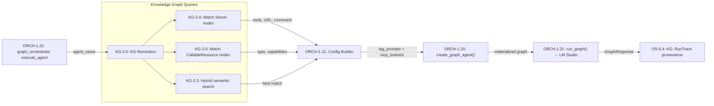

# ORCH-1.21: Agent Runner — KG-to-LLM Execution Bridge

## Concept Summary

| Field | Value |
|-------|-------|
| **Concept ID** | `ORCH-1.21` |
| **Pillar** | 1 — Graph Orchestration Engine |
| **Status** | Implemented |
| **Source Modules** | `orchestration/agent_runner.py` |
| **Test Modules** | `test_orchestrate_mcp.py` |
| **C4 Component** | Agent Runner |

## Overview

The **Agent Runner** bridges the `graph_orchestrate(action='execute_agent')` MCP tool
to the pydantic-graph execution infrastructure. It provides deep KG integration
rather than a simple passthrough — resolving agents from the Knowledge Graph,
dynamically binding MCP toolsets, and recording execution provenance.

## Architecture



## Execution Lifecycle

### 1. Agent Resolution
Queries the KG across three node types:

| Search | Cypher Pattern | What it finds |
|--------|---------------|---------------|
| Server nodes | `MATCH (s:Server) WHERE s.name = $name` | MCP servers with tools |
| CallableResource | `MATCH (r:CallableResource) WHERE r.name = $name` | Skills, A2A agents |
| Semantic search | `engine.hybrid_search(name, top_k=3)` | Best-effort fuzzy match |

### 2. Config Builder
Constructs a `create_graph_agent()` config from resolved metadata:
- **tag_prompts**: Agent name + tool descriptions + capabilities
- **mcp_toolsets**: Dynamically created `MCPServerStdio/SSE/StreamableHTTP` from URLs
- **LLM settings**: Unified model routing via XDG `config.json`

### 3. Graph Execution
Calls `create_graph_agent()` → `run_graph()` with the materialized graph.
Uses the same pipeline as the A2A agent and main server.

### 4. Provenance Tracking
Creates `RunTrace` nodes in the KG:
```cypher
CREATE (t:RunTrace {
  id: 'trace:run:abc12345',
  agent_name: 'portainer-agent',
  task: 'List all containers',
  status: 'completed',
  duration_ms: 1500.0,
  timestamp: '2026-05-18T01:00:00Z'
})
MERGE (t)-[:EXECUTED_ON]->(s:Server {id: 'srv:portainer-agent'})
```

## Error Handling

- If KG resolution fails → falls back to workspace-based discovery
- If LM Studio is unreachable → logs error, records `status: 'failed'` trace
- If `create_graph_agent()` fails → caught and reported with full traceback

## MCP Interface

```
graph_orchestrate(
    action='execute_agent',
    agent_name='portainer-agent',
    task='List all running containers',
    max_steps=30
)
```

## Related Concepts

- **ORCH-1.20**: KG Graph Factory — materializes pydantic-graph from KG templates
- **ECO-4.6**: Agent Toolkit Ingestor — ingests Server/CallableResource nodes consumed by runner
- **ECO-4.6**: MCP Live Discovery — provides cached tool metadata for tool binding
- **ORCH-1.0**: Intelligence Graph Core — base graph infrastructure
