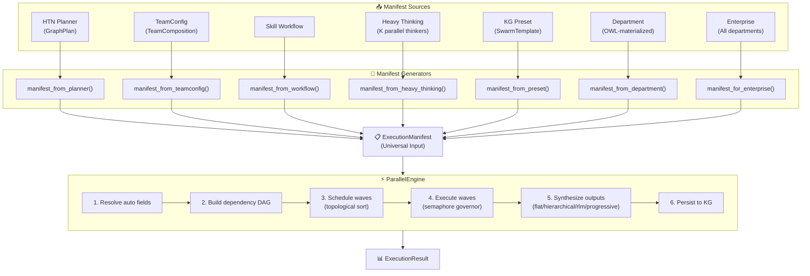
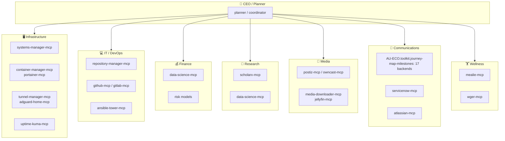

# CONCEPT:AU-ORCH.execution.parallel-engine-visualizer — Parallel Engine

> **Status**: Active
> **Pillar**: 1 — Graph Orchestration Engine (ORCH)
> **Replaces**: `GraphOrchestrator`, `HeavyThinkingOrchestrator`, `SubagentPatternRouter`, `CoordinationLayer` (standalone), `RLMEnvironment.run_parallel_sub_calls()`, `WorkflowRunner` wave execution

---

## Overview

The **Parallel Engine** (`ParallelEngine`) is the single, unified agent execution engine for the entire agent-utilities ecosystem. It handles every execution — from a trivial 1-agent LLM call to a 300-agent enterprise swarm — through the **same code path**.

### First Principles

1. **One Engine, Dynamic Scale**: A single `ParallelEngine` handles every execution. The same code path runs for all scales.
2. **RLM-Native Synthesis**: All output aggregation uses the RLM pattern — outputs are stored as Pydantic objects (not context windows), metadata-only pointers guide the synthesizer.
3. **Topology from Manifest**: The engine receives an `ExecutionManifest` generated from any source: planners, workflows, TeamConfigs, stored presets, or OWL-materialized company departments.
4. **XDG-Native Config**: All scaling parameters live in `~/.config/agent-utilities/config.json` via `AgentConfig`.

---

## Architecture



---

## Core Components

### ExecutionManifest

The universal input to the `ParallelEngine`. Every execution is expressed as a manifest.

**Key properties:**
- `agents: list[AgentSpec]` — The agents to execute
- `synthesis: SynthesisSpec` — How to merge outputs
- `execution_mode` — `auto | sequential | parallel | mixed | wave`
- `max_concurrency` — Override global semaphore
- `query` — Original user query

**Auto-resolution rules:**
| Agent Count | Execution Mode | Synthesis Strategy |
|---|---|---|
| 1 | sequential | flat |
| 2-5 (no deps) | parallel | flat |
| 6-10 | wave | flat |
| 11-50 | wave | hierarchical |
| 50+ | wave | rlm |

### AgentSpec

Specification for a single agent invocation. Fan-out is expressed via `partitions`: if set, the agent is invoked once per partition with `{{partition}}` replaced in `task_template`.

### SynthesisSpec (CONCEPT:AU-ORCH.execution.parallel-engine-visualizer)

Controls how outputs from parallel agents are merged:
- **flat**: Simple concatenation with headers — fast, no LLM cost
- **hierarchical**: Group → sub-summaries → final summary — O(log N) depth
- **progressive**: Incrementally merge as results arrive — streaming-friendly
- **rlm**: Full RLM environment for massive-scale programmatic synthesis

---

## Execution Flow

### 1. Manifest Resolution

```python
def _resolve_manifest(manifest: ExecutionManifest) -> ExecutionManifest:
    # execution_mode: sequential (1), parallel (≤5), wave (>5)
    # synthesis: flat (≤10), hierarchical (≤50), rlm (>50)
```

### 2. DAG Scheduling

Uses `graph_primitives.topological_generations()` (a dependency-free, rustworkx-compatible
shim in `knowledge_graph/core/graph_primitives.py`) to group agents by dependency level:

```python
# Agents with no dependencies → Wave 0
# Agents depending on Wave 0 → Wave 1
# etc.
# Within each wave, sub-batch by parallel_batch_size
```

### 3. Wave Execution

Each wave runs concurrently with `asyncio.Semaphore` backpressure:

```python
semaphore = asyncio.Semaphore(config.max_parallel_agents)  # Default: 60

async def _run_one(agent):
    async with semaphore:
        return await _execute_agent(agent)

results = await asyncio.gather(*[_run_one(a) for a in wave])
```

### 4. Circuit Breaker

Per-agent-type circuit breaker prevents cascading failures:
- Track consecutive failures per `agent_id`
- Open breaker after `circuit_breaker_threshold` (default: 3) consecutive failures
- Skip disabled agents with immediate failure result
- Reset on success

### 5. Output Synthesis

See **CONCEPT:AU-ORCH.execution.parallel-engine-visualizer** for detailed synthesis strategies.

---

## 🧬 Advanced Safety & Capabilities (Capability Wiring Engine)

When launching massively concurrent executions (e.g. 50+ agents or partition fan-outs), executing raw agents without safety rails is dangerous. The `ParallelEngine` leverages the **Capability Wiring Engine** (`create_agent` factory) to dynamically wire the following 8 critical safety capabilities onto every execution wave:

1. **Stuck-Loop Detection (`StuckLoopDetection`)**: Aborts agents caught in repetitive tool-use patterns or infinite loops before they drain rate limits or token budgets.
2. **Checkpointing (`CheckpointMiddleware`)**: Persists the execution state of each wave boundary to a file or graph store. If a downstream wave fails, execution can resume from the last successful wave boundary without re-running the entire swarm.
3. **Tool Output Eviction (`ToolOutputEviction`)**: Prunes excessively verbose tool return payloads (e.g., thousands of lines of output logs) before they overload context windows.
4. **Context Compaction (`ContextCompaction`)**: Dynamically summarizes or compresses the dialogue history during prolonged task execution.
5. **Human-in-the-Loop (`HITLApproval`)**: Pauses the sub-agent and solicits user validation before performing high-risk actions (e.g., deletes, pushes, payment broadcasts).
6. **Token-Rate Limiter (`TokenRateLimiter`)**: Governs concurrency rates to respect provider tokens-per-minute (TPM) and requests-per-minute (RPM) limits.
7. **Secrets Vault Integration (`SecretsVault`)**: Safely resolves environment variables and third-party credentials on demand at runtime.
8. **Logging & Tracing (`LangfuseLogger`)**: Emits structured spans and traces to Langfuse for auditing, performance analysis, and tracing.

### Topological Data-Flow (Context Injection)

To ensure that downstream agents can build on the insights and deliverables of upstream dependencies, the engine performs automatic **Topological Data-Flow Context Injection**:
- As waves complete, the result outputs from completed upstream parent agents are gathered.
- Before executing a downstream agent, the engine synthesizes these outputs into a structured `## DEPENDENCY OUTPUTS` block.
- This block is prepended directly to the downstream agent's task description, ensuring a clean, continuous flow of operational context.

### Auto-Healing & Self-Repair

When a sub-agent execution fails (e.g., due to temporary network issues, rate limits, or validation errors), the engine automatically triggers **Auto-Healing**:
- It attempts up to `max_retries` (default: 3) with exponential backoff.
- If a downstream agent fails due to syntax or schema mismatches in upstream inputs, the engine invokes a validation model to self-repair the payload and retries the step.

### Adversarial Verification

To ensure that final synthesized outputs meet extreme standards of quality and correctness, the engine can execute an **Adversarial Verification** pass:
- An independent assessor agent (`adversary`) is initialized to scrutinize the aggregated results.
- It analyzes the synthesized response against the original user query and execution constraints.
- If inconsistencies, hallucinated details, or gaps are discovered, the adversary generates a correction plan and triggers a self-correction repair cycle.

### Persisted KG Topology

Following execution, the entire topological hierarchy and execution results are persisted in the Graph-OS Knowledge Graph:
- A `ParallelExecution` node is created representing the orchestrator run.
- Individually executed `AgentExecutionResult` nodes are generated for each agent step.
- Directed `DEPENDS_ON` and `PARENT_RUN` edges are written to preserve the exact dependency DAG in the graph topology for long-term trace audit.

---

## Configuration (XDG)

All configuration lives in `~/.config/agent-utilities/config.json`:

```json
{
  "MAX_PARALLEL_AGENTS": 60,
  "PARALLEL_BATCH_SIZE": 25,
  "SYNTHESIS_STRATEGY": "auto",
  "SYNTHESIS_RATIO": 10,
  "AGENT_EXECUTION_TIMEOUT": 120.0,
  "CIRCUIT_BREAKER_THRESHOLD": 3,
  "ENABLE_PROGRESSIVE_SYNTHESIS": true
}
```

| Parameter | Default | Description |
|---|---|---|
| `MAX_PARALLEL_AGENTS` | 60 | Global semaphore limit |
| `PARALLEL_BATCH_SIZE` | 25 | Max agents per wave |
| `SYNTHESIS_STRATEGY` | auto | Output merging strategy |
| `SYNTHESIS_RATIO` | 10 | Outputs per hierarchical sub-node |
| `AGENT_EXECUTION_TIMEOUT` | 120.0 | Per-agent timeout (seconds) |
| `CIRCUIT_BREAKER_THRESHOLD` | 3 | Consecutive failures to trip breaker |
| `ENABLE_PROGRESSIVE_SYNTHESIS` | true | Stream synthesis as agents complete |

---

## Manifest Generators

### manifest_from_planner()
Converts `GraphPlan` steps into `AgentSpec` entries, preserving DAG dependencies.

### manifest_from_teamconfig()
Converts `TeamComposition` agent roster and execution mode into a manifest.

### manifest_from_workflow()
Converts Skill workflow `GraphPlan` steps with wave-based ordering.

### manifest_from_heavy_thinking() — *planned, not yet implemented*
Intended to create K parallel thinker agents + 1 deliberator with `depends_on=[all thinkers]`
to replace `HeavyThinkingOrchestrator`. **No `manifest_from_heavy_thinking()` function exists in
`graph/manifest_generators.py` yet** — heavy-thinking-style fan-out is currently expressed via a
generic preset/manifest with a deliberator step that `depends_on` the thinkers.

### manifest_from_preset()
Materializes named presets (fan_out_research, fan_out_audit, etc.) with partition-based fan-out.

### manifest_from_department() (CONCEPT:AU-ORCH.execution.autonomous-department-orchestration)
Queries the KG for agents in an OWL-materialized company department with `reportsTo` hierarchy.

### manifest_for_enterprise()
Full enterprise manifest — all agents across all departments. This is the 300-agent case.

---

## Company-Scale Topology (CONCEPT:AU-ORCH.execution.autonomous-department-orchestration)



---

## KG Integration

### Persisted Nodes

| Node Type | Created When | Contains |
|---|---|---|
| `ParallelExecution` | After each execution | manifest_id, agent_count, wave_count, success metrics |
| `AgentExecutionResult` | Per agent | output, duration, success, model_id |

> `_persist_execution()` currently writes a `ParallelExecution` node plus one
> `AgentExecutionResult` node per agent (connected by `HAS_RESULT`/`DEPENDS_ON` edges).
> A dedicated `SynthesisResult` node type (model: `core/analysis_models.py`) and an
> `ExecutionManifestTemplate` node for preset registration are not yet persisted by the
> engine — synthesis output is stored inline on the `ParallelExecution` node.

### OWL Classes (CONCEPT:AU-ORCH.execution.autonomous-department-orchestration)

```turtle
:Department rdfs:subClassOf :OrganizationalUnit
:AgentRole rdfs:subClassOf :Role
:ExecutionManifestTemplate rdfs:subClassOf :WorkflowTemplate
:hasDepartment rdfs:domain :Company ; rdfs:range :Department
:hasAgentRole rdfs:domain :Department ; rdfs:range :AgentRole
:usesTool rdfs:domain :AgentRole ; rdfs:range :MCPServer
:reportsTo rdfs:domain :AgentRole ; rdfs:range :AgentRole
```

---

## Related Concepts

| Concept | Relationship |
|---|---|
| ORCH-1.1 (HTN Planning) | Planner generates `GraphPlan` → `manifest_from_planner()` |
| ORCH-1.3 (Coordination) | `CoordinationLayer` is a subcomponent of `ParallelEngine` |
| ORCH-1.4 (Dynamic Subgraph) | `GraphOrchestrator.synthesize_team()` generates teams → `manifest_from_teamconfig()` |
| ORCH-1.8 (Synthesis) | Output synthesis strategies used by `ParallelEngine._synthesize()` |
| AU-ORCH.execution.autonomous-department-orchestration (Departments) | OWL-materialized departments → `manifest_from_department()` |
| AU-AHE.harness.self-evolution-narrative (Heavy Thinking) | K-parallel reasoning → `manifest_from_heavy_thinking()` |
| KG-2.6 (Company Ops) | Company topology stored in KG |
| RLM (ORCH-1.1) | RLM synthesis strategy for 50+ agent outputs |

---

## Code Modules

| File | Purpose |
|---|---|
| `models/execution_manifest.py` | Data models: `ExecutionManifest`, `AgentSpec`, `SynthesisSpec`, `ExecutionResult` |
| `graph/parallel_engine.py` | `ParallelEngine` — the single execution engine |
| `graph/manifest_generators.py` | All manifest generation functions |
| `core/config.py` | XDG config fields for `ParallelEngine` |
| `graph/coordination.py` | `CoordinationLayer` (subcomponent) |
