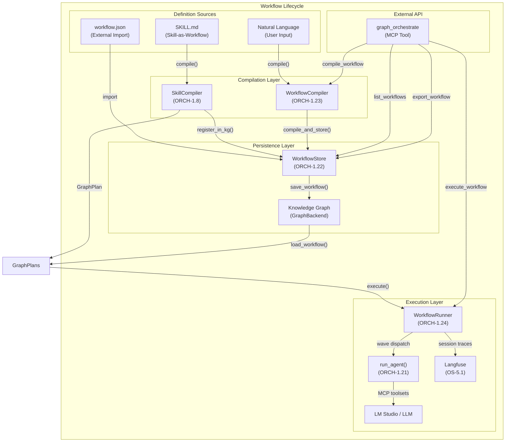

# ORCH-1.24: Workflow Lifecycle Management

## Concept ID
`CONCEPT:ORCH-1.24`

## Status
**Implemented** — v1.0

## Summary

Provides a unified system for defining, persisting, discovering, and
executing reusable agent workflows. The workflow lifecycle spans from
SKILL.md / natural-language definitions through KG persistence to live
multi-agent execution with full Langfuse tracing.

## Architecture



## Components

### SkillCompiler
**Module**: `agent_utilities.workflows.skill_compiler`

Compiles a `SKILL.md` (procedural steps) into a `GraphPlan` and
registers it in the KG via `WorkflowStore`. This replaces the former
static YAML catalog: any skill directory becomes a runnable workflow.

```python
from pathlib import Path
from agent_utilities.workflows.skill_compiler import SkillCompiler

# Compile a SKILL.md into a GraphPlan
plan = SkillCompiler.compile(Path("/path/to/skill_dir"))

# Register in KG (creates WorkflowDefinition + DEFINED_BY_SKILL edge)
outcome = SkillCompiler.register_in_kg(engine, Path("/path/to/skill_dir"))
```

Persisted workflows are then discovered and version-managed by the
`WorkflowStore` (`agent_utilities.knowledge_graph.workflow_store`),
which auto-increments the version on re-registration.

### WorkflowRunner
**Module**: `agent_utilities.workflows.runner`

Executes stored `GraphPlan` workflows step-by-step using the
agent_runner pipeline:

1. **Wave Builder** — Groups steps by dependency into concurrent waves
2. **Parallel Execution** — Runs independent steps via `asyncio.gather()`
3. **Context Injection** — Passes prior step outputs to dependent steps
4. **Langfuse Session** — Groups all traces under a single session ID
5. **KG Provenance** — Records `RunTrace` nodes for audit

```python
from agent_utilities.workflows.runner import WorkflowRunner

runner = WorkflowRunner()
result = await runner.execute_by_name("container_health_check", engine)
print(result.summary())
print(result.mermaid)
```

### MCP Surface
**Tool**: `graph_orchestrate`

External agents consume workflows via four new actions:

| Action | Description |
|--------|-------------|
| `compile_workflow` | NL → GraphPlan → KG persistence |
| `list_workflows` | List stored workflow definitions |
| `execute_workflow` | Load and run a stored workflow. Supports `completion_state` and `max_fan_out` for dynamic adversarial execution loops. |
| `export_workflow` | Export a workflow as JSON |

### Dynamic Workflow Execution

Workflows can optionally be executed in an autonomous, adversarial loop by specifying a `completion_state`. When this parameter is provided, the `execute_workflow` action shifts from a linear execution path to an iterative convergence loop:

1. **Parallel Fan-Out**: The engine spawns up to `max_fan_out` (default: 5) parallel subagents to attempt the goal.
2. **Adversarial Verification**: Results are synthesized and passed through a secondary `run_adversarial_pass` verifier to check if the `completion_state` has been met.
3. **Feedback Loop**: Failures generate specific feedback fed into the next iteration.
4. **GitOps Integration**: Upon successful convergence, a dedicated `pr_submitter` agent automatically commits changes and submits a Pull Request.

## KG Schema

### Nodes
- **WorkflowDefinition** — Top-level workflow with name, version, description
- **WorkflowStep** — Individual step with agent, task, expected outcomes
- **RunTrace** — Execution record with status, duration, outputs

### Relationships
- `HAS_STEP` — WorkflowDefinition → WorkflowStep
- `TRANSITION_TO` — WorkflowStep → WorkflowStep (dependency)
- `REQUIRES_TOOL` — WorkflowStep → MCPServer/Skill/NativeTool
- `DERIVED_FROM` — RunTrace → WorkflowDefinition

## Version Strategy

When a workflow is re-registered (e.g., catalog updated), the
`WorkflowStore` checks for an existing definition with the same name.
If found, it auto-increments the version number rather than overwriting.
This preserves historical workflow definitions for audit and rollback.

## Workflow Sources

Workflows are no longer shipped as a single embedded YAML catalog.
The authoritative source of a runnable workflow is one of:
1. **SKILL.md** — any skill directory, compiled on demand via `SkillCompiler`.
2. **Natural language** — compiled via `WorkflowCompiler` (ORCH-1.23).
3. **KG persistence** — once registered, definitions live as `WorkflowDefinition`
   nodes in the KG and are discovered via `WorkflowStore`.

A human-reference example catalog remains at
`docs/examples/workflows/catalog.yaml` for documentation purposes only.

## Dependencies

- `ORCH-1.21` — Agent Runner (step execution)
- `ORCH-1.22` — WorkflowStore (KG persistence)
- `ORCH-1.23` — WorkflowCompiler (NL compilation)
- `KG-2.0` — Knowledge Graph Engine (storage)
- `OS-5.1` — Observability / Langfuse (tracing)

## Testing

```bash
# Structural tests (no LLM)
pytest tests/test_dynamic_workflow.py -v -k "not live"
pytest tests/test_mcp_orchestrate.py tests/test_orchestrate_mcp.py -v -k "not live"

# Live tests (LM Studio + MCP servers)
pytest tests/test_mcp_orchestrate.py -v -m live
```
