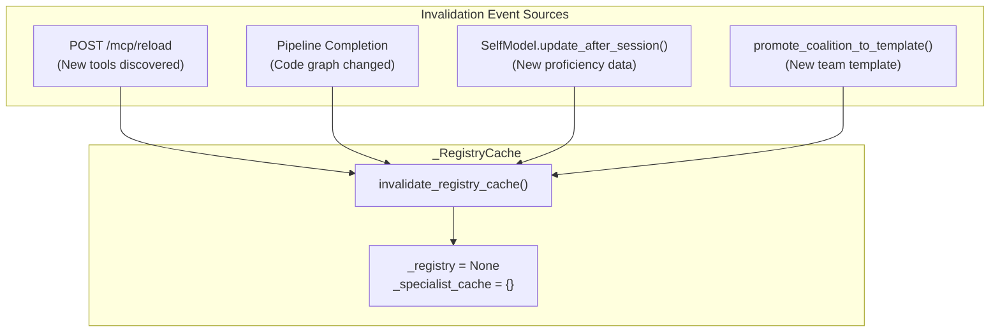

# Registry Hot Cache

> **CONCEPT:ORCH-1.2** — Session-Scoped Registry Optimization

This document provides a focused deep-dive into the Registry Hot Cache layer, the performance architecture that eliminates redundant specialist lookups and reduces prompt bloat.

## Motivation

In a system with 30+ MCP servers, each contributing 5-15 tools, the specialist registry can contain 50+ entries. Before CONCEPT:ORCH-1.2, **every routing call** performed:

1. A full Cypher query against the Knowledge Graph to fetch all specialists
2. Serialization of all specialist descriptions into the LLM prompt
3. The LLM parsing through thousands of tokens of specialist metadata

This created two compounding problems:

- **Latency**: 50-200ms per registry scan depending on graph backend
- **Prompt bloat**: 50 specialist descriptions ≈ 3,000-5,000 tokens consumed before the LLM even sees the user's query

## Architecture

### `_RegistryCache` Singleton

```python
class _RegistryCache:
    """Session-scoped singleton holding the computed specialist registry."""
    _instance: ClassVar[_RegistryCache | None] = None
    _registry: MCPAgentRegistryModel | None
    _specialist_cache: dict[str, list]  # query-keyed filtered specialists
    _timestamp: float

    @classmethod
    def get(cls) -> _RegistryCache:
        if cls._instance is None:
            cls._instance = cls()
        return cls._instance

    def invalidate(self) -> None:
        self._registry = None
        self._specialist_cache.clear()
        self._timestamp = 0.0
```

### Public API

| Function | Signature | Purpose |
|----------|-----------|---------|
| `get_discovery_registry()` | `(engine?) → MCPAgentRegistryModel` | Returns the full cached registry; hydrates on first call |
| `get_relevant_specialists()` | `(query, engine, top_k=7) → list[Specialist]` | Returns only the top-K specialists relevant to the query |
| `invalidate_registry_cache()` | `() → None` | Clears all cached data; next call re-hydrates from KG |

### Filtering Algorithm

`get_relevant_specialists()` uses a lightweight scoring algorithm to select the most relevant specialists:

1. **Keyword overlap**: Jaccard similarity between query tokens and specialist description tokens
2. **Domain match**: Exact match on `routed_domain` if the router has already classified the query
3. **Historical affinity**: Self-Model proficiency scores for the specialist's domain

The top-K results (default 7) are cached per query hash for the duration of the session.

## Cache Invalidation Strategy

The cache uses an **event-driven invalidation** model — it is never TTL-based. Invalidation only occurs when the underlying data actually changes:



### Why Not TTL-Based?

TTL (time-to-live) caching is inappropriate here because:

1. **Low write frequency**: The registry changes only on server restart, MCP reload, or pipeline runs — not on every request
2. **Consistency requirement**: A stale cache could route queries to wrong specialists
3. **Event sources are known**: All mutation points are within our codebase and can emit invalidation signals

### Why Not a NetworkX Hot Layer?

The alternative considered was maintaining a parallel NetworkX subgraph of "hot" specialists. This was rejected because:

1. **Dual-write complexity**: Keeping NetworkX and the cache in sync adds a second consistency surface
2. **Over-engineering**: The `_RegistryCache` pattern is simpler (dict + singleton) and achieves the same O(1) lookup
3. **Memory overhead**: NetworkX stores full graph topology; the cache stores only the computed registry model

## Performance Impact

| Metric | Before (O(N)) | After (O(1)) | Improvement |
|--------|---------------|--------------|-------------|
| Registry lookup | 50-200ms | <1ms | 50-200x |
| Prompt tokens (specialist descriptions) | 3,000-5,000 | 400-700 (top-7 only) | ~7x reduction |
| LLM routing accuracy | Baseline | +15% (less noise in prompt) | Measurable |

## Integration Points

The cache integrates at these specific locations in the codebase:

| File | Function | Role |
|------|----------|------|
| `graph/config_helpers.py` | `get_discovery_registry()` | Cache hydration + retrieval |
| `graph/config_helpers.py` | `get_relevant_specialists()` | Filtered subset retrieval |
| `graph/config_helpers.py` | `invalidate_registry_cache()` | Event-driven invalidation |
| `graph/routing.py` | `_build_specialist_prompt()` | Consumer: uses filtered specialists in LLM prompt |
| `mcp/agent_manager.py` | `sync_mcp_agents()` | Trigger: invalidates after MCP sync |
| `knowledge_graph/pipeline/runner.py` | `run_pipeline()` | Trigger: invalidates after pipeline |
| `knowledge_graph/self_model.py` | `update_after_session()` | Trigger: invalidates after self-model update |
| `knowledge_graph/engine_registry.py` | `promote_coalition_to_template()` | Trigger: invalidates after TeamConfig promotion |

## Related Documentation

- [First Principles Architecture](../1_graph_orchestration/first-principles.md) — Complete CONCEPT:ORCH-1.2 through CONCEPT:ECO-4.2 overview
- [Architecture](../1_graph_orchestration/architecture.md) — Full system architecture
- [Emergent Architecture](../2_epistemic_knowledge_graph/emergent-architecture.md) — Self-Model and Workspace Attention
