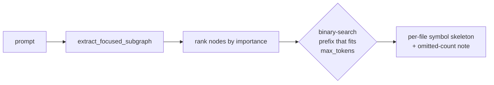

# Pillar 2: Epistemic Knowledge Graph

## Overview

The **Epistemic Knowledge Graph** transforms how the agent ecosystem perceives, stores, and retrieves information. It replaces static vector-based Retrieval-Augmented Generation (RAG) with a dynamic, graph-native, and self-organizing memory substrate that leverages formal mathematics and topological reasoning.

## Why We Built This (Rationale)

Standard RAG architectures suffer from three critical flaws that block Agentic General Intelligence (AGI):
1. **Context Fragmentation**: Vector databases retrieve isolated chunks without understanding structural dependencies, leading to "hallucinations" when synthesizing complex concepts.
2. **Retrieval Degradation (O(N) Scanning)**: As memory grows, scanning all vectors becomes computationally expensive and introduces irrelevant noise.
3. **Poisoning and Contradictions**: Agents continually ingesting data can overwrite critical instructions or believe contradictory facts if there is no epistemological verification.

## How It Works (Implementation)

The solution is a unified `IngestionEngine` and layered `GraphBackend` (PostgreSQL/pg-age + the Rust `epistemic-graph` durable tier), with NetworkX retained as an ephemeral in-memory compute scratchpad.

### RAG-KG Unification & Spectral Clustering (KG-2.38 & KG-2.34)
We collapsed separate vector indexes directly into the Knowledge Graph. By computing an **Auto-Similarity Memory Graph**, the system pre-computes semantic proximity and creates `SIMILAR_TO` edges. Retrieval is now accelerated to O(degree) complexity via shortest-path traversal. The **Spectral Cluster Navigator** groups these nodes using normalized Laplacian eigengap heuristics, providing hierarchy-aware context scoping.

### Multi-Domain Architecture (KG-2.51)
Transitioned the agent framework into a **Multi-Domain Expert System**, supporting modular expansion into `finance`, `medical`, `law`, and `science`. The architecture relies on Vectorized Topological Memory and the core Knowledge Graph for semantic interoperability. Domain-specific dependencies (e.g., PyTorch, Statsmodels for quantitative finance) are loaded optionally via environment tags (like `agent-utilities[finance]`) to keep the core graph orchestrator lightweight.

### Enterprise Architecture Scaling (Hub-and-Spoke Ingestion)
To support 100,000+ employees and scale to true enterprise size, the architecture has decoupled its localized NetworkX memory from the persistent Backend. NetworkX now serves purely as an **ephemeral compute scratchpad** for localized sub-graph analytics, preventing Out-Of-Memory (OOM) bottlenecks.
Furthermore, raw data ingestion (e.g., Active Directory, Workday, ServiceNow) is externalized to peripheral "spoke" agents. These webhooks utilize high-throughput asynchronous batched `UNWIND` logic directly into the central graph.

### High-Throughput Stream Ingestion & Shared Ephemeral Memory (CONCEPT:KG-2.7)
To scale to massive workloads (100K+ employees, tens of thousands of active codebases, and continuous AI chat streams), the system incorporates a unified stream hydration and cache fabric:

1. **High-Throughput Parallel Stream Hydration**: Consumes large data streams from external enterprise systems (ServiceNow incidents, GitLab repositories/pipelines, etc.) in parallel. Rather than relying on LLMs to translate unstructured text into graph representations, the pipeline utilizes schema-compliant, rigid R2RML mappings. These map raw JSON structures directly to formal ontology classes (like `au:Incident`, `au:Repository`, `au:Pipeline`), guaranteeing zero hallucination, predictable execution paths, and complete semantic alignment.
2. **Shared Ephemeral Cache Fabric**: Enables stateless, short-lived agents and communication channels to share context instantly. The cache fabric is powered by a standard connection URI supporting Redis and Valkey (`redis://` or `valkey://`) with serializable payloads, falling back to a structured local directory namespaces architecture.
3. **Dynamic TTL Eviction**: Prevents graph pollution from transient conversational memories. Nodes and edges ingested into ephemeral namespaces are decorated with explicit temporal boundaries (`ttl` and `created_at`). A periodic background task (`cleanup_expired_namespaces`) automatically sweeps and purges expired namespaces from the graph.

### Deterministic Garbage Collection (Mark-and-Sweep)
To maintain 1:1 parity between external file systems and the Knowledge Graph, the system utilizes a **Mark-and-Sweep Synchronization** approach:
- **Mark**: During ingestion, every parsed file (e.g., `:Code` or `:Article` nodes) is tagged with a session-specific `last_seen_timestamp` in the pipeline context.
- **Sweep**: After parsing concludes, a cleanup Cypher query automatically detaches and deletes any nodes in the active workspace scope that have an older timestamp.
- **Handling Duplicates/Updates**: Because upserts are idempotent and keyed on `id`, repeatedly ingesting the same file naturally updates its properties rather than creating duplicates.
- **MD5 Checksums vs Timestamps**: We explicitly opted for temporal mark-and-sweep over md5 checksum tracking. Checksum tracking introduces significant state overhead and collision complexities. In contrast, timestamp-based pruning is an atomic and stateless mechanism that natively drops deleted files while gracefully updating modified ones.

### Graph-Level Access Control (RBAC/ABAC)
Security is enforced natively on the read path. Node ACLs (`DataLevelPermissions` —
classification + read/write roles) and tenant scoping are applied at retrieval time
via `core/secured_reads.py` and the guarded `facade.designate`/`facade.query`, so
agents cannot retrieve restricted sub-graphs (like executive compensation data)
regardless of the prompt. Enforcement is gated by **`KG_BRAIN_ENFORCE`** (off by
default for backward compatibility); identity is carried by an `ActorContext`. See
**[Company Brain Runtime](../architecture/company_brain_runtime.md)** for the full
wiring.

### Entailment-Aware Permission Scoper (CONCEPT:KG-2.6 / KG-2.7)
Logical inferences inherit their parents' secrecy. When `owl_bridge` downfeeds an
inferred relationship (e.g. `dependsOn` transitivity), `secured_reads.inherit_inferred_acl`
sets the inferred target's `DataClassification` to the **strictest** of its premise
nodes, so implicitly reasoned knowledge can never bypass the classification
perimeter. Active under `KG_BRAIN_ENFORCE`.

### Semantic Subsumption & Inductive Hypergraphs (KG-2.2 & KG-2.4)
When new information is encountered, **OWL-Driven Semantic Subsumption** automatically computes embedding similarities against OWL class prototypes, injecting the new concept into the correct lineage. **Inductive Knowledge Hypergraphs** vectorize relationship intersections via `EncPI` (Positional Interaction Encodings), enabling the graph to perform zero-shot generalization over entirely novel runtime topologies.

### Rust-Compiled Epistemic Reasoning Backend (CONCEPT:KG-2.6)
The core OWL reasoning engine has transitioned to using a high-performance **Rust-Compiled Epistemic Backend** (`Jena Fuseki / EpistemicGraph ComputeDatalogBackend`) as the framework-wide default. By leveraging `epistemic-graph` via Unix Sockets and under-the-hood `pyjena_fuseki` serialization, the backend completely bypasses the legacy Java Virtual Machine (JVM) overhead of `owlready2`.

It performs high-performance, compiled Datalog forward-chaining reasoning directly in Rust with standard OWL structural inference rules:
- **Subclass Transitivity**: Propagates hierarchical node typing down class inheritance lineages.
- **Subproperty Transitivity**: Matches and infers subproperty roles.
- **Symmetric & Inverse Properties**: Automatically populates reciprocal relationships (e.g., `partnerOf` reciprocity, or `childOf` translating to `parentOf`).
- **Transitive Properties**: Infers paths across transitive edge networks (e.g., `dependsOn`).

### High-Performance Quant FFI Engine (CONCEPT:KG-2.7)
To support advanced quantitative reasoning and high-throughput financial factor analysis natively within the agent’s execution stack, the `epistemic-graph` integrates native vectorized computing primitives:
- **Vectorized Moving Averages & Variance**: `moving_average`, `exponential_moving_average`, `rolling_variance`, and `rolling_zscore` calculated over arbitrary streaming windows at C-speed.
- **High-Performance Order Book Matching**: Native tick simulation (`simulate_order_matching`) matching bidirectional buy/sell orders against streaming L2 limits to simulate trade executions in real-time.

### Formal Mathematical Primitives (KG-2.41 — KG-2.49)
We integrated advanced primitives from the MIT Mathematics for Computer Science (MCS) curriculum:
- **Formal Relations (KG-2.47)**: Enforces Reflexive, Symmetric, and Transitive closures for zero-shot entity resolution.
- **State Machine Invariants (KG-2.48)**: Validates deterministic transitions against structural invariants.
- **Markov Transition Forecasting (KG-2.49)**: Predicts statistical failure nodes in execution traces. Extended with:
  - **Chapman-Kolmogorov Multi-Step Forecasting**: N-step transition probabilities via matrix powers for long-horizon prediction.
  - **Markov Regime Detection**: Three-state (Bull/Bear/Sideways) market regime classification from financial time-series with per-asset-class default thresholds (equities, crypto, forex, commodities, fixed income).
  - **Hidden Markov Model Inference**: Gaussian HMM with Baum-Welch estimation and Viterbi decoding for latent regime detection (`hmmlearn` integration).
  - **Walk-Forward Backtesting**: Rolling-window regime model re-estimation with strict no-lookahead bias guarantees.
  - **PreemptiveCacheEngine Integration**: `predict_next_states()` satisfies the forecaster contract for predictive context pre-loading.
- **Structural Causal Reasoning (KG-2.43)**: Utilizes do-calculus and d-separation to perform counterfactual analysis, moving beyond correlation to causal verification.

## Ontology System (Palantir-Foundry-parity)

On top of the epistemic graph sits a **first-class ontology layer**
(`agent_utilities/knowledge_graph/ontology/`), reached through `kg.ontology`
(`KnowledgeGraph.ontology` → `OntologySystem`). It mirrors the Palantir Foundry /
AIP object model — interfaces, value/property types, functions, derived properties,
action types, durable edits, indexing, object sets, fine-grained permissioning, and
document processing — but binds those registries to the **same live backend** the
rest of the KG uses (store / `owl_bridge` semantic / retrieval), so it is not a
parallel shell: interface targeting, derived-property compute, Functions-on-Objects,
and ACL enforcement all resolve against the real graph. Provenance for each module
is cited in its docstring against the Foundry docs; identifiers are named from
purpose, never the vendor.

- **Interfaces (CONCEPT:KG-2.38)** — abstract shapes a concrete object type implements;
  the programmatic-targeting resolver expands an interface name to its implementers.
- **Value types (CONCEPT:KG-2.39)** — constrained semantic types (EmailAddress,
  Percentage, …) compiled to reusable SHACL `sh:PropertyShape` / named `rdfs:Datatype`
  and gated by the SHACL validator on write.
- **Derived properties (CONCEPT:KG-2.40)** — read-time computed properties dispatched
  across `FUNCTION / CYPHER / SPARQL / EMBEDDING`.
- **Functions (CONCEPT:KG-2.41)** — typed, versioned, governed user functions
  (`PLAIN | ON_OBJECTS | QUERY`) over a single audited runtime.
- **Action types (CONCEPT:KG-2.42, `knowledge_graph/actions/`)** — submission-criteria-gated,
  typed-side-effecting, batchable, notification/webhook-dispatching, and **revertable**
  actions over the edit ledger.
- **Durable object edits (CONCEPT:KG-2.43)** — a bitemporal edit ledger (`EditLedger`,
  `JsonlEditSink`, `WriteBackRouter`) with per-object history and `revert_edit` / `revert_object`.
- **Indexing lifecycle (CONCEPT:KG-2.44)** — content-hashed `ObjectIndexFunnel` +
  `StalenessLedger` driving the same live search index.
- **Object Set service (CONCEPT:KG-2.45)** — composable handles with
  `filter` / `search` / `search_around` / `pivot` / `aggregate` and set algebra.
- **Fine-grained permissioning (CONCEPT:KG-2.46)** — entailment-aware ACL **marking
  propagation** + `restricted_view` row-drop and `enforce` on the read path.
- **Property types (CONCEPT:KG-2.47)** — the scalar/geo/vector-embedding/array/struct type
  vocabulary that drives node-table column DDL and write-path coercion (`column_type_for`).
- **Document processing (CONCEPT:KG-2.48)** — extract → chunk → embed → link
  (`DocumentProcessor`, `process_document`).
- **Document → atomic-triple fact extraction (CONCEPT:KG-2.64/2.65/2.66)** — a document,
  URL, or pasted text becomes canonical `(subject) -[predicate]-> (object)` fact edges with
  evidence span, confidence, and tags; facts stream live, dedup semantically against our own
  embedder, and persist as engine edges (variant node names merged). Runs on a single-GPU-slot
  scheduler (preempt/backfill/resume) and is rendered interactively in all three frontends. See
  [Document → KG Fact Extraction](../architecture/document_fact_extraction.md).
- **First-class / reified links (CONCEPT:KG-2.26)** — named directed link types plus
  many-to-many junction reification onto the existing graph-write path, with reverse traversal.

The layer is exposed over the `ontology_*` MCP tools (`mcp/kg_server.py`) and an operator
UI in agent-webui — `/api/enhanced/ontology/*` routes plus the **ObjectExplorerView /
ObjectView / VertexView** views. **Unique value-adds vs Foundry**: OWL/SHACL-backed
interfaces + value types (reasoning + validation), embedding/cypher/sparql-backed derived
properties, reified junction links, entailment-aware ACL marking propagation, a bitemporal
edit history, a self-evolving ontology, and the Rust epistemic engine underneath.

## Benefits Introduced

- **Provable Safety**: Formal state machines and causal reasoning provide mathematical guarantees against infinite loops and logical paradoxes.
- **Retrieval Precision**: The `Hybrid Search Index` combining semantic+keyword scoring (72%/28%), augmented by `Backlink-Density Boost`, yields unmatched relevance, fetching central hub concepts naturally.
- **Epistemic Integrity**: The two-phase Entity-Claim Extraction extracts assertions and explicitly maps contradictions (`CONTRADICTS` edge), ensuring the system maintains a logically consistent worldview.

## Key Concepts Leveraged
- **KG-2.0**: Active Knowledge Graph
- **KG-2.2**: Ontology & Epistemics (Semantic Subsumption)
- **KG-2.4**: Inductive Knowledge Hypergraphs
- **KG-2.3**: Vectorized Retrieval
- **KG-2.7**: Centralized Epistemic Gateway & Transaction Proxy
- **KG-2.7**: Compiled Rust & Rustworkx Compute Engine 🔬
- **KG-2.7**: Rust-Compiled Epistemic Reasoning Backend
- **KG-2.7**: High-Performance Quant FFI Engine
- **KG-2.21**: Multi-Timescale Memory
- **KG-2.26**: First-Class / Reified Junction Links (Ontology System)
- **KG-2.34**: Spectral Cluster Navigator
- **KG-2.38**: RAG-KG Unification / Ontology Interfaces
- **KG-2.39 / 2.40 / 2.41 / 2.42 / 2.43 / 2.44 / 2.45 / 2.46 / 2.47 / 2.48**: Ontology System (value types, derived properties, functions, action types, durable edits, indexing lifecycle, object sets, fine-grained permissioning, property types, document processing) — Palantir-Foundry-parity
- **KG-2.41–2.49**: Formal Mathematics, Causal Reasoning, and Optimal Execution
- **KG-2.51**: Multi-Domain Architecture
- **KG-2.7**: High-Throughput Stream Ingestion & Shared Ephemeral Memory
- **KG-2.7**: Ontology Alignment Bridge
- **KG-2.7**: Entailment-Aware Permission Scoper
- **KG-2.6**: Context Graph Architecture (SPARQL, ArchiMate, ADR)

## Enterprise Ontology Alignments

The Knowledge Graph is heavily aligned with the **Basic Formal Ontology (BFO)** and other industry standards, enabling enterprise-scale deployments:
- **BFO (Basic Formal Ontology)**: Provides a mathematically sound upper ontology, allowing transitive reasoning for critical structural analysis (e.g., blast-radius detection via `dependsOn`).
- **PROV-O (Provenance Ontology)**: Ensures every action or fact injected into the graph is completely auditable (`wasDerivedFrom`, `wasAttributedTo`), which is non-negotiable for regulated enterprise environments.
- **SKOS (Simple Knowledge Organization System)**: Enables semantic mapping between internal proprietary terminology and industry-standard vocabularies dynamically (`broader`, `narrower`, `exactMatch`).
- **Dublin Core**: Provides standard metadata tracing for documents, datasets, and codebase artifacts.
- **ArchiMate 3.2**: Enterprise architecture types (`BusinessRole`, `ApplicationComponent`, `BusinessProcess`) are registered in both the OWL ontology (`ontology.ttl`) and the Python graph schema (`schema_definition.py`), enabling cross-repository capability mapping.

### Ontology Alignment Bridge (CONCEPT:KG-2.7)
The **Ontology Alignment Bridge** organically unifies disparate silos (e.g., EARs vs. BPM tools vs. ServiceNow). When hydrating from disjoint domains, the system compares topological embeddings via `cosine_similarity`. Structurally equivalent conceptual nodes are automatically linked via `owl:sameAs` (materialized as `:SAME_AS`). This enables downstream tasks like graph traversal or RAG pipelines to reason across platforms without requiring manual ETL harmonization.

## Continuous Ingestion (Git Hook Pipeline)

The Knowledge Graph maintains currency with codebase changes through a **post-commit hook** pipeline:

1. **`scripts/install_git_hooks.py`**: Deploys `.git/hooks/post-commit` to all repositories in the workspace.
2. **`.git/hooks/post-commit`**: On each commit, invokes `scripts/submit_diff.py` with the latest diff.
3. **`scripts/submit_diff.py`**: Bridges the git hook to the KG task queue via `engine.submit_task(task_type="diff")`.
4. **`engine_tasks.py`**: The `TaskManagerMixin` processes diff tasks, creating `DiffEntry` nodes that link the patch content to the originating repository.

This ensures the Knowledge Graph stays synchronized with the active development state without requiring manual re-ingestion.

## Entity Lifecycle Management

All graph nodes follow a converged lifecycle state machine:

```
ACTIVE ──(soft-delete)──▶ ARCHIVED ──(hard-delete)──▶ REMOVED
   ▲                         │
   └──────(restore)──────────┘
```

- **`status: ACTIVE`** — Default state. Node is included in all search and retrieval operations.
- **`status: ARCHIVED`** — Soft-deleted. Excluded from `search_hybrid()`, `_search_keyword()`, and `discover_all_capabilities()`. Can be restored via `DocumentDeletionPipeline.restore_document()`.
- **`status: DEPRECATED`** — Marked for eventual removal but still discoverable for migration purposes.
- **Hard deletion** — Permanently removed from the graph after age-based cleanup (`DocumentCleanup.cleanup_soft_deleted_documents()`).

This lifecycle is enforced uniformly across:
- `QueryMixin` (engine_query.py) — Search-time filtering
- `DocumentDeletionPipeline` (document_deletion.py) — Soft-delete/restore operations
- `DocumentUpdatePipeline` (document_update.py) — Update rejection for archived nodes
- `DocumentCleanup` (document_cleanup.py) — Age-based hard deletion

## Context Graph Architecture (KG-2.6)

The Knowledge Graph implements the **Context Graph Architecture** pattern, formalizing the decision trace, enterprise governance, and semantic interoperability layers that turn a fragmented graph into a unified intelligence substrate.

### Architecture Decision Records (ADR)

`ArchitectureDecisionRecord` is a first-class KG node type that captures the full decision context:
- **Context**: Why the decision was needed
- **Decision**: What was decided
- **Rationale**: Why this option was chosen
- **Alternatives**: Options that were considered
- **Consequences**: Known tradeoffs
- **Authority**: Who/what approved (user, policy, evolution daemon)
- **Impacted Concepts**: Which concept IDs are affected

ADR lifecycle: `proposed → accepted → deprecated → superseded`

The `supersedes` relationship is declared as an OWL `TransitiveProperty`, enabling full decision lineage queries (if ADR-C supersedes ADR-B supersedes ADR-A, then ADR-C transitively supersedes ADR-A).

### ArchiMate EA Governance Layer

The `ArchiMateLayer` module (`core/archimate_layer.py`) maps KG node types to **ArchiMate 3.2** metamodel elements across five layers:

| Layer | KG Types | ArchiMate Types |
|-------|----------|----------------|
| **Business** | Policy, ProcessFlow, Organization, Role, Team | BusinessRule, BusinessProcess, BusinessActor |
| **Application** | Agent, Tool, Skill, SystemPrompt | ApplicationComponent, ApplicationService |
| **Technology** | Server, DataConnector, Pipeline, Repository | TechnologyService, Node, Artifact |
| **Strategy** | Concept, Capability, Experiment, ADR | Capability, CourseOfAction |
| **Motivation** | Goal, Principle, Regulation, EngineeringRule | Goal, Principle, Constraint, Requirement |

This enables enterprise-architecture-level views and governance over the agent ecosystem.

### Domain Configuration: Schema Packs vs Knowledge Packs (KG-2.2 & KG-2.6)

To modularize intelligence by domain (e.g., finance, biomedical), the system separates structural definitions from actual instances:

- **SchemaPacks (Structure)**: Defines the *allowed vocabulary* for a domain. A SchemaPack specifies which ontology node types (e.g., `TRADING_STRATEGY`, `FINANCIAL_INSTRUMENT`) and edge types are active, as well as retrieval boosts and inference rules. It does not contain data.
- **KnowledgePacks (Data)**: Defines the *actual instances* of data. A KnowledgePack is an exportable, human-readable bundle (YAML/JSON) of specific nodes and edges (e.g., specific whitepapers, github repositories, entities) that can be deterministically seeded into the graph.

This strict separation guarantees that exported domain knowledge is consistently formatted as human-readable Knowledge Graph primitives, allowing agents to hot-swap intelligence packs.

### SPARQL Read-Only Endpoint

The OWL bridge (`core/owl_bridge.py`) provides a SPARQL read-only interface via `rdflib` materialization:

1. **rdflib Materialization**: The LPG is materialized into an in-memory `rdflib.Graph` with typed individuals and property assertions under the `au:` namespace.
2. **Query Execution**: Full SPARQL SELECT, ASK, and CONSTRUCT queries are supported.
3. **Cache**: The RDF graph is cached and invalidated when the LPG changes.
4. **Programmatic Access**: Available via `OWLBridge.query_sparql()` for direct SPARQL queries (and the standalone W3C SPARQL HTTP endpoint below).

This enables Semantic Web interoperability without requiring a native SPARQL triplestore.

### SPARQL HTTP Endpoint

The `SPARQLEndpoint` class (`core/sparql_http.py`) provides a **W3C SPARQL Protocol**-compliant HTTP interface:

- **GET/POST** handlers with `?query=` parameter
- **Content negotiation**: `application/sparql-results+json`, `text/turtle`
- Returns standard **W3C SPARQL Results JSON** format
- Mountable as a Starlette ASGI app onto FastMCP

This allows other agent-utilities deployments to consume the KG as a standard SPARQL endpoint over HTTP.

### SDD Ontology Layer

The Spec-Driven Development ontology (`ontology_sdd.ttl`) formalizes the SDD workflow into OWL classes mapped to ArchiMate 3.2:

| SDD Class | OWL Parent | ArchiMate Layer → Type |
|-----------|-----------|----------------------|
| `Specification` | bfo:GDC | Strategy → Capability |
| `SoftwareFeature` | bfo:GDC | Application → ApplicationFunction |
| `Requirement` | Specification | Motivation → Requirement |
| `UserStory` | Requirement | Motivation → Requirement |
| `AcceptanceCriteria` | Specification | Motivation → Requirement |
| `SoftwareComponent` | bfo:IC | Application → ApplicationComponent |
| `APIContract` | bfo:GDC | Application → ApplicationInterface |
| `TestCase` | bfo:Process | Application → ApplicationFunction |
| `DesignGuideline` | Principle | Motivation → Principle |
| `ComplianceConstraint` | Regulation | Motivation → Constraint |

SDD properties include `realizes`, `specifies`, `testedBy`, `constrainedBy`, `guidelineFor`, `implementedBy`, `exposesAPI`, and `derivedFrom` (transitive).

### Enterprise Core Ontology

The `ontology_enterprise.ttl` module extracts the governance-relevant subset into a standalone importable standard:

- **ArchiMate 3.2 layer hierarchy** (Business, Application, Technology, Strategy, Motivation)
- **ADR decision trace** classes and properties
- **Enterprise governance** properties (`governedBy`, `enforces`, `complianceStatus`)
- **Enterprise integration points**: `EAFactSheet` and `ProcessModel` classes for EA and BPM tool interoperability
- `externalToolId` property for linking KG nodes to external EA tools

Domain deployments import via `owl:imports <http://knuckles.team/kg/enterprise>`.

### Modular Ontology Architecture

The ontology is organized into domain modules following the `owl:imports` pattern:

```
ontology.ttl                → Core upper ontology (BFO, PROV-O, SKOS)
├── owl:imports enterprise  → ArchiMate, ADR, governance
├── owl:imports sdd         → Spec-driven development classes
└── Domain modules:
    ├── ontology_banking.ttl     → ISO 20022, KYC/AML, Basel III
    ├── ontology_government.ttl  → Government-specific
    ├── ontology_hr.ttl          → Human resources
    ├── ontology_legal.ttl       → Legal domain
    └── ontology_medical.ttl     → Healthcare/medical
```

The `OntologyLoader` (`core/ontology_loader.py`) resolves `owl:imports` declarations at runtime, fetching remote ontologies via HTTP with TTL-based caching.

### Vendor-Neutral Enterprise Crosswalk (CONCEPT:KG-2.9)

The enterprise rarely runs one vendor per capability — ServiceNow *or* ERPNext for
ITSM, Camunda *or* Archi for processes. The crosswalk makes reasoning
**vendor-neutral**: each per-system class is related to one canonical
ArchiMate-aligned concept in `ontology_archimate.ttl`, so a single query resolves
all sources regardless of which product produced the data.

```turtle
:Incident      rdfs:subClassOf :ApplicationEvent .   # ServiceNow
:ErpNextIssue  rdfs:subClassOf :ApplicationEvent .   # ERPNext
:Incident      owl:equivalentClass :ErpNextIssue .   # interchangeable
:Change        rdfs:subClassOf :BusinessProcess .
```

After `owl_bridge` reasoning, ServiceNow incidents, ERPNext issues, and Camunda
process incidents all carry inferred `rdf:type :ApplicationEvent`, so
`SELECT ?e WHERE { ?e a :ApplicationEvent }` returns them all. Vendor data lands
via **self-registering extractors** (`enrichment/extractors/{servicenow,erpnext,camunda,leanix}.py`)
that emit canonical node types; code is linked to the `BusinessCapability` it
realizes via `enrichment/realizes.py` (with write-back to Archi/LeanIX); and live
REST systems can be queried on-demand via `engine_federation.register_rest_source`.

→ **Deep dive:** [Vendor-Neutral Enterprise Ontology](../architecture/vendor_neutral_enterprise_ontology.md)

### SHACL Governance Validation

The `SHACLValidator` (`core/shacl_validator.py`) validates the materialized RDF graph against SHACL shape constraints using `pyshacl`:

- **Single-file validation**: Validate against one shapes file
- **Layered validation**: Apply global shapes first, then domain-specific overrides
- **KG integration**: `validate_kg(owl_bridge)` materializes the LPG and validates in one call

Default governance shapes (`shapes/governance.shapes.ttl`) enforce:
- ADR must have `context`, `decision`, and `authority`
- Agent must have a `name`
- Policy should link to at least one Concept
- Specification must have a `name`
- Requirement should have a `priority`

### Ontology Publisher

The `OntologyPublisher` (`core/ontology_publisher.py`) enables agent-utilities to serve as both ontology author and distributor:

- **Local export**: Serialize RDF to TTL/XML/N3 with version tags
- **Stardog push**: Upload via `pystardog` to centralized Stardog instances
- **Fuseki push**: Upload via REST API to Apache Jena Fuseki (`push_to_jena_fuseki`)

This completes the "Hub-and-Spoke" ontology distribution pattern where agent-utilities maintains the authoritative source and pushes evolved ontologies to enterprise infrastructure.


### Unified Native Ingestion Pipeline

All ingestion now flows through a single front door — the `IngestionEngine`
(`knowledge_graph/ingestion/engine.py`), driven by typed `IngestionManifest`
objects and per-`ContentType` adaptors. The `graph_ingest` MCP tool is a thin
wrapper over it. This abstracts away the previous multi-phase in-memory
pipeline, providing robust, database-first ingestion against the
`GraphBackend` (PostgreSQL/pg-age + epistemic-graph), parallel execution, and
direct Cypher materialization.

Re-ingestion is delta-aware: the durable `DeltaManifest`
(`knowledge_graph/ingestion/manifest.py`) records graph-native
`:IngestManifest` nodes (SQLite fallback) so unchanged sources are skipped and
records are upserted by stable id (no duplicates). Codebase ingestion is
two-phase: a structural `EnrichmentPipeline` (Code/Test/Feature nodes,
patterns, edges, classification — no LLM) is immediately queryable, while LLM
capability-card summaries are backfilled by a background daemon. Per-category
enrichment coverage is reported via `graph_analyze(action="enrichment_coverage")`.

### Architecture

```mermaid
graph TD
    subgraph Ingestion_Pipeline ["graph-os Ingestion [KG-2.0]"]
        direction LR
        S1["Stage 1: Context [KG-2.0]"] --> S2["Stage 2: Structure [KG-2.0]"] --> S3["Stage 3: Topology [KG-2.5]"] --> S4["Stage 4: Epistemic [KG-2.2]"] --> S5["Stage 5: Governance [ORCH-1.5]"]

        subgraph S1 ["Stage 1: Context [KG-2.0]"]
            direction LR
            Mem["Memory [KG-2.1]"] --> Scan["Scan [KG-2.0]"] --> WS["WS Sync [KG-2.0]"] --> Reg["Reg [KG-2.0]"]
        end

        subgraph S2 ["Stage 2: Structure [KG-2.0]"]
            direction LR
            Parse["Parse [KG-2.0]"] --> Resolve["Resolve [KG-2.0]"] --> MRO["MRO [KG-2.0]"] --> Ref["Ref [KG-2.0]"]
        end

        subgraph S3 ["Stage 3: Topology [KG-2.5]"]
            direction LR
            Comm["Comm [KG-2.5]"] --> Cent["Cent [KG-2.5]"] --> Emb["Embed [KG-2.1]"]
        end

        subgraph S4 ["Stage 4: Epistemic [KG-2.2]"]
            direction LR
            Sync["Sync [KG-2.0]"] --> OWL["OWL [KG-2.2]"] --> Ext["Ext [KG-2.6]"] --> KB["KB [KG-2.6]"]
        end

        subgraph S5 ["Stage 5: Governance [ORCH-1.5]"]
            direction LR
            Val["Validate [ORCH-1.5]"] --> Exp["Distill [AHE-3.1]"] -.->|Async| Evo["Evolution [AHE-3.2]"]
        end
    end

    subgraph Memory_Layer ["In-Memory Graph [KG-2.0]"]
        NX[("NetworkX [KG-2.0]")]
        NX -- "Topological [KG-2.5]" --> NX
    end

    subgraph Persistence_Layer ["Persistent Graph [KG-2.0]"]
        LDB["GraphBackend<br/>(Postgres/pg-age + epistemic-graph) [KG-2.0]"]
        LDB -- "Cypher [KG-2.0]" --> LDB
    end

    subgraph Query_Layer ["Query / Interface [KG-2.3]"]
        Q_Impact["Impact [KG-2.5]"]
        Q_Query["Query [KG-2.3]"]
    end

    Ingestion_Pipeline -- "Mutates" --> Memory_Layer
    Memory_Layer -- "Syncs To" --> Persistence_Layer
    Query_Layer -- "Query" --> Persistence_Layer

    subgraph Autonomous_Loop ["Self-Improvement Loop [AHE-3.2]"]
        direction TB
        Outcome["Outcome [AHE-3.1]"] --> Critique["Critique [AHE-3.2]"]
        Critique --> Evolution["Evolve [AHE-3.2]"]
        Evolution --> Persistence_Layer
    end
```



### MAGMA-Inspired Orthogonal Reasoning Views
The graph engine supports policy-guided retrieval across four orthogonal views:
- **Semantic View**: Traditional RAG/vector search for conceptual similarity.
- **Temporal View**: Episodic memory retrieval based on chronological sequences and Ebbinghaus-style temporal decay.
- **Causal View**: Reasoning traces and "Why" links (e.g., `ReasoningTrace -> ToolCall -> OutcomeEvaluation`).
- **Entity View**: Structural knowledge of People, Organizations, Locations, and Code Symbols.
- **Epistemic View** (CONCEPT:KG-2.2): Beliefs, supporting evidence (BUILDS_ON, EXEMPLIFIES, CITES), and contradictions. Powered by `retrieve_epistemic_view()`.
- **Research Knowledge Base**: Grounded evidence and sources for domain-specific topics (e.g., Medical Journals).

### Persistent Task Tracking (CONCEPT:KG-2.0)
Background ingestion jobs across the entire ecosystem are no longer transient in-memory tasks. The `IntelligenceGraphEngine` provides a native, decoupled `TaskManagerMixin` where jobs are durably persisted natively as `Task` nodes directly within the Knowledge Graph.
- **Job Recovery**: If the MCP server or your IDE restarts, pending ingestion jobs are automatically recovered from the cypher backend on startup and placed back into the execution queue.
- **Provenance**: Jobs store `agent_id`, timestamp, and metadata (like `.git` directory mapping) as topological properties.
- **Monitoring**: Check statuses reliably via the `graph_ingest` MCP tool actions `jobs` (list) and `job_status` (per-job), which interact natively with the graph backend instead of memory.

### KG-2.11 — Bi-Temporal Memory Layers

Assimilated from Quarq Agent's three memory layers and Temporal Truth Protocol
(`agent-oss/agent.py`), implemented **structurally** rather than via prompt date-discipline.
Three additions: (1) a first-class **procedural** memory layer — `MemoryNode.memory_type ∈
{semantic, episodic, procedural}` with `target_entity` for 1-hop entity-scoped rule injection;
(2) **bi-temporal stamping** — every relationship carries `event_time` (when it happened) vs
`storage_time` (when it was saved) plus `valid_from`/`valid_to`, auto-applied on the
`engine.link_nodes` hot path via the pure `knowledge_graph/core/bitemporal.py` helpers; (3)
**as-of queries** (`query_cypher(as_of=T)`, surfaced through `graph_query(as_of=...)`) and
**event-time contradiction precedence** (`resolve_temporal_contradiction` writes a `SUPERSEDES`
edge and closes the superseded fact's validity interval — never deleting it, so history remains
queryable). This is the correctness substrate for memory-first retrieval (KG-2.12) and the
background learner (KG-2.13). Extends KG-2.1.

### KG-2.12 — Memory-First Retrieval

Assimilated from Quarq Agent's retrieval stack (`agent-oss/agent.py`), layered as a *policy* over
the KG-2.3 hybrid retriever via `HybridRetriever.plan_and_retrieve`: (1) **HyDE query expansion** —
the ORCH-1.27 `planner` role emits a multi-vector plan (baseline / entity / action / literal-unit)
+ keywords + mode, each query running through the graph-native `retrieve_hybrid` (so backlink boost
and positional encodings enrich every hit); (2) **dual thresholds** — standard 0.38 / deep 0.28
(`hyde_planner.HYDE_THRESHOLDS`); (3) **self-correcting two-pass** — a second pass at the deep
threshold fires *only* when the KG-2.6 quality gate reports `gate_passed=False` (an evidence-based
trigger, stronger than Quarq's model-self-report `REQUIRED_DATA`); (4) **quantitative-fidelity
ledger** — `build_evidence_ledger` emits an ACCEPT/REJECT table with extracted numbers for
complete-ledger aggregation. Exposed via `graph_search(mode="hyde"|"deep", self_correct=True)`.
Extends KG-2.3; reuses AHE-3.4 decomposition and the KG-2.6 gate.

### KG-2.13 — Background Learning Engine

Assimilated from Quarq Agent's async learner (`agent-oss/agent.py`). `BackgroundLearner`
(`knowledge_graph/memory/learning_engine.py`) runs targeted **ADD / UPDATE / DELETE** fact edits —
not raw transcript dumps — under a `Semaphore(4)` with bounded exponential backoff and an
`await_pending` sync barrier. The ORCH-1.27 `learner` role extracts edits (`extract_edits`);
`resolve_relative_dates` converts "yesterday"/"N weeks ago" to absolute dates at learn time so the
stored `event_time` is a real instant. Edits become **bi-temporal mutations** (KG-2.11): an UPDATE
re-stamps event/storage time on the node; a DELETE is **soft** (`status=REMOVED` + `valid_to`),
preserving history — strictly better than Quarq's JSON-line overwrite / hard delete. Exposed via
the `agent-utilities-memory learn` CLI subcommand. Backoff is bounded (not Quarq's infinite loop) so
background learning can never wedge CI. Extends KG-2.1 (+AHE-3).

### KG-2.14 — Ground-Truth Context Authority

Makes injected memory **authoritative**: each `StartupChunk` carries a `source_authority` tier and
the startup payload opens with a Ground-Truth Hierarchy preamble instructing the agent to use the
injected memory directly and stop re-fetching ("memory-zero behavior"). Graph-grounded (composes
with KG-2.11 validity + KG-2.6 trust), not a flat prompt rule. Assimilated from memory-os Layer 7.
See [KG-2.14](2_epistemic_knowledge_graph/KG-2.14-Ground_Truth_Authority.md). Extends KG-2.1.

### KG-2.15 — Resilient Retrieval

A 4-level fallback cascade (hybrid → dense → lexical → backend) guarantees a query always returns
something even when the vector store is offline, and a social-closer gate skips retrieval on trivial
turns. See [KG-2.15](2_epistemic_knowledge_graph/KG-2.15-Resilient_Retrieval.md). Extends KG-2.12.

### KG-2.17 — Memory Hygiene

A maintenance pass that bounds growth without data loss: a decay scanner archives stale AI memory by
closing its bi-temporal `valid_to` (never deletes; alerts high-confidence stale items), and a
semantic-merge pass collapses near-duplicates (cosine ≥ 0.92). Exposed via `agent-utilities-memory
hygiene`. See [KG-2.17](2_epistemic_knowledge_graph/KG-2.17-Memory_Hygiene.md). Extends KG-2.1/2.3.

### KG-2.18 — Evidence-Weighted Memory

Closes the feedback loop the quality gate lacked: a Bayesian trust score trained by recall→usage
telemetry, persisted onto nodes, plus a generation lineage record linking each answer to the memory
ids it was grounded on. See [KG-2.18](2_epistemic_knowledge_graph/KG-2.18-Evidence_Weighted_Memory.md). Extends KG-2.6.

### KG-2.19 — Self-Curating Wiki

Continuously ingests a markdown knowledge vault into the graph but only when pages change (SHA-256
delta-skip, crash-safe state), reusing the ingestion engine + synthesis. Exposed via
`graph_ingest(action="curate_wiki")`. See [KG-2.19](2_epistemic_knowledge_graph/KG-2.19-Self_Curating_Wiki.md). Extends KG-2.7.

### KG-2.2 — Self-bootstrapping ontology (ingest)

The OWL reasoning ingest phase can derive its ontology from the graph's own
records instead of the fixed `ontology.ttl`. With `PipelineConfig.enable_ontology_bootstrap`
(env `ENABLE_KG_ONTOLOGY_BOOTSTRAP`) set and no explicit `owl_ontology_path`,
`bootstrap_ontology_path` samples nodes, derives classes + typed properties
(plateau-stopped `OntologyBootstrapper`), emits Turtle, and reasons over it —
falling back to the bundled ontology if nothing is derived. Extends KG-2.7.

### KG-2.12 — Executable-RAG LLM plan synthesizer

`HybridRetriever.retrieve_executable(use_planner=True)` synthesizes a richer,
non-linear retrieve/answer plan via the ORCH-1.27 `planner` role instead of the
deterministic linear plan. `parse_executable_plan` is parse-or-fallback: any
malformed/partial LLM output degrades to `build_linear_plan`, so the run never
breaks on a planner failure. Extends KG-2.12.

### KG-2.1 — MEMO merge-generalize

`EvolvingMemoryStore.reconcile_similar` collapses *near-duplicate* insights (not
just exact-signature dups) into a canonical survivor via `merge(generalize=True)`,
preserving absorbed variants under `metadata['generalized_from']`. Wired into the
evolution cycle so paraphrased insights converge on general rules. See the
[In-House Training Substrate](../architecture/in_house_training_substrate.md) for
how this couples with the replay buffer. Extends KG-2.1.

### KG-2.7 — Graph-Native Assimilation Engine

The self-evolution loop that assimilates external innovations (research papers, OSS
libraries, our ~62 repos, docs/chat) into the ecosystem — as **graph operations**,
not per-source LLM reading. `knowledge_graph/assimilation/` provides dedup
(`SIMILAR_TO`/`SUPERSEDES`), gap analysis (`SATISFIED_BY` + `open_features` — the
"stop rediscovering built features" filter), synergy bundles (cross-pillar
`HAS_SYNERGY_WITH`) + leverage ranking, grounded plan synthesis from a feature's KG
neighborhood, and lifecycle close-out (`DERIVED_FROM_RESEARCH`/`ASSIMILATED_INTO`).
Content-addressed ingest + a per-cycle state watermark make it idempotent — cost
grows with the delta, not the corpus. Runs via `graph_orchestrate(action="assimilate")`,
the golden-loop daemon tick, or `scripts/run_assimilation_breadth.py`. Each cycle
emits metrics + a queryable `EvolutionCycle` node for monitoring. Full design:
[Graph-Native Assimilation Engine](../architecture/assimilation_engine.md). Extends KG-2.7.

### KG-2.7 — Knowledge Distillation → Skill-Graphs

Makes the KG the source of truth for packageable agent knowledge. Document ingestion is
standardized into **one** verbatim contract regardless of submission form
(`Document{content}` + `IdeaBlock` chunks `PART_OF` it + `Concept` via `MENTIONS`), so
`SkillGraphDistiller` (`knowledge_graph/distillation/`) can project a coherent subgraph
back into a versioned, shareable skill-graph (`reference/` tree + `kg_manifest.json`) — and
`import_skill_graph_pack` re-ingests one into another KG with dedup-merge. Procedure
subgraphs (`PRECEDES` edges) distill into graph-native skill-**workflows**; a single batched
`GetSubgraph` engine read backs the projection. Reachable via
`graph_ingest(action="distill" | "import_pack")`, `generate_skill.py --from-kg`, and
`crawl.py --ingest-kg`. Full design:
[Knowledge Distillation → Skill-Graphs](../architecture/knowledge_distillation_skill_graphs.md).
Extends KG-2.7.

### KG-2.52 / KG-2.53 — Published TBox + BPMN Process Lift

The ontology the platform ships is published, not just held in memory: a
background daemon tick (`knowledge_graph/core/ontology_publisher.py`) publishes
the authoritative TBox to the Fuseki SPARQL endpoint, so external reasoners and
the execution gate (ORCH-1.42) validate against the same source of truth.
Alongside it, the descriptive process world gains step-level shape (KG-2.53):
the Camunda extractor (`enrichment/extractors/camunda.py`) and `owl_bridge`
model BPMN processes down to their steps, which is what makes
`compile_process` (ORCH-1.41) and lineage close-out (ORCH-1.43) possible — see
[pillar 1](1_graph_orchestration.md) and the
[ontology-to-workflow example](../examples/ontology-to-workflow.md).

### KG-2.54 — Cross-Host Task Queue (SKIP LOCKED)

With `STATE_DB_URI` set (OS-5.16), the KG task + staging queue moves onto the
shared Postgres state store (`knowledge_graph/core/postgres_queue_backend.py`):
claims are atomic `FOR UPDATE SKIP LOCKED` selections, so any number of hosts
can poll the same queue without double-firing, and visibility-timeout recovery
re-queues tasks whose claimant died. This is the durable substrate the ingest
workers (KG-2.57) and dispatch workers (ORCH-1.45) stand on. Full design:
[State Externalization](../architecture/state_externalization.md).

### KG-2.55 / KG-2.56 / KG-2.57 — Kafka Ingest Scale-Out

The durable ingest queue is a selectable, fail-loud, horizontally scalable
system:

- **KG-2.55 — fail-loud backend selection**: `TASK_QUEUE_BACKEND`
  (`sqlite` | `postgres` | `kafka`; default auto = postgres when `STATE_DB_URI`
  is set, else sqlite). An explicitly selected backend that is unreachable
  raises `TaskQueueUnavailable` at startup with the endpoint and remediation —
  never a silent SQLite degrade. One construction path (`create_task_queue`)
  serves the engine and the staging CLI.
- **KG-2.56 — keyed partitions**: Kafka `kg_tasks` messages carry a partition
  key (tenant → repo/corpus identifier → task type), giving per-tenant and
  per-repo ordering without global serialization. Startup idempotently
  ensures/grows the topic to `KG_TASKS_PARTITIONS` (default 6).
- **KG-2.57 — decoupled consumer group**: the `kg-ingest-worker` console
  script (`knowledge_graph/ingest_worker.py`) runs ingest workers as engine
  *clients* (UDS/TCP + the OS-5.14 HMAC secret, no host flock) in the
  `kg-ingest` consumer group; the host engine's own pool joins the same group,
  so partitions spread across the host and any number of external workers.
  At-least-once delivery with idempotent `job_id`-keyed claims.

Backpressure is visible: `agent_utilities_kg_ingest_queue_depth{backend}` and
`agent_utilities_kg_ingest_consumer_lag{topic,group}` gauges on the gateway
metrics registry (OS-5.23). Full design:
[Event Backbone — Ingest Task Queue Scale-Out](../architecture/event_backbone_architecture.md).

### KG-2.58 — Tenant-Partitioned Engine Sharding

With 2+ `GRAPH_SERVICE_ENDPOINTS`, `GraphComputeEngine` routes each named graph
to its owning engine shard via HRW (rendezvous) hashing — the exact
`epistemic_graph.pool.ShardRouter` hash, so sync and async callers agree by
construction. The routing key resolves explicit graph name → ambient
`ActorContext` tenant (through `tenant_graph_name(tenant, base)` in
`knowledge_graph/core/shard_topology.py`) → `KG_DEFAULT_GRAPH`. An unreachable
remote shard is a fail-loud `ConnectionError` naming the shard, its graph, and
the remediation; autostart applies only to the local `unix://` endpoint.
Topology is observable (OS-5.28): `shard_topology_status()` on the daemon
status, the gateway dashboard's `daemon/shards` route, and
`agent_utilities_engine_shard_up{endpoint}` /
`agent_utilities_engine_shard_requests_total{endpoint,outcome}` metrics. A
worked 3-shard recipe ships in `docker/engine-shards.compose.yml`.
Single-endpoint deployments are byte-for-byte unchanged. Full design:
[Engine Sharding](../architecture/engine_sharding.md); walkthrough:
[sharding example](../examples/sharding-walkthrough.md).

### ORCH-1.48 — Token-Budgeted Repo-Map Skeleton

The codemap (`models/codemap.py`, built by `knowledge_graph/core/codemaps.py`)
already ranks code symbols by PageRank-style `importance` (graph centrality). ORCH-1.48
adds a compact, context-injection view: **`CodemapArtifact.to_skeleton(max_tokens)`**
sorts nodes by importance and **binary-searches** the largest prefix that fits a token
budget, rendering a per-file `path → symbol (type) [Ln]` skeleton — so the
highest-signal symbols always survive truncation (the aider repo-map pattern over our
graph). `CodemapGenerator.skeleton()` produces it from a focused subgraph **without the
expensive LLM hierarchy pass**, cheap enough to inject every turn, and the live
`POST /api/codemap` endpoint returns it via the `skeleton` / `max_tokens` request flags.



### KG-2.73b — Persistent Latent Rollout Memory
The learned world-model rollout (KG-2.73) now **carries the predicted next-state
latent forward** and EMA-blends it each step instead of discarding it and re-deriving
from the bare next-state string — keeping an imagined trajectory on-manifold
(measurably lower step-to-step drift). Default-on; `latent_memory=False` reproduces
the legacy memoryless rollout. Surfaced via `graph_analyze action="world_model_rollout"`.
Distilled from arXiv:2606.09828. See [Latent-Native Memory](../architecture/latent_native_memory.md).

### KG-2.44b — Ontology-Prior Retrieval Ranking
`CapabilityIndex.designate` re-projects the flat cosine neighbourhood through the
ontology **type structure** — the dominant type among the strongest cosine hits is
boosted, so a type-coherent neighbourhood survives interleaving different-type
candidates. Node types flow in from the live nodes (`add(node_type=…)` / funnel);
`prior_weight=0` (or no stored types) restores pure cosine. Distilled from
arXiv:2606.09828. See [Latent-Native Memory](../architecture/latent_native_memory.md).
