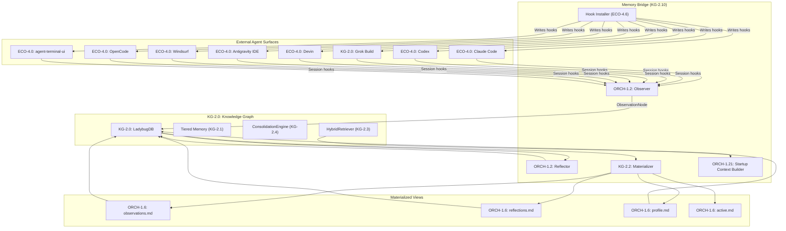

# KG-2.10: Observational Memory Bridge

> **Concept**: `CONCEPT:KG-2.1`
> **Pillar**: 2 — Epistemic Knowledge Graph
> **Status**: Implemented
> **Research**: Inspired by observational-memory v0.6.3

---

## Overview

The Observational Memory Bridge provides **cross-agent session memory** that survives
switching between Claude Code, Codex, Grok Build, Devin, Antigravity, Windsurf,
OpenCode, and agent-terminal-ui. It extends the Knowledge Graph with a materialized
Markdown view layer and LLM-powered observation/reflection pipeline.

### Core Design Principle

> **Markdown files are materialized views — the KG is the source of truth.**

```
KG (LadybugDB + OWL) ──materialize()──> observations.md, reflections.md, profile.md, active.md
profile.md / active.md ──file-watch──> KG (upsert edits)
```

---

## Architecture



---

## Components

### 1. Memory Materializer

**Module**: `knowledge_graph/memory/memory_materializer.py`

Renders 4 Markdown files from KG state:

| File | Content | Update Frequency |
|:-----|:--------|:----------------|
| `observations.md` | Recent notes with 🔴/🟡/🟢 priority tags, dated sections | After every observe cycle |
| `reflections.md` | Long-term condensed facts, categorized with confidence | After every reflect cycle |
| `profile.md` | Stable user identity (name, preferences, style) | After reflect, on user edit |
| `active.md` | Current goals, recent sessions, thread snapshot | After every materialize |

**Features**:
- Bidirectional sync: user edits to Markdown are ingested back into the KG
- Cursor-based change detection (MD5 hash comparison)
- XDG-compliant storage at `~/.local/share/agent-utilities/memory/`

### 2. Observer & Memento Context Compressor

**Module**: `knowledge_graph/memory/observer.py` and `knowledge_graph/memory/memento_compressor.py`

LLM-powered transcript compression and Context Management:
- **Observations**: Extracts decisions, preferences, lessons, context from raw conversations using a 🔴/🟡/🟢 priority system.
- **Mementos**: Segments long-running agent action-observation cycles and compresses them into dense `MementoBlock` nodes (preserving precise formulas and state).
- **KV Cache Compaction**: Intercepts the history stream and constructs a sawtooth context pattern (`[Past Mementos] + [Current Active Block]`) to prevent context window explosion and OOM errors during infinite-horizon tasks.
- Cursor-based incremental processing (avoid re-processing seen messages)
- Per-source parsers for Claude, Codex, Grok JSONL formats

### 3. Reflector

**Module**: `knowledge_graph/memory/reflector.py`

Condenses observations into durable long-term memory:
- Wired into existing ConsolidationEngine (KG-2.4)
- Merges, promotes, demotes, and archives observations
- Extracts preferences and principles into dedicated KG node types
- Triggers materialization after reflection

### 4. Startup Context Builder

**Module**: `knowledge_graph/memory/startup_context.py`

Produces deterministic, budgeted startup payloads:
- Default budget: 24,000 characters
- Priority-scored chunks from profile + active context
- Routing terms from `--cwd` and `--task` boost relevant sections
- Overflow handles for expanding specific sections via `recall`

### 5. Hook Installer (ECO-4.6)

**Module**: `ecosystem/hook_installer.py`

Writes startup/checkpoint hooks into external agent configurations:

| Agent | Hook Mechanism |
|:------|:--------------|
| Claude Code | `~/.claude/settings.json` SessionStart/End hooks |
| Codex | `~/.codex/hooks.json` |
| Grok Build | `~/.grok/hooks/agent-utilities-memory.json` |
| Devin | `~/.devin/hooks.json` |
| Antigravity | `~/.gemini/antigravity/hooks.json` |
| Windsurf | `~/.codeium/windsurf/hooks.json` |
| OpenCode | `~/.opencode/hooks.json` |
| agent-terminal-ui | Direct Python API (zero-copy) |
| Cowork | macOS plugin directory |
| Hermes | `$HERMES_HOME/plugins/` |

---

## CLI Commands

```bash
# Produce startup context for an agent
agent-utilities context --for codex --cwd $PWD --task "fix CI" --budget-chars 24000

# Search KG memory
agent-utilities recall --query "what was decided about the database?"

# Expand a specific startup handle
agent-utilities recall --handle startup:profile:preferences

# Process pending transcripts
agent-utilities observe --source claude

# Run reflection cycle
agent-utilities reflect

# Install hooks into external agents
agent-utilities install --claude --codex --grok --all

# Verify hook health
agent-utilities doctor
```

---

## Data Flow

```
Agent A finishes session
  → Session hook fires (SessionEnd)
  → Transcript parsed + ingested into KG as Thread/Message nodes
  → LLM Observer extracts decisions, preferences, lessons → ObservationNode in KG
  → ConsolidationEngine reflects → updates Semantic Memory
  → KG Materializer renders updated Markdown files

Agent B starts session
  → Startup hook fires (SessionStart)
  → Calls `agent-utilities context --for <agent> --cwd $PWD`
  → Context Builder queries KG HybridRetriever
  → Produces budgeted startup payload
  → Agent B receives startup context
  → Agent B can expand via `agent-utilities recall --query "..."`
```

---

## File Storage

```
~/.local/share/agent-utilities/
├── kg/
│   └── knowledge_graph.db        # Source of truth (LadybugDB)
├── memory/                        # Materialized views (KG-2.10)
│   ├── observations.md
│   ├── reflections.md
│   ├── profile.md
│   ├── active.md
│   ├── .memory_cursor.json       # Materialization state
│   └── .observer_cursor.json     # Observer incremental state
└── ...
```

---

## Related Concepts

- **KG-2.1**: Tiered Memory & Context — underlying memory tier lifecycle
- **KG-2.4**: Inductive Knowledge & Hypergraphs — ConsolidationEngine hosts reflection rules
- **KG-2.3**: Graph Integrity & Retrieval — HybridRetriever powers startup context
- **KG-2.9**: External Graph Federation — multi-machine KG sync
- **ECO-4.6**: Agent Hook Installer — cross-agent integration
- **OS-5.0**: Agent OS Kernel — XDG path resolution for memory directory
