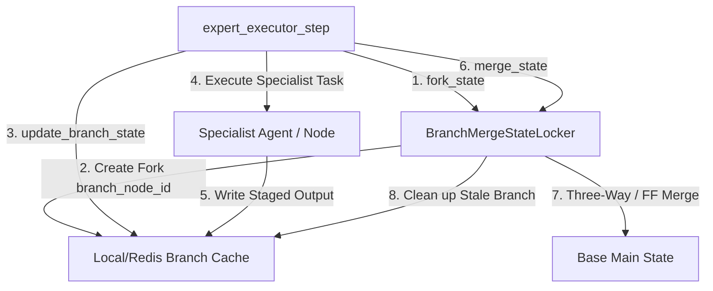

# Distributed Agent State Concurrency (CONCEPT:AHE-3.7)

## Overview
The `BranchMergeStateLocker` handles parallel state branching, versioned optimistic staging, and three-way recursive dictionary merging to coordinate concurrent agent execution swarms without database locking bottlenecks.

## Component Architecture



## Core Abstractions

### 1. State Branching & Forking
State branches are lightweight replicas keyed as `base_key:branch:branch_name`.
* **Fast & Decoupled**: Staged state avoids physical filesystem delays by utilizing local memory or high-speed Redis hash caches.
* **Traceability**: Each fork stores `base_version` (the fork origin ancestor) enabling strict convergence detection.

### 2. Convergence Merging Mechanisms
When merging a branch back to the base state:
* **Fast-Forward Merge**: If the base state version matches the branched `base_version` (i.e. no concurrent writes occurred on base), the branch simply replaces the base state and increments the version by 1.
* **Three-Way Recursive Merge**: If the base state has mutated concurrently, the locker attempts a nested key-level recursive merge:
  * If a key was changed in branch but untouched in base, the branch change is adopted.
  * If a key was changed in base but untouched in branch, the base change is kept.
  * If both changed, it resolves utilizing a custom arbitrating callback (`resolver`) or last-writer-wins (branch preference).

## Implementation Details
* **Source Code Path**: [distributed_state_manager.py](file:///home/apps/workspace/agent-packages/agent-utilities/agent_utilities/harness/distributed_state_manager.py)
* **Pillar**: Agentic Harness Engineering (AHE)
* **Concept ID**: `CONCEPT:AHE-3.7`

## Example Usage

```python
from agent_utilities.harness.distributed_state_manager import BranchMergeStateLocker

locker = BranchMergeStateLocker()

# 1. Fork state for concurrent execution paths
locker.fork_state("workflow_state_01", "programmer_branch")

# 2. Update branch state staging
locker.update_branch_state(
    "workflow_state_01",
    "programmer_branch",
    {"staged_code": "def hello(): pass"}
)

# 3. Merge branch back to base state, resolving concurrent updates safely
success = locker.merge_state("workflow_state_01", "programmer_branch")
```
