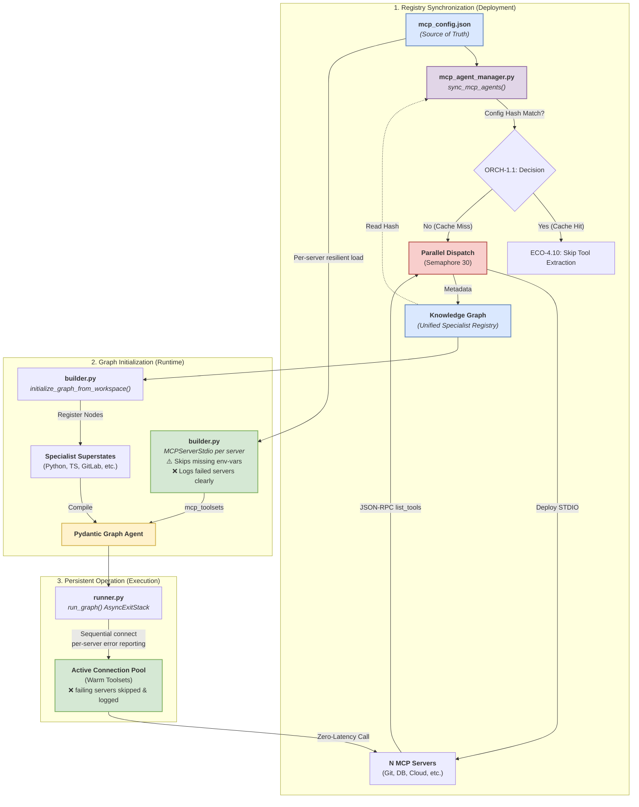

# Pillar 4: Ecosystem & Peripherals

## Overview

The **Ecosystem & Peripherals** pillar handles the integration boundary between the agent's internal reasoning and the external world. It defines how tools are discovered, how agents communicate with each other, and how dynamic skills are synthesized on the fly.

## Why We Built This (Rationale)

1. **Tool Sprawl**: Statically coding APIs for GitHub, Slack, GitLab, Docker, etc., creates an unmaintainable monolith.
2. **Static Capability Degradation**: An agent restricted to its factory-installed tools becomes obsolete the moment a user asks it to perform a novel task.
3. **Coordination Overhead**: Multi-agent systems traditionally struggle with Byzantine fault tolerance and consensus, making distributed problem-solving brittle.

## How It Works (Implementation)

### Unified Tool Interface & MCP (ECO-4.0 & ECO-4.1)
The foundation is the **Model Context Protocol (MCP)**. Instead of hardcoding integrations, `agent-utilities` acts as a universal client. Upon startup, it parses `mcp_config.json`, connects to N independent MCP servers (via `stdio` or SSE), and dynamically pulls all tools into the Knowledge Graph registry.

### Skill Evolution Engine (ECO-4.8)
When the system encounters a problem it lacks a tool for, the **SkillNeologismDetector** identifies the capability gap. The **SkillFactory** then uses execution traces to write a new, permanent `universal-skill` (complete with Python code and documentation). This ensures the agent's capabilities grow synchronously with the complexity of its environment.

### A2A Network & Consensus (ECO-4.2)
Agent-to-Agent (A2A) communication is configured via `a2a_config.json`. Remote agents are ingested as `CallableResource` nodes in the KG. The system supports multi-agent **Byzantine Fault Tolerance (BFT)** consensus algorithms, allowing a swarm of agents to vote on optimal pathways or verify code logic independently before returning a synthesized result to the user.

### Market Data Connector Protocol (ECO-4.4)
For financial workflows (linked to KG-2.46 Optimal Execution), the ecosystem implements a prioritized failover chain for market data fetchers, ensuring high availability and immutable audit trails for quantitative trading intelligence.

## Benefits Introduced

- **Infinite Scalability**: Adding a new integration requires zero code changes to the core agent—simply add an MCP server to the config.
- **Emergent Capabilities**: The agent autonomously writes and integrates the tools it needs, enabling true unsupervised problem-solving.
- **Robust Decentralization**: A2A config resolution and BFT consensus prevent single points of failure in complex, multi-stage agent swarms.

## Key Concepts Leveraged
- **ECO-4.0**: Unified Tool Interface
- **ECO-4.1**: Capability Registry Engine
- **ECO-4.2**: A2A Network & Consensus
- **ECO-4.4**: Market Data Connector Protocol
- **ECO-4.8**: Skill Evolution Engine
- **ECO-4.10**: Agent Toolkit Ingestor — unified MCP/Skill/A2A ingestion with auto-detection heuristics
- **ECO-4.11**: MCP Live Discovery — live `list_tools()` invocation, config hash freshness, and KG caching

### graph-os MCP Tools

The `graph-os` MCP server provides native tools for interacting with the unified Knowledge Graph.

| Tool Name | Description |
|-----------|-------------|
| `graph_analyze` | Execute complex analysis across the Knowledge Graph (synthesize, deep_extract, evaluate, security_scan, etc). |
| `graph_configure` | Manage backend configurations, system credentials, and tool registration within the unified agent ecosystem. |
| `graph_ingest` | Smart ingestion for codebases, documents, directories, and conversation logs. |
| `graph_orchestrate`| Orchestrate multi-agent workflows, dispatch subagents, and manage execution loops. |
| `graph_query` | Execute a read-only Cypher query against the Knowledge Graph. |
| `graph_search` | Search the Knowledge Graph using multiple strategies (hybrid, concept, analogy, memory, discover, dci). |
| `graph_write` | Write nodes, relationships, or register external graphs to the Knowledge Graph. |

### Server Endpoints

| Endpoint | Method | Description |
|---|---|---|
| `/health` | GET | Health check and server metadata |
| `/ag-ui` | POST | AG-UI streaming with sideband graph events |
| `/stream` | POST | SSE stream for graph execution |
| `/acp` | MOUNT | ACP protocol (sessions, planning, approvals) |
| `/a2a` | MOUNT | Agent-to-Agent JSON-RPC |
| `/api/approve` | POST | Resolve pending tool approvals and MCP elicitation |
| `/chats` | GET | List chat sessions |
| `/chats/{id}` | GET/DELETE | Get or delete a chat session |
| `/mcp/config` | GET | Current MCP server configuration |
| `/mcp/tools` | GET | List all connected MCP tools |
| `/mcp/reload` | POST | Hot-reload MCP servers and rebuild graph |

### MCP Loading & Registry Architecture
This diagram illustrates how MCP servers are discovered, specialized, and persisted in the graph.

