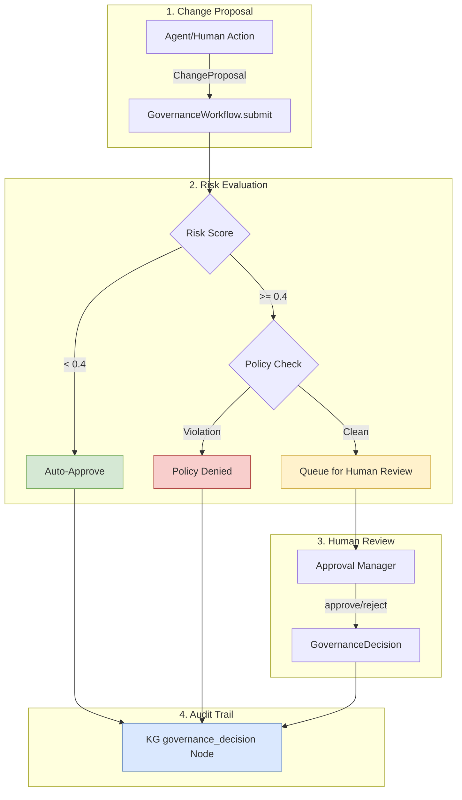
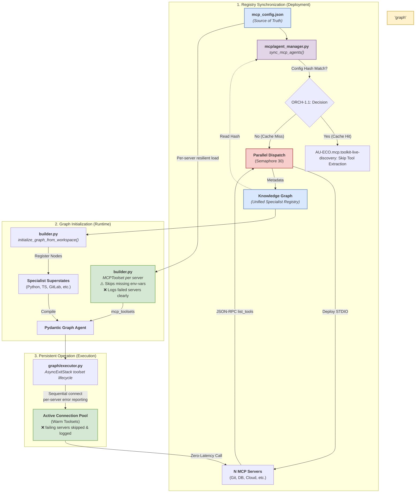

# Pillar 4: Ecosystem & Peripherals

## Overview

The **Ecosystem & Peripherals** pillar handles the integration boundary between the agent's internal reasoning and the external world. It defines how tools are discovered, how agents communicate with each other, and how dynamic skills are synthesized on the fly.

## Why We Built This (Rationale)

1. **Tool Sprawl**: Statically coding APIs for GitHub, Slack, GitLab, Docker, etc., creates an unmaintainable monolith.
2. **Static Capability Degradation**: An agent restricted to its factory-installed tools becomes obsolete the moment a user asks it to perform a novel task.
3. **Coordination Overhead**: Multi-agent systems traditionally struggle with Byzantine fault tolerance and consensus, making distributed problem-solving brittle.

## How It Works (Implementation)

### Unified Tool Interface & MCP (ECO-4.0 & ECO-4.1)
The foundation is the **Model Context Protocol (MCP)**. Instead of hardcoding integrations, `agent-utilities` acts as a universal client. Upon startup, it parses `mcp_config.json`, connects to N independent MCP servers (via `stdio` or SSE), and dynamically pulls all tools into the Knowledge Graph registry.

### Skill Evolution Engine (AU-OS.deployment.blueprint-library)
When the system encounters a problem it lacks a tool for, the **SkillNeologismDetector** identifies the capability gap. The **SkillFactory** then uses execution traces to write a new, permanent `universal-skill` (complete with Python code and documentation). This ensures the agent's capabilities grow synchronously with the complexity of its environment.

### A2A Network & Consensus (AU-ECO.toolkit.journey-map-narrative)
Agent-to-Agent (A2A) communication is configured via `a2a_config.json`. Remote agents are ingested as `CallableResource` nodes in the KG. The system supports multi-agent **Byzantine Fault Tolerance (BFT)** consensus algorithms, allowing a swarm of agents to vote on optimal pathways or verify code logic independently before returning a synthesized result to the user.

## Benefits Introduced

- **Infinite Scalability**: Adding a new integration requires zero code changes to the core agent—simply add an MCP server to the config.
- **Emergent Capabilities**: The agent autonomously writes and integrates the tools it needs, enabling true unsupervised problem-solving.
- **Robust Decentralization**: A2A config resolution and BFT consensus prevent single points of failure in complex, multi-stage agent swarms.

## Key Concepts Leveraged
- **ECO-4.0**: Unified Tool Interface
- **ECO-4.1**: Capability Registry Engine
- **AU-ECO.toolkit.journey-map-narrative**: A2A Network & Consensus
- **AU-ECO.toolkit.journey-map-milestones**: Native Messaging Backend Abstraction — NATS/Kafka event queue messaging interfaces
- **AU-OS.deployment.blueprint-library**: Skill Evolution Engine
- **AU-ECO.mcp.toolkit-live-discovery**: Agent Toolkit Ingestor — unified MCP/Skill/A2A ingestion with auto-detection heuristics
- **AU-ECO.mcp.toolkit-live-discovery**: MCP Live Discovery — live `list_tools()` invocation, config hash freshness, and KG caching
- **AU-ECO.bus.pluggable-queue-backend**: Pluggable Event Queue Backend — Abstract QueueBackend with Memory, Nats, and Kafka implementations for multi-scale event distribution
- **AU-KG.memory.team-startup-context**: Hierarchical AGENTS.md & Team Context — Root-first layered configuration walking
- **AU-KG.memory.team-startup-context**: Self-Improving AGENTS.md Reflector — Stop-hook that proposes configuration updates
- **AU-OS.governance.lint-enforcement-hook**: Deterministic Lint Enforcement Hook — Subprocess-based code quality gates
- **AU-ECO.toolkit.self-documenting-plugin-bundle**: Plugin Bundle Distribution System — Manifest-based skill/hook/config packaging
- **AU-OS.governance.permission-policy**: Permission Policy Engine — File & tool deny/allow rules via PRE_TOOL_USE hooks
- **AU-OS.governance.permission-policy**: Configuration Staleness Auditor — Periodic review of unused rules, skills, and hooks
- **AU-OS.governance.permission-policy**: Governance Workflow Pipeline — Unified change proposal, risk scoring, and approval routing
- **AU-KG.memory.team-startup-context**: Codebase Map Generator — Deterministic `CODEBASE.md` generation for navigational context
- **ECO-4.25–4.29**: Document-Source Connector Framework — `load`/`poll`/`slim` connectors (web, filesystem, database, MCP fleet) with checkpoints and permission sync
- **AU-ECO.mcp.profile-differences-from-client**: GraphOS Fleet Gateway Hardening — per-child limits, session pools, restart-on-crash, and circuit breakers

---

## 🏛️ Enterprise Agent Governance (AU-KG.memory.team-startup-context — AU-OS.governance.permission-policy)

Enterprise-grade governance for large-scale agent deployments. Inspired by [Anthropic's Claude Code at Scale](https://www.anthropic.com) best practices, these modules bridge autonomous agent actions with human-in-the-loop oversight, ensuring compliance, auditability, and configuration hygiene across multi-team ecosystems.

### 📄 Hierarchical AGENTS.md & Team Context (AU-KG.memory.team-startup-context) { #hierarchical-agent-context }

Implements **root-first additive** AGENTS.md resolution. When an agent operates in a subdirectory, it walks UP from CWD to project root, collecting all `AGENTS.md` files and assembling them root-first (root rules → subdirectory overrides). Team-specific conventions are injected at startup via KG `TeamConfigNode` entries.

- **Source Code**: `knowledge_graph/core/agents_md.py` (`load_agents_md_layered()`), `knowledge_graph/memory/memory_engine.py` (`build_startup_context()` `team` parameter)
- **Behavior**: Root rules form the base; subdirectories only ADD or OVERRIDE sections. Scoped build/test/lint commands use nearest-directory-wins precedence.

### 🔄 Self-Improving AGENTS.md Reflector (AU-KG.memory.team-startup-context)

A **SessionEnd stop hook** that reflects on session transcripts to propose AGENTS.md updates. Detects patterns like unused rules, frequently corrected conventions, and new capabilities discovered during work.

- **Source Code**: `ecosystem/agents_md_reflector.py`
- **Behavior**: Proposals above 0.9 confidence auto-apply. Below threshold, proposals are persisted as `agents_md_proposal` KG nodes for human review. Generates markdown diffs for clear change visualization.

### 🔍 Deterministic Lint Enforcement Hook (AU-OS.governance.lint-enforcement-hook) { #lint-enforcement }

A **PRE_TOOL_USE** hook that intercepts file writes and runs linters (`ruff`, `mypy`, `eslint`) in subprocess. Ensures code quality is enforced deterministically without LLM involvement.

- **Source Code**: `ecosystem/lint_enforcement_hook.py`
- **Behavior**: Configurable per-linter thresholds. Fails the file write if violations exceed limits. Results are cached by content hash to avoid re-running on identical content.

### 📦 Plugin Bundle Distribution System (AU-ECO.toolkit.self-documenting-plugin-bundle) { #plugin-bundles }

Manifest-based distribution for unified sets of skills, hooks, and MCP configurations. Bundles are registered in the KG and can be shared globally via GitHub.

- **Source Code**: `ecosystem/plugin_bundle.py`
- **Behavior**: YAML manifest format with version pinning, compatibility declarations, and install/uninstall lifecycle. The KG registry enables discovery and compliance auditing across teams.

### 🛡️ Permission Policy Engine (AU-OS.governance.permission-policy) { #permission-policy }

Version-controlled deny/allow rules for file paths and tool names, enforced at the PRE_TOOL_USE lifecycle hook. Policies are YAML files tracked alongside code.

- **Source Code**: `ecosystem/permission_policy.py`
- **Behavior**: Path glob matching for file access control, tool name pattern matching for tool access. All policy decisions are persisted to the KG for audit trail.

### 📊 Configuration Staleness Auditor (AU-OS.governance.permission-policy)

Periodic (default 30-day) health check that reviews AGENTS.md sections, skills, hooks, and plugins for staleness. Identifies rules never triggered, skills never invoked, and hooks compensating for resolved model limitations.

- **Source Code**: `ecosystem/config_staleness_auditor.py`
- **Behavior**: KG-backed usage tracking with markdown report generation. Each item receives a KEEP / UPDATE / REMOVE recommendation with confidence scores.

### ⚖️ Governance Workflow Pipeline (AU-OS.governance.permission-policy)

**Unified governance pipeline** that orchestrates approval flows for all ecosystem mutations. Integrates the `ApprovalManager`, `PermissionsKernel`, `PolicyIngestor`, and `ConfigStalenessAuditor` into a single compliance layer.

- **Source Code**: `ecosystem/governance_workflow.py`
- **Architecture**:

```mermaid
graph TD
    subgraph Proposal ["1. Change Proposal"]
        A[Agent/Human Action] -->|"ChangeProposal"| B[GovernanceWorkflow.submit]
    end

    subgraph Evaluation ["2. Risk Evaluation"]
        B --> C{Risk Score}
        C -->|"< 0.4"| D[Auto-Approve]
        C -->|">= 0.4"| E{Policy Check}
        E -->|"Violation"| F[Policy Denied]
        E -->|"Clean"| G[Queue for Human Review]
    end

    subgraph Resolution ["3. Human Review"]
        G --> H[Approval Manager]
        H -->|"approve/reject"| I[GovernanceDecision]
    end

    subgraph Persistence ["4. Audit Trail"]
        D --> J[KG governance_decision Node]
        F --> J
        I --> J
    end

    style D fill:#d5e8d4,stroke:#82b366
    style F fill:#f8cecc,stroke:#b85450
    style G fill:#fff2cc,stroke:#d6b656
    style J fill:#dae8fe,stroke:#6c8ebf
```

- **Change Types**: `agents_md_edit`, `hook_install/uninstall`, `plugin_install/uninstall`, `permission_change`, `policy_update`, `constitution_amend`, `skill_install`, `tool_registration`
- **Risk Scoring**: Constitution amendments (0.9), permission changes (0.8), policy updates (0.7), hook installs (0.5), plugin installs (0.4), AGENTS.md edits (0.3), tool registrations (0.2). Human-initiated changes receive a 0.7x modifier.
- **Audit Cycle**: `run_audit_cycle()` coordinates staleness auditor + reflector proposals + combined markdown report generation.

### 🗺️ Codebase Map Generator (AU-KG.memory.team-startup-context)

Generates deterministic `CODEBASE.md` files with directory-tree TOCs and docstring summaries. Fully subprocess-based (no LLM inference) for always-accurate project navigation context.

- **Source Code**: `tools/codebase_map_tools.py`
- **Behavior**: Walks the file tree, extracts module docstrings, and produces a navigational markdown document. Registered as a graph-os MCP tool.

### 🛡️ GraphOS Fleet Gateway Hardening (AU-ECO.mcp.profile-differences-from-client)

GraphOS aggregates the whole `*-mcp` fleet through its embedded gateway, and every child runs behind a per-child `ChildRuntime` (`agent_utilities/mcp/child_resilience.py`) instead of one bare shared session:

- **Per-child concurrency limits + bounded queue** — `MCP_CHILD_MAX_CONCURRENCY` (default 8; per-server `max_concurrency` in `mcp_config.json`) caps in-flight calls; excess calls queue at most `MCP_CHILD_QUEUE_TIMEOUT` (default 30s) then fail with the typed `MCPChildBusyError`, so one slow child cannot cause head-of-line hangs.
- **Session pools for HTTP children** — remote (streamable-http/SSE) children hold `MCP_CHILD_POOL_SIZE` round-robin connections (default 1 keeps the historical resource profile); stdio stays single-pipe.
- **Restart-on-crash supervision** — transport failures recycle the child's connection generation with jittered exponential backoff; more than `MCP_CHILD_MAX_RESTARTS` (default 5) inside `MCP_CHILD_RESTART_WINDOW` (default 300s) parks the child as `failed` with the typed `MCPChildUnavailableError` naming the child and its restart state.
- **Per-child circuit breaker** — consecutive transport failures open a breaker (`MCP_CHILD_BREAKER_THRESHOLD` / `MCP_CHILD_BREAKER_COOLDOWN`) that short-circuits with `MCPChildCircuitOpenError` until a half-open probe succeeds.
- **Health surface + metrics** — GraphOS reports per-child up/restarting/failed state, restart count, breaker state, pool size, in-flight and queued calls; per-child Prometheus series (`agent_utilities_mcp_child_calls_total{server,outcome}`, `..._breaker_state`, `..._restarts_total`, `..._queue_depth`) land on the AU-OS.observability.no-op-without-metrics gateway registry.

### GraphOS model-facing MCP surface

The current default (`MCP_TOOL_MODE=intent`) starts with exactly **11 visible
tools**: **six intent verbs and five control tools**. This is progressive
disclosure, not a compatibility alias over the former granular startup table.

| Surface | Always-visible tools | Purpose |
|---|---|---|
| Intent | `ask`, `find`, `write`, `act`, `manage`, `why` | Resolve a governed natural-language intent to the exact current capability; mutating verbs preview before execution. |
| Control | `find_tools`, `list_catalog`, `load_tools`, `unload_tools`, `multiplexer_status` | Discover, expose, retract, and inspect exact tools without permanently filling model context. |

The generated Capability Power Descriptor catalog currently contains **111
public capabilities**. Their granular MCP and REST actions remain current and
fully governed, but are hidden from the initial model context. `find_tools`
ranks the catalog, `load_tools` exposes only the selected exact tools for the
calling session, and `unload_tools` retracts them again. Dynamic loading never
weakens the loaded tool's verified session, scope, approval, or mutation policy.
The source contracts are `agent_utilities/mcp/tool_specs.py`,
`agent_utilities/mcp/tools/intent_tools.py`, and
`agent_utilities/mcp/multiplexer.py`; the generated inventory is
[Capability Power](../capabilities-power.md).

### Server Endpoints

| Endpoint | Method | Description |
|---|---|---|
| `/health` | GET | Status-only, non-fingerprinting liveness probe |
| `/ag-ui` | POST | AG-UI streaming with sideband graph events |
| `/stream` | POST | SSE stream for graph execution |
| `/acp` | MOUNT | ACP protocol (sessions, planning, approvals) |
| `/a2a` | MOUNT | Agent-to-Agent JSON-RPC |
| `/api/approve` | POST | Resolve pending tool approvals and MCP elicitation |
| `/chats` | GET | List chat sessions |
| `/chats/{id}` | GET/DELETE | Get or delete a chat session |
| `/mcp/config` | GET | Current MCP server configuration |
| `/mcp/tools` | GET | List all connected MCP tools |
| `/mcp/reload` | POST | Hot-reload MCP servers and rebuild graph |

### MCP Loading & Registry Architecture
This diagram illustrates how MCP servers are discovered, specialized, and persisted in the graph.

```mermaid
graph TD
    subgraph Registry_Phase ["1. Registry Synchronization (Deployment)"]
        Config["<b>mcp_config.json</b><br/><i>(Source of Truth)</i>"] --> Manager["<b>mcp/agent_manager.py</b><br/><i>sync_mcp_agents()</i>"]
        KG_Registry["<b>Knowledge Graph</b><br/><i>(Unified Specialist Registry)</i>"] -.->|Read Hash| Manager

        Manager -->|Config Hash Match?| Branch{ORCH-1.1: Decision}
        Branch -- "Yes (Cache Hit)" --> Skip["AU-ECO.mcp.toolkit-live-discovery: Skip Tool Extraction"]
        Branch -- "No (Cache Miss)" --> Parallel["<b>Parallel Dispatch</b><br/>(Semaphore 30)"]

        Parallel -->|Deploy STDIO| Servers["<b>N MCP Servers</b><br/>(Git, DB, Cloud, etc.)"]
        Servers -->|JSON-RPC list_tools| Parallel
        Parallel -->|Metadata| KG_Registry
    end

    subgraph Initialization_Phase ["2. Graph Initialization (Runtime)"]
        Config -->|Per-server resilient load| Loader["<b>builder.py</b><br/><i>MCPToolset per server</i><br/>⚠️ Skips missing env-vars<br/>❌ Logs failed servers clearly"]
        KG_Registry --> Builder["<b>builder.py</b><br/><i>initialize_graph_from_workspace()</i>"]
        Loader -->|mcp_toolsets| graphNode
        Builder -->|Register Nodes| Specialists["<b>Specialist Superstates</b><br/>(Python, TS, GitLab, etc.)"]
        Specialists -->|Compile| graphNode["<b>Pydantic Graph Agent</b>"]
    end

    subgraph Operation_Phase ["3. Persistent Operation (Execution)"]
        graphNode --> Lifespan["<b>graph/executor.py</b><br/><i>AsyncExitStack toolset lifecycle</i>"]
        Lifespan -->|"Sequential connect<br/>per-server error reporting"| ConnPool["<b>Active Connection Pool</b><br/>(Warm Toolsets)<br/>❌ failing servers skipped & logged"]
        ConnPool -->|Zero-Latency Call| Servers
    end

    %% Styling
    style Config fill:#dae8fe,stroke:#6c8ebf,stroke-width:2px
    style KG_Registry fill:#dae8fe,stroke:#6c8ebf,stroke-width:2px
    style Manager fill:#e1d5e7,stroke:#9673a6,stroke-width:2px
    style Parallel fill:#f8cecc,stroke:#b85450,stroke-width:2px
    style ConnPool fill:#d5e8d4,stroke:#82b366,stroke-width:2px
    style 'graph' fill:#fff2cc,stroke:#d6b656,stroke-width:2px
    style Loader fill:#d5e8d4,stroke:#82b366,stroke-width:2px
```
