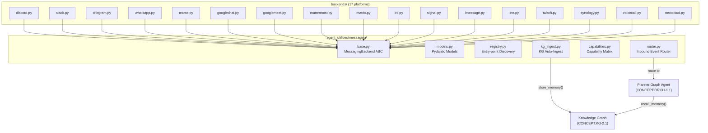
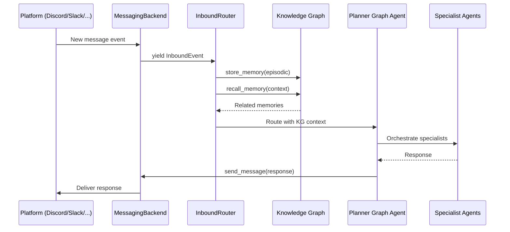
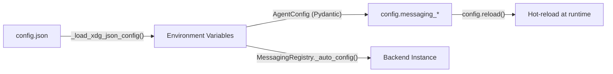

# ECO-4.5 — Native Messaging Backend Abstraction

> **CONCEPT:ECO-4.5** | Pillar 4: Ecosystem & Peripherals
>
> Provides a pluggable, transport-agnostic messaging framework enabling agents
> to send and receive messages across 17+ platforms with full KG integration.

---

## Overview

The Native Messaging Backend Abstraction extends the agent-utilities ecosystem
with bidirectional, event-driven messaging across 17 platforms. Unlike MCP-based
request-response integrations, this system uses persistent connections with
`AsyncIterator`-based inbound event streaming for real-time messaging.

### Design Philosophy

The architecture follows three proven patterns already in agent-utilities:

1. **`TraceBackend` ABC** (`harness/trace_backend.py`) — abstract methods define
   the contract, concrete methods provide defaults, factory auto-detects backends
2. **`PluginRegistry`** (`graph/plugin_registry.py`) — dynamic discovery via
   `importlib.metadata.entry_points` for zero-config backend registration
3. **`store_memory()`/`recall_memory()`** (`knowledge_graph/core/engine_memory.py`)
   — inbound messages auto-ingest into the KG as tiered episodic memory nodes

---

## Architecture



## Inbound Message Flow



---

## Installation

```bash
# Single backend
pip install agent-utilities[messaging-discord]

# Multiple backends
pip install agent-utilities[messaging-discord,messaging-slack,messaging-telegram]

# All 17 backends
pip install agent-utilities[messaging]
```

## Quick Start

```python
from agent_utilities.messaging import MessagingRegistry, MessagingBackend

# Discover installed backends
registry = MessagingRegistry()
print(registry.list_backends())  # ['discord', 'slack', ...]

# Create and connect a backend
discord = registry.create_backend("discord")
await discord.connect()

# Send a message
result = await discord.send_message("#general", "Hello from agent!")

# Listen for inbound messages
async for event in discord.listen():
    print(f"[{event.platform}] {event.user_name}: {event.content}")
```

## Configuration (XDG config.json)

All messaging configuration is managed through the unified XDG config file:

```
~/.config/agent-utilities/config.json
```

> **See:** [ECO-4.5 Messaging Configuration Guide](ECO-4.5-Messaging_Configuration_Guide.md)
> for the complete per-platform reference with all keys and env var mappings.

### Config Priority Chain

```
1. Environment variable (MESSAGING_DISCORD_TOKEN=...)         ← highest
2. XDG config.json (~/.config/agent-utilities/config.json)
3. .env file (project-local)
4. Platform-native env vars (DISCORD_BOT_TOKEN)               ← lowest
```

### Minimal config.json Example

```json
{
    "messaging_enabled_backends": ["discord", "slack"],
    "messaging_kg_ingest": true,
    "messaging_route_to_planner": true,

    "messaging_discord_token": "BOT_TOKEN_HERE",
    "messaging_slack_token": "xoxb-...",
    "messaging_slack_app_token": "xapp-..."
}
```

### How It Works



All `messaging_*` keys in `config.json` are:
1. Loaded at startup by `_load_xdg_json_config()` (uppercased to env vars)
2. Parsed into first-class `AgentConfig` fields (accessible as `config.messaging_discord_token`)
3. Read by `MessagingRegistry._auto_config()` when creating backend instances

### XDG Directory Layout

```
~/.config/agent-utilities/
├── config.json                    ← All messaging config lives here
├── mcp_config.json
└── a2a_config.json

~/.local/share/agent-utilities/
├── kg/knowledge_graph.db          ← Messages stored here as memory nodes
├── messaging/
│   ├── sessions/                  ← Backend-specific auth state
│   └── history/                   ← Local message history cache
└── ...
```

### WhatsApp Dual Mode

```json
{
    "messaging_whatsapp_use_business_api": true,
    "messaging_whatsapp_token": "<access-token>",
    "messaging_whatsapp_phone_number_id": "<phone-id>"
}
```

Set `messaging_whatsapp_use_business_api` to `false` (default) for the
`neonize` bridge, which connects via QR code with no token required.

---

## Capability Matrix

| Capability | Discord | Slack | Telegram | WhatsApp | Teams | GChat | GMeet | MM | Matrix | IRC | Signal | iMsg | LINE | Twitch | Syno | Voice | NC |
|---|---|---|---|---|---|---|---|---|---|---|---|---|---|---|---|---|---|
| Send text | ✅ | ✅ | ✅ | ✅ | ✅ | ✅ | ❌ | ✅ | ✅ | ✅ | ✅ | ✅ | ✅ | ✅ | ✅ | ✅ | ✅ |
| Media | ✅ | ✅ | ✅ | ✅ | ✅ | ✅ | ❌ | ✅ | ✅ | ❌ | ✅ | ✅ | ✅ | ❌ | ❌ | ❌ | ✅ |
| Threads | ✅ | ✅ | ✅ | ❌ | ✅ | ✅ | ❌ | ✅ | ✅ | ❌ | ❌ | ❌ | ❌ | ❌ | ❌ | ❌ | ✅ |
| Reactions | ✅ | ✅ | ✅ | ✅ | ✅ | ✅ | ❌ | ✅ | ✅ | ❌ | ✅ | ✅ | ❌ | ❌ | ❌ | ❌ | ✅ |
| Typing | ✅ | ✅ | ✅ | ✅ | ✅ | ❌ | ❌ | ✅ | ✅ | ❌ | ❌ | ✅ | ❌ | ❌ | ❌ | ❌ | ❌ |
| Inbound | ✅ | ✅ | ✅ | ✅ | ✅ | ✅ | ✅ | ✅ | ✅ | ✅ | ✅ | ✅ | ✅ | ✅ | ✅ | ✅ | ✅ |
| Voice | ❌ | ❌ | ❌ | ❌ | ❌ | ❌ | ✅ | ❌ | ❌ | ❌ | ❌ | ❌ | ❌ | ❌ | ❌ | ✅ | ❌ |

---

## Module Reference

| Module | Purpose | CONCEPT |
|---|---|---|
| `messaging/__init__.py` | Public API surface | ECO-4.5 |
| `messaging/base.py` | `MessagingBackend` ABC | ECO-4.5 |
| `messaging/models.py` | Pydantic data models | ECO-4.5 |
| `messaging/registry.py` | Entry-point backend discovery | ECO-4.5 |
| `messaging/capabilities.py` | Platform capability matrix | ECO-4.5 |
| `messaging/router.py` | Inbound → Planner Graph Agent | ECO-4.5 + ORCH-1.1 |
| `messaging/kg_ingest.py` | KG auto-ingest | ECO-4.5 + KG-2.1 |
| `messaging/backends/*.py` | 17 platform implementations | ECO-4.5 |

---

## KG Integration (CONCEPT:KG-2.1)

Inbound messages are automatically ingested as `episodic` memory nodes:

```python
engine.store_memory(
    content="[DISCORD] Message from user in #general: Hello!",
    memory_type="episodic",
    tags=["platform:discord", "channel:general", "user:alice"],
    trust_score=0.7,
)
```

Agent responses are stored as `semantic` memory (longer half-life):

```python
engine.store_memory(
    content="[DISCORD] Agent response in #general: I can help with that.",
    memory_type="semantic",
    trust_score=0.9,
)
```

Both leverage the existing `MemoryDecayConfig` (CONCEPT:KG-2.3) for
Ebbinghaus-curve-based relevance decay over time.

---

## Cross-References

- **CONCEPT:ORCH-1.1** — Planner Graph Agent receives routed messages
- **CONCEPT:KG-2.1** — Tiered Memory for conversation persistence
- **CONCEPT:KG-2.3** — Memory decay for message relevance scoring
- **CONCEPT:ECO-4.0** — Plugin registry pattern for backend discovery
- **CONCEPT:OS-5.0** — XDG paths for session/config storage
