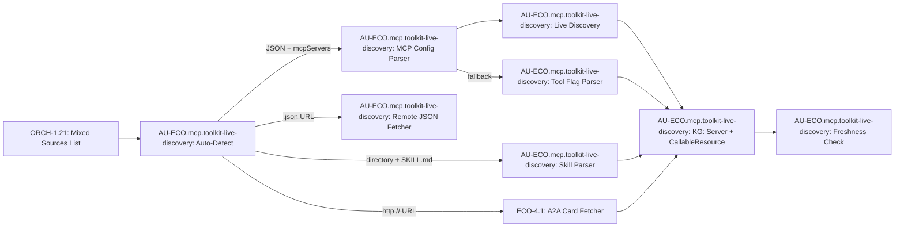

# AU-ECO.mcp.toolkit-live-discovery: Unified Agent Toolkit Ingestor

## Concept Summary

| Field | Value |
|-------|-------|
| **Concept ID** | `AU-ECO.mcp.toolkit-live-discovery` |
| **Pillar** | 4 — Ecosystem & Peripherals |
| **Status** | Implemented |
| **Source Modules** | `engine_ingestion.py` |
| **Test Modules** | `test_agent_toolkit_ingestion.py` |
| **C4 Component** | Agent Toolkit Ingestor |

## Overview

The **Agent Toolkit Ingestor** provides a single unified entry point for ingesting
three types of agent artifacts into the Knowledge Graph:

1. **MCP Server Configs** — `mcp_config.json` files containing `mcpServers` entries
2. **Agent Skill Directories** — Directories containing a `SKILL.md` with YAML frontmatter
3. **A2A Agent Cards** — URLs serving `/.well-known/agent.json` (Google A2A spec)

The system auto-detects the source type and routes it to the appropriate handler,
eliminating the need for callers to know what they're ingesting.

## Architecture



## Auto-Detection Heuristics

| Source Pattern | Detected As |
|---------------|-------------|
| `http://` or `https://` (non-.json) | A2A agent URL |
| URL ending in `.json` | Remote JSON (auto-classify) |
| Local `.json` file with `mcpServers` key | MCP config |
| Directory containing `SKILL.md` | Skill directory |
| Directory containing `mcp_config.json` | MCP config (via directory) |
| Anything else | Unknown (logged as error) |

## MCP Tool Interface

Exposed via `graph_ingest(action='agent_toolkit')`:

```
target_path: JSON array of sources OR single source path
             e.g., '["/path/to/mcp_config.json", "http://agent.local", "/skills/my-skill"]'

description: Optional A2A agent card path override (default: /.well-known/agent.json)
```

## Idempotent Refresh

Each MCP server config is fingerprinted with a SHA-256 hash of its `(name, command, args, env)` tuple. On subsequent ingestion:
1. The hash is compared against the KG-stored `config_hash` on the Server node
2. The timestamp is checked against `max_age_hours` (default: 24h)
3. If both match → the server is skipped (reported as `skipped` in summary)
4. If either differs → full re-ingestion occurs

## A2A Agent Card Support

Supports the Google A2A specification:
- **Primary path**: `/.well-known/agent.json` (default)
- **Secondary path**: `/agent-card.json` (fallback)
- **Override**: Callers can specify any custom path via `agent_card_path` parameter

## Key Functions

| Function | Description |
|----------|-------------|
| `ingest_agent_toolkit(sources, agent_card_path)` | Main entry point |
| `_detect_toolkit_source_type(source)` | Auto-detection |
| `_ingest_mcp_from_config(config_data, source_path, summary)` | MCP pipeline |
| `_ingest_skill_from_directory(dir_path, summary)` | Skill pipeline |
| `_ingest_a2a_from_url(base_url, agent_card_path, summary)` | A2A pipeline |

## Related Concepts

- **AU-ECO.mcp.toolkit-live-discovery**: MCP Live Discovery — live `list_tools()` invocation
- **ECO-4.0**: Tool Interface & MCP Factory — the base MCP infrastructure
- **ECO-4.1**: A2A Network — the A2A protocol layer
- **ORCH-1.21**: Agent Runner — consumes ingested Server/CallableResource nodes
