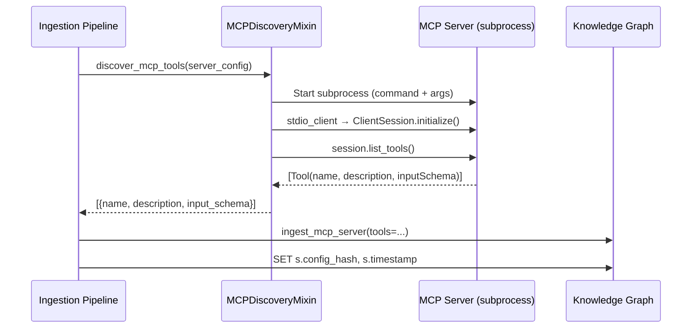

# AU-ECO.mcp.toolkit-live-discovery: MCP Live Tool Discovery

## Concept Summary

| Field | Value |
|-------|-------|
| **Concept ID** | `AU-ECO.mcp.toolkit-live-discovery` |
| **Pillar** | 4 — Ecosystem & Peripherals |
| **Status** | Implemented |
| **Source Modules** | `engine_mcp_discovery.py`, `tools/dynamic_tool_orchestrator.py` |
| **Test Modules** | `test_agent_toolkit_ingestion.py`, `test_dynamic_tool_selection.py` |
| **C4 Component** | MCP Live Discovery |

## Overview

The **MCP Live Discovery** mixin enables the Knowledge Graph engine to connect
to MCP servers at ingestion time, discover their tools via `list_tools()`, and
cache the metadata as `CallableResource` nodes. It supports lazy-refresh
verification to ensure cached tool metadata stays current.

## How It Works



## Key Methods

### `parse_mcp_config(config_data) → list[dict]`
Parses an `mcp_config.json` payload into normalized server entries. Handles:
- Standard format: `{"mcpServers": {"name": {"command": ..., "args": [...], "env": {...}}}}`
- Disabled servers: entries with `"disabled": true` are skipped
- Tool flags: env vars like `DOCKERTOOL=True` are extracted as capabilities

### `discover_mcp_tools(server_config, timeout=30.0) → list[dict]`
Starts an MCP server as a subprocess, connects via stdio, and calls `list_tools()`.
Returns tool metadata including name, description, and input schema. Falls back
gracefully if the `mcp` package isn't installed or the server fails to start.

### `check_server_freshness(server_name, config_hash, max_age_hours=24.0) → bool`
Checks if a server's cached KG data is still fresh by comparing:
1. **Config hash** — deterministic SHA-256 of `(name, command, args, env)`
2. **Timestamp age** — against configurable `max_age_hours`

### `verify_mcp_freshness(server_name, server_config) → dict`
Compares KG-cached tool count against live tool count to detect drift.

## Tool Flag Parsing

When live discovery fails, the system falls back to extracting capabilities
from environment variables. The convention across agent-packages is:

```
DOCKERTOOL=True    → capability: "docker"
STACKTOOL=True     → capability: "stack"
KUBERNETESTOOL=True → capability: "kubernetes"
```

The `_parse_tool_flags()` method strips the `TOOL` suffix and normalizes to
lowercase. This provides a minimum capability profile even when the server
can't be reached.

## Freshness Strategy

```
First Ingestion:
  1. parse_mcp_config() → extract server entries
  2. discover_mcp_tools() → live connect + list_tools()
  3. ingest_mcp_server() → Server + CallableResource nodes
  4. SET config_hash + timestamp on Server node

Subsequent Ingestion:
  1. check_server_freshness() → compare config_hash + age
  2. If fresh → SKIP (saves ~30s per server)
  3. If stale → re-run live discovery
```

## Dynamic Toolset Resolution & Cache Refresh

Beyond static ingestion-time discovery, **AU-ECO.mcp.toolkit-live-discovery** supports runtime dynamic toolset resolution and background cache refreshing via the `DynamicToolOrchestrator`.

When an MCP client passes query filters or custom headers requesting context-scoped capabilities:
1. **Direct KG Resolution**: The `DynamicToolOrchestrator` queries the Active Knowledge Graph using optimized, LLM-free Cypher matching against `CallableResource` nodes to filter the active tools list.
2. **Lazy Cache Freshness Guard**: The orchestrator verifies the server node's last updated timestamp:
   - If the age exceeds **24 hours**, it returns the cached list instantly to keep request latencies under sub-milliseconds.
   - Concurrently, it schedules a **non-blocking background task** (`refresh_cached_tools`) to execute live introspection against the target server subprocess and asynchronously update the graph database entries.

---

## Related Concepts

- **AU-ECO.mcp.toolkit-live-discovery**: Agent Toolkit Ingestor — the unified ingestion pipeline that calls discovery
- **ECO-4.0**: Tool Interface & MCP Factory — base MCP infrastructure
- **KG-2.0**: Active Knowledge Graph — persistence layer for cached tools
