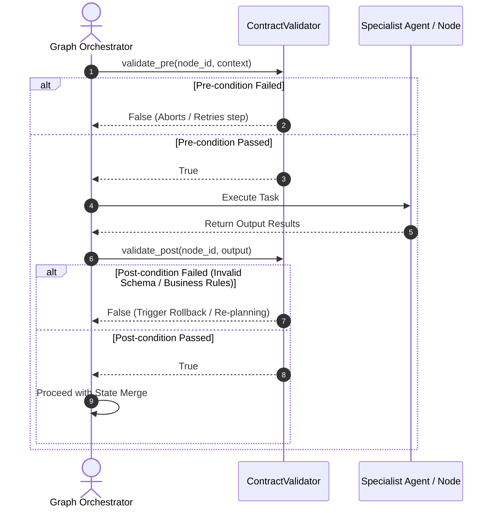

# Pillar 5: Agent OS Infrastructure

## Overview

The **Agent OS Infrastructure** pillar provides the production-grade foundation, telemetry, and proactive security guardrails that elevate `agent-utilities` from a research prototype into an enterprise-ready Agentic Operating System.

## Why We Built This (Rationale)

Deploying autonomous systems in production introduces severe risks:
1. **Prompt & Command Injection**: Malicious or malformed inputs can hijack the agent's LLM context and execute arbitrary code.
2. **Infinite Loops (Doom Loops)**: Agents can get stuck repeatedly calling the same tool with the same failed arguments, burning thousands of dollars in LLM API credits.
3. **Lack of Auditability**: When an agent modifies a production database or deletes a file, tracking exactly *why* that decision was made is critical for compliance.

---

## ⚙️ Standardized Configuration

The `agent-utilities` ecosystem uses a standardized XDG-compliant JSON configuration for its language models (LLMs), embeddings, and system properties. This architecture ensures a single source of truth across all tools and agent sessions.

### Unified Configuration (`config.json`)

The primary configuration file is located at `~/.config/agent-utilities/config.json`. This file is dynamically hot-reloadable.

#### Example `config.json`

```json
{
  "chat_models": [
    {
      "id": "gpt-4o",
      "provider": "openai",
      "intelligence_level": "normal",
      "supports_json": true,
      "vision": true
    },
    {
      "id": "gpt-4o-mini",
      "provider": "openai",
      "intelligence_level": "light",
      "supports_json": true,
      "vision": true
    },
    {
      "id": "claude-3-5-sonnet-latest",
      "provider": "anthropic",
      "intelligence_level": "super",
      "supports_json": true,
      "vision": true
    }
  ],
  "embedding_models": [
    {
      "id": "text-embedding-nomic-embed-text-v2-moe",
      "provider": "openai",
      "base_url": "http://vllm-embed.arpa/v1"
    }
  ]
}
```

#### Model Properties

*   `id`: The specific model string identifier to pass to the API.
*   `provider`: The API provider (e.g., `openai`, `anthropic`, `ollama`).
*   `intelligence_level`: Categorizes the model's capability (`light`, `normal`, `super`). Replaces legacy `LITE_LLM`, `SUPER_LLM` tier routing.
*   `supports_json`: Boolean indicating if the model natively supports JSON mode.
*   `vision`: Boolean indicating if the model supports multimodal inputs (images).

### Environment Variables (`.env`)

Environment variables are now strictly reserved for sensitive credentials. They are decoupled from routing flags.

```env
# Sensitive Credentials Only
LLM_API_KEY=sk-...
ANTHROPIC_API_KEY=sk-ant-...
```

---

## 🏠 Gateway Service Dashboard (CONCEPT:AU-OS.config.gateway-service-dashboard)

The **Gateway** provides a Homepage-style service dashboard for Agent-OS. It is the unified data layer that all three frontends (agent-webui, agent-terminal-ui, geniusbot) use to render service health, metrics, and quick-access links for 50+ integrated services.

> [!NOTE]
> Synthesized from the former standalone `service-dashboard-core` package into
> `agent_utilities/gateway/` to eliminate duplicate registries, duplicate XDG path
> logic, and an orphaned package dependency. See [AU-OS.config.gateway-service-dashboard](5_agent_os_infrastructure/OS-5.9-Gateway_Service_Dashboard.md) for full documentation.

### Key Components

| Component | Source | Description |
|-----------|--------|-------------|
| **Widget Registry** | `gateway/registry.py` | Lazy-loading discovery of 50 widget types (graceful degradation) |
| **Config Manager** | `gateway/config.py` | YAML service layout + auto-discovery from `mcp_config.json` |
| **Aggregator** | `gateway/aggregator.py` | Async parallel data fetching via `ThreadPoolExecutor` |
| **Dashboard Router** | `gateway/api.py` | REST endpoints: `/layout`, `/data`, `/widgets`, `/health`, `/discover` |
| **WebSocket Manager** | `gateway/ws.py` | Real-time streaming at `/ws/dashboard` |
| **Widget Modules** | `gateway/widgets/*.py` | 50 service-specific implementations (Portainer, GitLab, Jellyfin, etc.) |

### Integration Architecture

```
agent-webui ──── REST /api/dashboard ────┐
                 WS /ws/dashboard ───────┤
                                         ├── Aggregator ── Registry ── 50 Widgets
agent-terminal-ui ── direct Python ──────┤
                                         │
geniusbot ────── QThread/direct ─────────┘
```

All XDG paths delegate to `core/paths.py`:
- `services_config_path()` → `~/.config/agent-utilities/services.yaml`
- `dashboard_layout_path()` → `~/.local/share/agent-utilities/layout.yaml`
- `mcp_config_path()` → `~/.config/agent-utilities/mcp_config.json`

---

## 🔒 Secrets & Authentication (CONCEPT:AU-OS.config.secrets-authentication)

### Session Concurrency Management

*   **Source Code**: `agent_utilities/server/concurrency.py`
*   **Behavior**: Distributed request queuing, interrupt mapping, and double-texting concurrency control (enqueue/reject/interrupt/rollback).

### Native xAI OAuth PKCE Integration

Supports native xAI OAuth 2.0 PKCE authentication to access the X / xAI API and search X posts or browse individual posts without hitting static API key limitations.

```
┌──────────────┐          1. Click link          ┌──────────────┐
│ Agent / CLI  ├────────────────────────────────►│ x.com Auth   │
│              │◄────────────────────────────────┤ Login Page   │
│ (Spin Server)│     2. Callback with Code       └──────┬───────┘
└──────┬───────┘    (or manual CLI input)               │
       │                                                │
       │ 3. Exchange Auth Code + Verifier               │
       ▼                                                │
┌──────────────┐                                        │
│  xAI OAuth   │◄───────────────────────────────────────┘
│  Token Endpt │
└──────┬───────┘
       │ 4. Store encrypted tokens in SecretsClient
       ▼
┌──────────────┐
│SecretsClient │
└──────────────┘
```

#### Loopback & Headless Authentication Support

1. **How Loopback Works Remotely**
   The OIDC callback server runs inside the workspace environment at `http://127.0.0.1:56121/callback`.
   Because `graph-os` runs as an MCP server, standard standard-input prompts (`input()`) cannot be used (since the IDE uses standard input/output for JSON-RPC communication, reading from stdin would hang the MCP server).
   Therefore, the callback server is the exclusive way to exchange tokens without crashing the MCP channel.

2. **How to Authenticate in a Headless/Remote Environment**
   To authenticate using your local browser while the MCP server runs on the remote container/VM:
   * **Forward the Callback Port**: Set up a local port forward for port `56121` in your IDE (or via SSH using `ssh -L 56121:127.0.0.1:56121`).
   * **Authorize**: Click the xAI auth link in your browser and log in.
   * **Seamless Redirect**: When the browser redirects to `http://127.0.0.1:56121/callback`, the traffic will be forwarded back to your remote workspace. The OIDC loopback server will instantly capture the authorization code, exchange it, and save the token securely—completing the setup automatically with zero manual copy-pasting!

---

## 🛡️ Declarative Sensory Guardrails & Safety Contracts (CONCEPT:AU-OS.config.secrets-authentication)

Sensory verification utilizes declarative tool contracts (`ContractValidator`) enforcing functional pre-conditions and strict schema-validated post-conditions on execution steps. This ensures that agent steps operate strictly within validated environments and return safety-compliant data structures.

### System Sequence Flow



### Key Capabilities

1. **Pre-condition Assertions**: Assert the prerequisite structural and environmental states required for a step to begin safely (e.g., database locks, network connections).
2. **Post-condition Schema Enforcement**: Ensure output values match strict Pydantic structures (`post_condition_schema`) or pass customized assertion functions (`post_condition_verifier`).

*   **Source Code Path**: [contract_validator.py](file:///home/apps/workspace/agent-packages/agent-utilities/agent_utilities/harness/contract_validator.py)

---

## 📈 Telemetry, Observability & Token Usage (CONCEPT:AU-OS.config.secrets-authentication)

### Token Usage Tracker

Provides 4-bucket granular token analytics (prompt/response/thoughts/tool_use) with session aggregation, agent breakdown, and budget alerting. Ported from MATE's `token_usage_service.py`. Uses OWL-inferred `highCostAgent` classification.
*   **Source Code**: `agent_utilities/observability/token_tracker.py`

### Audit Logger (CONCEPT:AU-OS.governance.wasm-micro-agent-sandbox)

Append-only compliance audit trail with 30+ action constants, never-raise semantics, configurable retention, and query filtering. Ported from MATE's `audit_service.py`. Uses OWL-inferred `escalationChain` temporal reasoning.
*   **Source Code**: `agent_utilities/observability/audit_logger.py`

### Centralized Logging & XDG Path Resolution (CONCEPT:AU-OS.config.agent-os-pillar-overview)

To ensure workspace cleanliness, seamless containerization, and standardized troubleshooting, `agent-utilities` employs a centralized logging and path resolution architecture based on the **XDG Base Directory Specification**. All agent packages and downstream tools redirect their execution and debug logs away from workspace folders and into a single, unified log folder.

#### Path Resolution Architecture
*   **Standard XDG Log Directory**: Resolves by default to the standard platform-specific user log path, utilizing `user_log_path(APP_NAME, APP_AUTHOR)` (e.g., `~/.cache/agent-utilities/log/` on Linux).
*   **Environment Override**: Developers and CI/CD environments can easily override the path using the `AGENT_UTILITIES_LOG_DIR` environment variable.
*   **Centralized Path Helpers**: Exposed as first-class standard helpers in `agent_utilities.core.paths` via `log_dir() -> Path` and auto-created during initialization via `ensure_dirs()`.

#### Package Standardization & Standalone Resilience
To prevent runtime `ImportError` failures when individual packages or tools are run in standalone environments without the full `agent-utilities` library installed, packages use a resilient fallback pattern with `platformdirs`:

```python
try:
    from agent_utilities.core.paths import log_dir
    logs_dir = log_dir()
except ImportError:
    import platformdirs
    logs_dir = Path(platformdirs.user_log_path("agent-utilities", "knuckles-team"))
```

#### Standardized Components & Log Files
*   **`repository-manager`**: Centralizes operational debug traces to `repository_manager_debug.log` and active server integration test output to `server_integration.log`.
*   **`geniusbot`**: Standardizes all chat assistant logs to `geniusbot.log` located exclusively within the unified log directory.
*   **Workspace Protection**: Guarantees that no developer logs, temporary telemetry databases, or debug outputs clutter workspace repositories, preserving git and build environment cleanliness.

*   **Source Code**: [paths.py](file:///home/apps/workspace/agent-packages/agent-utilities/agent_utilities/core/paths.py)

### Telemetry & Observability

Real-time Graph Streaming (SSE) and lifecycle events. Per-step state snapshots via `graph.iter()`. Early OTEL/logfire gate. Includes Native Langfuse Tracing hooks via `@trace` decorators and automated continuous improvement dataset promotion.
*   **Source Code**: `agent_utilities/observability/telemetry.py`, `agent_utilities/harness/tracing.py`, `agent_utilities/harness/evaluators.py`

#### Native Langfuse Integration
`agent-utilities` integrates directly with the Langfuse API client (`langfuse-agent`) to provide zero-overhead, batch-flushed tracing. By providing `LANGFUSE_SECRET_KEY` in the environment, agents automatically push traces, metrics, and LLM-as-a-judge scores. Traces that fall below `LANGFUSE_DATASET_CAPTURE_THRESHOLD` are promoted to Langfuse Datasets for closed-loop continuous improvement.

---

## 🛡️ Proactive Security & Execution Stability

### Threat Defense Engine (Injection & Jailbreak) (AU-OS.governance.wasm-micro-agent-sandbox & AU-OS.observability.empty-derive-from-effect)
*   **Source Code**: `agent_utilities/security/prompt_scanner.py`
*   **Defense**: Intercepts inputs and tool outputs, scanning against 25+ threat vectors (reverse shells, command injection). Implements a 4-category jailbreak defense taxonomy covering DAN, optimization-based GCG suffixes, context boundary confusion, and role-play escalations.

### Topological Vulnerability Scanning (OS-5.11)
*   **Source Code**: `agent_utilities/security/topological_scanner.py`
*   **Defense**: Scans the execution graph planner outputs for untrusted data flows or dependency deadlocks by matching structures against risk subgraphs using the Analogy Engine (KG-2.7).

### Execution Stability Engine (Doom-Loop & Repetition Guard) (OS-5.1 & AU-OS.governance.reactive-multi-axis-budget)
*   **Source Code**: `agent_utilities/security/execution_stability_engine.py`
*   **Behavior**: Tracks repeated sequences of tool calls with identical arguments. On loop detection, denies execution and injects corrective guidance into the prompt context to steer the agent towards alternative strategies.

---

## 🤝 Human-in-the-Loop (Tool Approval & Elicitation)

`agent-utilities` provides true **pause-and-resume** human-in-the-loop for sensitive tool execution and MCP elicitation. When a specialist sub-agent calls a tool flagged with `requires_approval=True`, the graph suspends at that exact node, streams an approval request to the connected UI, and resumes only after the user responds.

### Key Components:
- **`ApprovalManager`** (`approval_manager.py`) — asyncio.Future-based registry that pauses coroutines and resumes them when the UI responds.
- **`run_with_approvals()`** — wraps pydantic-ai's two-call pattern into a single blocking call.
- **`/api/approve`** endpoint — REST endpoint that both UIs POST to when the user approves/denies.
- **`global_elicitation_callback()`** — MCP `ctx.elicit()` callback using the same pause/resume mechanism.

### Protocol Support:
| Protocol | Approval Mechanism |
|---|---|
| AG-UI (web + terminal) | Sideband SSE events + `POST /api/approve` |
| ACP | pydantic-acp's native `NativeApprovalBridge` (automatic) |
| SSE (`/stream`) | Same as AG-UI |

---

## 🪙 Reactive Budget Guardrails (CONCEPT:AU-OS.governance.reactive-multi-axis-budget)

To prevent runaway API costs and infinite loops, the system implements a **Reactive Budget Guardrail** framework. It provides real-time, fine-grained tracking of token counts, monetary expenses, and execution step thresholds.

### Key Capabilities

1. **Preemption Thresholds**: The execution manager continuously monitors active agent session costs. When usage reaches a pre-configured preemption threshold (e.g., 90% of the maximum allotted budget), a reactive event is dispatched.
2. **Homeostatic Model Downgrades**: Instead of outright killing the agent mid-task, the scheduler triggers a homeostatic model downgrade. For example, routing shifts from a high-cost model (like Claude 3.5 Sonnet) to a low-cost model (like GPT-4o-mini) to complete the final steps of execution within budget.
3. **Structured Preemption**: If the budget is completely exhausted, the system halts execution, captures a serialized state checkpoint (`CONCEPT:AU-ORCH.execution.execution-budget-caps`), and yields control back to the orchestrator with a structured `BudgetExceededError`, ensuring no progress is lost.

*   **Source Code Paths**:
    *   `agent_utilities/graph/reactive/budget.py`
    *   `agent_utilities/observability/token_tracker.py`

---

## ⚡ Massive Scale Architecture & WASM Sandbox (CONCEPT:AU-OS.governance.wasm-micro-agent-sandbox)

Scaling to **100,000,000 concurrent agents** requires swapping out local memory queues, resolving GIL contention, and running untrusted agent code in highly secure, low-overhead environments.

### Key Capabilities

1. **Pluggable Event Fabrics**: Local, in-memory queues are abstracted using a unified `QueueBackend` interface (`CONCEPT:AU-ECO.bus.pluggable-event-queue`). The system supports zero-overhead memory backends, NATS messaging clusters (`NatsQueueBackend`), and distributed Apache Kafka partitions (`KafkaQueueBackend`) for multi-host, high-throughput event sourcing.
2. **Compiled Rust Graph Compute**: High-performance epistemic reasoning, transitive closure calculations, and topological analogy scans run in the compiled Rust `epistemic-graph` engine (`CONCEPT:AU-KG.ingest.engineering-rules`), reached **out-of-process** over a MessagePack/UDS (or TCP) client — there is **no PyO3** in the primary path — substantially reducing analytical overhead.
3. **WebAssembly sandboxed Micro-Agents**: Untrusted or user-generated micro-agents are executed inside an isolated WebAssembly sandbox using `wasmtime` (`CONCEPT:AU-ORCH.sandbox.compiled-orchestration-kernel`). Sandboxes enforce strict gas limits, precise memory caps, and virtualized system calls. If WebAssembly compilation is unavailable on the host system, execution dynamically falls back to a secure Python emulation layer.

*   **Source Code Paths**:
    *   `agent_utilities/core/wasm_runner.py`
    *   `agent_utilities/knowledge_graph/core/queue_backend.py`
    *   `agent_utilities/knowledge_graph/core/nats_queue_backend.py`
    *   `agent_utilities/knowledge_graph/core/kafka_queue_backend.py`

---

## 🔀 Distributed Replay, Sandboxing, & Epistemic Scheduling (OS-5.6)

To satisfy strict regulatory compliance, low-level isolation, and intelligent resource allocation, the Agent OS is extended with advanced core modules connecting low-level execution with the epistemic Knowledge Graph.

### Key Synergistic Core Modules:

1. **Deterministic Replay & Trace Ontology (`OS-5.6`)**:
   Captures step-by-step agent executions (prompts, tool calls, memory state transitions) and registers them as first-class OWL sub-graphs under the **PROV-O (Provenance Ontology)**. This creates crypotographically immutable, auditable provenance logs.
   * *Source Code*: [replay_engine.py](file:///home/apps/workspace/agent-packages/agent-utilities/agent_utilities/observability/replay_engine.py)

2. **Hardened WASM Sandbox Executor (`AU-OS.deployment.platform-journey`)**:
   Runs untrusted external tools and sub-agent scripts inside isolated WebAssembly processes with custom Gas Limit Bounds and Memory Allocation limits (e.g. 64MB cap), executing with microsecond-level process containment.
   * *Source Code*: [sandboxed_executor.py](file:///home/apps/workspace/agent-packages/agent-utilities/agent_utilities/security/sandboxed_executor.py)

3. **Epistemic Resource Scheduler (`OS-5.8`)**:
   An advanced CPU/thread scheduler that dynamically calculates the **eigenvector/out-degree centrality** of active agent nodes in the live Knowledge Graph. High-centrality orchestrator blocks are scaled with increased execution quotas, while low-centrality crawler blocks are checkpointed and paged to disk under system load.
   * *Source Code*: [cognitive_scheduler.py](file:///home/apps/workspace/agent-packages/agent-utilities/agent_utilities/core/cognitive_scheduler.py)

4. **Ontological Guardrail Engine (`AU-OS.governance.reactive-multi-axis-budget`)**:
   Intercepts tool schemas and checks parameter payload arguments using real-time OWL subsumption reasoning. Automatically blocks access to files, network targets, or commands if they inherit from banned policy classes inside the Knowledge Graph.
   * *Source Code*: [tool_guard.py](file:///home/apps/workspace/agent-packages/agent-utilities/agent_utilities/security/tool_guard.py)

For a complete architectural analysis, refer to the detailed guide:
👉 [OS-5.6 — Distributed Replay, Sandboxing, & Epistemic Resource Scheduling](file:///home/apps/workspace/agent-packages/agent-utilities/docs/pillars/5_agent_os_infrastructure/OS-5.6-Distributed_Replay_And_Coordination.md)

---

## 🔐 Server-Minted Identity & Fail-Closed Permissioning (CONCEPT:AU-OS.identity.authenticated-identity-enforcement)

Identity is established **server-side**, never trusted from the client:

1. **JWT-minted ActorContext**: the `ActorIdentityMiddleware`
   (`agent_utilities/security/request_identity.py`) validates
   `Authorization: Bearer` tokens against the configured JWKS and scopes every
   request to a server-minted `ActorContext` (actor id, tenant, roles). With
   `KG_AUTH_REQUIRED`, unauthenticated requests are rejected with 401;
   `GET /metrics` is the deliberate exemption (scrapers cannot mint JWTs).
2. **Fail-closed permissioning**: an ACL-check exception denies; permission
   evaluation never falls open (`security/auth.py`,
   `knowledge_graph/ontology/permissioning.py`).
3. **Engine HMAC authentication**: connections to the Rust engine authenticate
   with an HMAC-SHA256 shared secret; unset, a per-machine secret is
   auto-generated under the data dir (mode 0600) so local processes agree,
   while multi-host/sharded deployments set one explicit secret everywhere
   (see `docker/engine-shards.compose.yml`).

In sharded deployments the ambient `ActorContext` tenant also drives graph
placement (AU-KG.sharding.tenant-partitioned-sharding-hrw). Walkthrough: [identity & JWT example](../examples/identity-jwt.md).

---

## 🗄️ Externalized Durable State & Multi-Host Operation (CONCEPT:AU-OS.state.unified-durable-state-externalization / AU-OS.state.cross-host-daemon-leadership / AU-OS.state.fleet-supervisory-plane-at)

One flag — `STATE_DB_URI` — moves all three durable stores (durable-execution
checkpoints, sessions/turns/goals, the KG task + staging queue) from per-host
SQLite onto a shared Postgres (`agent_utilities/core/state_store.py`). Unset,
behavior is byte-for-byte the zero-infra default.

- **Cross-host queue claims (AU-KG.ingest.cross-host-safe-kg)**: task claims are atomic
  `FOR UPDATE SKIP LOCKED` selections with visibility-timeout recovery, so
  multiple hosts can drain one queue safely.
- **Daemon leadership (AU-OS.state.cross-host-daemon-leadership)**: singleton background ticks elect exactly
  one leader fleet-wide via Postgres advisory locks
  (`agent_utilities/core/leadership.py`).
- **Supervisory plane at scale (AU-OS.state.fleet-supervisory-plane-at)**: fleet/session queries are
  SQL-aggregated, paginated, and filtered server-side, and desired-state
  pause/kill reconciles across hosts (`core/sessions.py`, `gateway/fleet.py`).
- **Durable goals (AU-ORCH.session.durable-goal-registry-goals)**: goals persist across restarts; stranded runs
  rehydrate as `orphaned` instead of silently vanishing.

Full design: [State Externalization](../architecture/state_externalization.md).

---

## 📡 Fleet Event Ingress (CONCEPT:AU-OS.config.fleet-event-ingress)

`POST /api/fleet/events` (`gateway/fleet_events.py`) is the webhook ingress
for monitoring systems (Alertmanager, Uptime Kuma, Portainer, …): alerts are
normalized and persisted as `FleetEvent` KG nodes, and a triage seam
(`knowledge_graph/adaptation/fleet_event_triage.py`) routes them to registered
remediation playbooks (AU-OS.host.remediation-playbooks). Wiring guide:
[fleet events example](../examples/fleet-events-wiring.md).

---

## 🚦 Gateway Middle-Tier Hardening (CONCEPT:AU-OS.observability.no-op-without-metrics)

The Python gateway tier is observable and self-protecting:

- **Prometheus metrics** (`observability/gateway_metrics.py`): ASGI middleware
  + `GET /metrics` (mounted by `register_graph_routes`, so the gateway and the
  agent-webui backend get identical instrumentation) emitting
  `agent_utilities_gateway_requests_total{route,method,status}` and its
  siblings (`agent_utilities_gateway_` + `request_duration_seconds{route}`,
  `in_flight_requests`, `rate_limited_total{tenant}`,
  `engine_requests_total{op,outcome}`,
  `engine_breaker_state{endpoint}`). `prometheus-client` is the optional
  `metrics` extra with a graceful no-op fallback; flag `GATEWAY_METRICS`
  (default on). Catalog: [metrics reference](../reference/metrics.md).
- **Per-tenant token-bucket rate limiting** (`gateway/rate_limit.py`): mounted
  inside the identity middleware so the bucket key is the server-minted
  ActorContext (tenant → actor → client IP); 429 + `Retry-After`. Flags:
  `GATEWAY_RATE_LIMIT` (req/s, default 0 = off), `GATEWAY_RATE_BURST`.
  Buckets are per-process: N workers multiply the configured rate.
- **Engine circuit breaker** (`knowledge_graph/core/engine_breaker.py`): one
  shared breaker per engine endpoint — `ENGINE_BREAKER_THRESHOLD` (default 5)
  consecutive connect/timeout failures open it, callers fail fast with the
  typed `EngineCircuitOpenError`, and a half-open probe after
  `ENGINE_BREAKER_COOLDOWN` (default 15s) heals it.
- **Multi-worker readiness**: `GATEWAY_WORKERS` (default 1) pre-forks workers
  on one shared listen socket; the flock host-lock still elects exactly one KG
  host daemon among them.

Full design: [Gateway Scaling](../architecture/gateway_scaling.md);
walkthrough: [observability example](../examples/observability.md).

---

## 🤖 Fleet Autonomy Control Plane (CONCEPT:AU-OS.deployment.fleet-lifecycle-control — AU-OS.config.health-gated-deploy-rollback, OS-5.29)

The layer that lets the platform act on its fleet — restart, scale, deploy,
remediate — without ever acting outside policy. One decision point, five
pieces:

1. **ActionPolicy decision point (OS-5.24,
   `orchestration/action_policy.py`)**: the single gate consulted before ANY
   autonomous mutating operational action. Per-action autonomy tiers (`auto` /
   `auto_notify` / `approval_required` / `forbidden`), durable per-action+target
   rate limits, blast-radius caps, and UTC maintenance windows. Policies load
   from YAML (`ACTION_POLICY_PATH`, default = the shipped conservative
   `deploy/action-policy.default.yml`: everything mutating requires approval)
   plus runtime KG `governance_rule` overrides. Decisions **fail closed**, are
   audit-logged as `ActionDecision` nodes, and queued approvals surface at
   `GET /api/fleet/approvals` / resolve via `.../grant`.
2. **Desired-state fleet reconciler (AU-OS.config.desired-state-fleet-reconciler,
   `orchestration/fleet_reconciler.py`)**: opt-in leader-only tick
   (`FLEET_RECONCILER`, default off) diffing `deploy/mcp-fleet.registry.yml`
   against a pluggable `FleetObserver` and converging each divergence through
   the ActionPolicy gate and the injectable `FleetActuator`
   (`orchestration/fleet_actuation.py`). The **default actuator is dry-run** —
   it records intended actions as `ActionExecution` nodes and mutates nothing;
   `FLEET_ACTUATOR=docker` selects the reference docker actuator. Storm guard:
   `FLEET_RECONCILER_MAX_ACTIONS` per tick.
3. **Remediation playbooks (AU-OS.host.remediation-playbooks,
   `knowledge_graph/adaptation/remediation_playbooks.py`)**: `service_down`
   (confirm → policy-gated restart → durable verification watch → escalate),
   `service_flapping` (back off + escalate), `resource_pressure` (notify +
   propose, never auto-act). Every step outcome lands on the originating
   FleetEvent node.
4. **Health-gated deploy watch (AU-OS.config.health-gated-deploy-rollback, `orchestration/deploy_watch.py`)**:
   every autonomy-triggered deploy/restart schedules a durable `deploy_watch`
   task probing the observer until its deadline (`DEPLOY_WATCH_WINDOW` /
   `DEPLOY_WATCH_POLL`). Sustained green records success; failure invokes the
   default `on_fail` — an ActionPolicy-gated `rollback_service` plus operator
   escalation; zero observations only notifies (never roll back on zero
   evidence).
5. **Reactive replica autoscaler (OS-5.29,
   `orchestration/fleet_autoscaler.py` + `scaling_signals.py`)**:
   registry-declared scaling bounds, pluggable signal providers, and a
   leader-only target-tracking tick (`FLEET_AUTOSCALER`, default off) whose
   scale actions pass the same policy gate and deploy watch.

Full design: [Fleet Autonomy](../architecture/fleet_autonomy.md); postures:
[action-policy examples](../examples/action-policy-postures.md); signals:
[autoscaling examples](../examples/autoscaling-signals.md).

---

## 🧭 Shard Topology Visibility (CONCEPT:AU-OS.scaling.shard-topology-visibility-per)

When the engine tier is sharded (AU-KG.sharding.tenant-partitioned-sharding-hrw), the topology is observable:
`shard_topology_status()` reports per-shard transport-level reachability and
breaker state on the unified daemon status, the gateway dashboard exposes it
at the `daemon/shards` route, and graph-os `GET /health` carries a config-only
summary. Metrics: `agent_utilities_engine_shard_up{endpoint}` and
`agent_utilities_engine_shard_requests_total{endpoint,outcome}`. See
[Engine Sharding](../architecture/engine_sharding.md).

## 🛠️ Developer-Workspace Runtime (CONCEPT:AU-OS.scaling.bridge-developer-workspace-mutating / ORCH-1.46 / KG-2.64)

The substrate a knowledge-grounded software-engineering agent (ORCH-1.47) runs in —
our answer to OpenHands' Docker runtime, projected onto our architecture. Unlike the
RLM sandbox (ORCH-1.38), which executes one snippet against a namespace and syncs back
`{vars, stdout}`, a `DevWorkspace` is **long-lived and stateful**: `cd`/edits/installed
deps persist across steps.

- **Backends (`agent_utilities/runtime/`).** `LocalWorkspace` is the always-available,
  zero-infra floor (host subprocess in a scratch dir). `DockerWorkspace` is the
  isolation tier: it reuses the proven hardening flags from
  `rlm/sandboxes/docker_backend.py` (`--cap-drop ALL`, `--security-opt
  no-new-privileges`, `--memory`/`--pids-limit`/`--cpus`) but keeps the container
  detached (`sleep infinity`) and runs actions via `docker exec`, with file ops done
  host-side on the `/workspace` bind-mount (no in-container shim). A class-level
  registry + `reap_idle()` reclaims leaked containers.
- **Typed action/observation protocol (ORCH-1.46, `events.py`/`bridge.py`).** Every
  step is a frozen, discriminated-union `Action` (`CmdRun`, `FileRead/Write/Edit`,
  `TestRun`, `PortExpose`, `AgentFinish`) yielding a typed `Observation`. Each event
  carries `run_id`/`step`/`ts`/`actor`. The shell's cwd persists via a marker file the
  wrapped command writes `pwd` into.
- **KG provenance (KG-2.64, `provenance.py`).** Each action/observation is minted into
  the KG (`(:RunTrace)-[:HAS_ACTION]->(:WorkspaceAction)-[:PRODUCED]->(:WorkspaceObservation)`,
  `[:NEXT]` for replay), and a file edit is grounded to the `Code` symbols it touched
  (`(:WorkspaceAction)-[:MUTATED]->(:Code)`). This is what lets the golden loop
  (AHE-3.23) attribute failures to edit-kinds on symbol classes as a graph query.
- **Governance.** Mutating actions map to `workspace.cmd|write|edit` and pass through
  the fail-closed `ActionPolicy` (OS-5.24) when a gate is supplied
  (`runtime.action_policy_gate`); the shipped default sets them to `auto` (the sandbox
  is the boundary) and an operator can override any to `approval_required`.
- **Surface.** `/api/runtime/*` — create a session, post typed actions, and stream the
  action/observation event log over SSE (consumed by the agent-webui SWE view, AU-OS.scaling.kg-provenance-panel-data).
