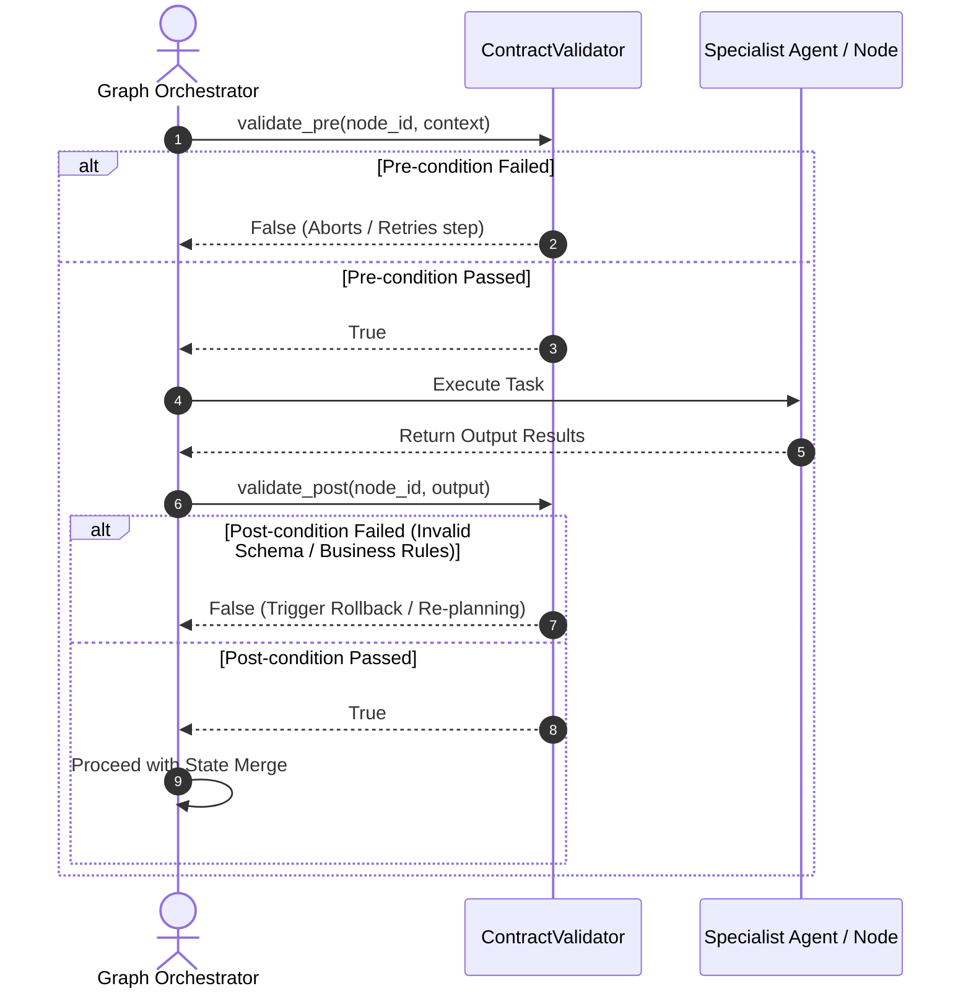

# Pillar 5: Agent OS Infrastructure

## Overview

The **Agent OS Infrastructure** pillar provides the production-grade foundation, telemetry, and proactive security guardrails that elevate `agent-utilities` from a research prototype into an enterprise-ready Agentic Operating System.

## Why We Built This (Rationale)

Deploying autonomous systems in production introduces severe risks:
1. **Prompt & Command Injection**: Malicious or malformed inputs can hijack the agent's LLM context and execute arbitrary code.
2. **Infinite Loops (Doom Loops)**: Agents can get stuck repeatedly calling the same tool with the same failed arguments, burning thousands of dollars in LLM API credits.
3. **Lack of Auditability**: When an agent modifies a production database or deletes a file, tracking exactly *why* that decision was made is critical for compliance.

---

## ⚙️ Standardized Configuration

The `agent-utilities` ecosystem uses a standardized XDG-compliant JSON configuration for its language models (LLMs), embeddings, and system properties. This architecture ensures a single source of truth across all tools and agent sessions.

### Unified Configuration (`config.json`)

The primary configuration file is located at `~/.config/agent-utilities/config.json`. This file is dynamically hot-reloadable.

#### Example `config.json`

```json
{
  "chat_models": [
    {
      "id": "gpt-4o",
      "provider": "openai",
      "intelligence_level": "normal",
      "supports_json": true,
      "vision": true
    },
    {
      "id": "gpt-4o-mini",
      "provider": "openai",
      "intelligence_level": "light",
      "supports_json": true,
      "vision": true
    },
    {
      "id": "claude-3-5-sonnet-latest",
      "provider": "anthropic",
      "intelligence_level": "super",
      "supports_json": true,
      "vision": true
    }
  ],
  "embedding_models": [
    {
      "id": "text-embedding-nomic-embed-text-v2-moe",
      "provider": "openai",
      "base_url": "http://10.0.0.18:1234/v1"
    }
  ]
}
```

#### Model Properties

*   `id`: The specific model string identifier to pass to the API.
*   `provider`: The API provider (e.g., `openai`, `anthropic`, `ollama`).
*   `intelligence_level`: Categorizes the model's capability (`light`, `normal`, `super`). Replaces legacy `LITE_LLM`, `SUPER_LLM` tier routing.
*   `supports_json`: Boolean indicating if the model natively supports JSON mode.
*   `vision`: Boolean indicating if the model supports multimodal inputs (images).

### Environment Variables (`.env`)

Environment variables are now strictly reserved for sensitive credentials. They are decoupled from routing flags.

```env
# Sensitive Credentials Only
LLM_API_KEY=sk-...
ANTHROPIC_API_KEY=sk-ant-...
```

---

## 🔒 Secrets & Authentication (CONCEPT:OS-5.1)

### Session Concurrency Management

*   **Source Code**: `agent_utilities/server/concurrency.py`
*   **Behavior**: Distributed request queuing, interrupt mapping, and double-texting concurrency control (enqueue/reject/interrupt/rollback).

### Native xAI OAuth PKCE Integration

Supports native xAI OAuth 2.0 PKCE authentication to access the X / xAI API and search X posts or browse individual posts without hitting static API key limitations.

```
┌──────────────┐          1. Click link          ┌──────────────┐
│ Agent / CLI  ├────────────────────────────────►│ x.com Auth   │
│              │◄────────────────────────────────┤ Login Page   │
│ (Spin Server)│     2. Callback with Code       └──────┬───────┘
└──────┬───────┘    (or manual CLI input)               │
       │                                                │
       │ 3. Exchange Auth Code + Verifier               │
       ▼                                                │
┌──────────────┐                                        │
│  xAI OAuth   │◄───────────────────────────────────────┘
│  Token Endpt │
└──────┬───────┘
       │ 4. Store encrypted tokens in SecretsClient
       ▼
┌──────────────┐
│SecretsClient │
└──────────────┘
```

#### Loopback & Headless Authentication Support

1. **How Loopback Works Remotely**
   The OIDC callback server runs inside the workspace environment at `http://127.0.0.1:56121/callback`.
   Because `graph-os` runs as an MCP server, standard standard-input prompts (`input()`) cannot be used (since the IDE uses standard input/output for JSON-RPC communication, reading from stdin would hang the MCP server).
   Therefore, the callback server is the exclusive way to exchange tokens without crashing the MCP channel.

2. **How to Authenticate in a Headless/Remote Environment**
   To authenticate using your local browser while the MCP server runs on the remote container/VM:
   * **Forward the Callback Port**: Set up a local port forward for port `56121` in your IDE (or via SSH using `ssh -L 56121:127.0.0.1:56121`).
   * **Authorize**: Click the xAI auth link in your browser and log in.
   * **Seamless Redirect**: When the browser redirects to `http://127.0.0.1:56121/callback`, the traffic will be forwarded back to your remote workspace. The OIDC loopback server will instantly capture the authorization code, exchange it, and save the token securely—completing the setup automatically with zero manual copy-pasting!

---

## 🛡️ Declarative Sensory Guardrails & Safety Contracts (CONCEPT:OS-5.3)

Sensory verification utilizes declarative tool contracts (`ContractValidator`) enforcing functional pre-conditions and strict schema-validated post-conditions on execution steps. This ensures that agent steps operate strictly within validated environments and return safety-compliant data structures.

### System Sequence Flow



### Key Capabilities

1. **Pre-condition Assertions**: Assert the prerequisite structural and environmental states required for a step to begin safely (e.g., database locks, network connections).
2. **Post-condition Schema Enforcement**: Ensure output values match strict Pydantic structures (`post_condition_schema`) or pass customized assertion functions (`post_condition_verifier`).

*   **Source Code Path**: [contract_validator.py](file:///home/apps/workspace/agent-packages/agent-utilities/agent_utilities/harness/contract_validator.py)

---

## 📈 Telemetry, Observability & Token Usage (CONCEPT:OS-5.4)

### Token Usage Tracker

Provides 4-bucket granular token analytics (prompt/response/thoughts/tool_use) with session aggregation, agent breakdown, and budget alerting. Ported from MATE's `token_usage_service.py`. Uses OWL-inferred `highCostAgent` classification.
*   **Source Code**: `agent_utilities/observability/token_tracker.py`

### Audit Logger (CONCEPT:OS-5.7)

Append-only compliance audit trail with 30+ action constants, never-raise semantics, configurable retention, and query filtering. Ported from MATE's `audit_service.py`. Uses OWL-inferred `escalationChain` temporal reasoning.
*   **Source Code**: `agent_utilities/observability/audit_logger.py`

### Telemetry & Observability

Real-time Graph Streaming (SSE) and lifecycle events. Per-step state snapshots via `graph.iter()`. Early OTEL/logfire gate. Includes Native Langfuse Tracing hooks via `@trace` decorators and automated continuous improvement dataset promotion.
*   **Source Code**: `agent_utilities/observability/telemetry.py`, `agent_utilities/harness/tracing.py`, `agent_utilities/harness/evaluators.py`

#### Native Langfuse Integration
`agent-utilities` integrates directly with the Langfuse API client (`langfuse-agent`) to provide zero-overhead, batch-flushed tracing. By providing `LANGFUSE_SECRET_KEY` in the environment, agents automatically push traces, metrics, and LLM-as-a-judge scores. Traces that fall below `LANGFUSE_DATASET_CAPTURE_THRESHOLD` are promoted to Langfuse Datasets for closed-loop continuous improvement.

---

## 🛡️ Proactive Security & Execution Stability

### Threat Defense Engine (Injection & Jailbreak) (OS-5.4 & OS-5.12)
*   **Source Code**: `agent_utilities/security/prompt_scanner.py`
*   **Defense**: Intercepts inputs and tool outputs, scanning against 25+ threat vectors (reverse shells, command injection). Implements a 4-category jailbreak defense taxonomy covering DAN, optimization-based GCG suffixes, context boundary confusion, and role-play escalations.

### Topological Vulnerability Scanning (OS-5.11)
*   **Source Code**: `agent_utilities/security/topological_scanner.py`
*   **Defense**: Scans the execution graph planner outputs for untrusted data flows or dependency deadlocks by matching structures against risk subgraphs using the Analogy Engine (KG-2.15).

### Execution Stability Engine (Doom-Loop & Repetition Guard) (OS-5.18 & OS-5.5)
*   **Source Code**: `agent_utilities/security/repetition_guard.py` & `agent_utilities/security/doom_loop_detector.py`
*   **Behavior**: Tracks repeated sequences of tool calls with identical arguments. On loop detection, denies execution and injects corrective guidance into the prompt context to steer the agent towards alternative strategies.

---

## 🤝 Human-in-the-Loop (Tool Approval & Elicitation)

`agent-utilities` provides true **pause-and-resume** human-in-the-loop for sensitive tool execution and MCP elicitation. When a specialist sub-agent calls a tool flagged with `requires_approval=True`, the graph suspends at that exact node, streams an approval request to the connected UI, and resumes only after the user responds.

### Key Components:
- **`ApprovalManager`** (`approval_manager.py`) — asyncio.Future-based registry that pauses coroutines and resumes them when the UI responds.
- **`run_with_approvals()`** — wraps pydantic-ai's two-call pattern into a single blocking call.
- **`/api/approve`** endpoint — REST endpoint that both UIs POST to when the user approves/denies.
- **`global_elicitation_callback()`** — MCP `ctx.elicit()` callback using the same pause/resume mechanism.

### Protocol Support:
| Protocol | Approval Mechanism |
|---|---|
| AG-UI (web + terminal) | Sideband SSE events + `POST /api/approve` |
| ACP | pydantic-acp's native `NativeApprovalBridge` (automatic) |
| SSE (`/stream`) | Same as AG-UI |
