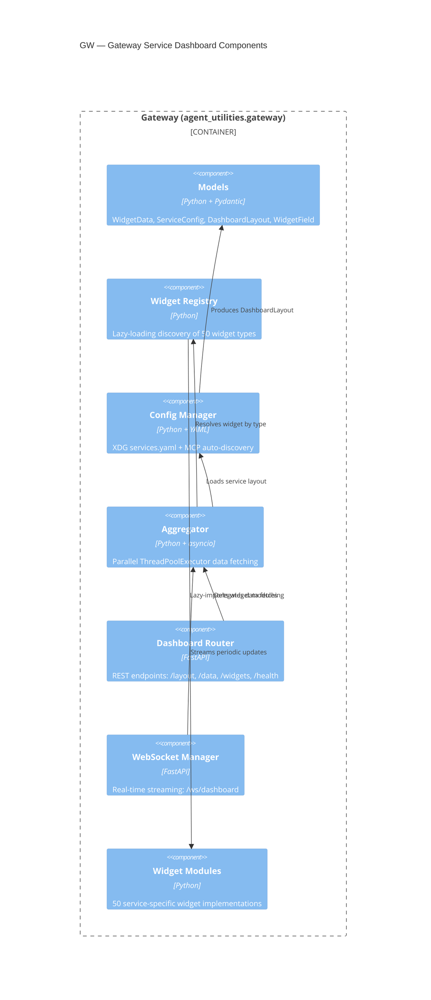

# Gateway Service Dashboard (CONCEPT:GW-1.0)

> **CONCEPT:GW-1.0** — Gateway Service Dashboard
>
> Synthesized from the former standalone `service-dashboard-core` package
> into `agent_utilities/gateway/` to eliminate duplicate registries,
> duplicate XDG path logic, and an orphaned package dependency.

## Overview

The Gateway provides a **Homepage-style service dashboard** for Agent-OS.
It is the unified data layer that all three frontends use to render
service health, metrics, and quick-access links for 50+ integrated services.

| Frontend | Integration | Data Flow |
|----------|-------------|-----------|
| **agent-webui** | `dashboard_router` mounted at `/api/dashboard` | REST + WebSocket |
| **agent-terminal-ui** | `Aggregator` imported directly | Direct Python API |
| **geniusbot** | `Aggregator` imported directly | Direct Python API (QThread) |

## Architecture



## Package Structure

```
agent_utilities/gateway/
├── __init__.py          # Public API re-exports
├── models.py            # Pydantic models: WidgetData, ServiceConfig, DashboardLayout
├── registry.py          # Widget Registry singleton with lazy loading
├── config.py            # ConfigManager: YAML load/save + MCP auto-discovery
├── aggregator.py        # Async parallel data fetcher (ThreadPoolExecutor)
├── api.py               # FastAPI router (mountable at /api/dashboard)
├── ws.py                # WebSocket manager (/ws/dashboard)
└── widgets/
    ├── __init__.py
    ├── base.py           # BaseWidget ABC
    ├── portainer.py      # Portainer widget
    ├── uptime_kuma.py    # Uptime Kuma widget
    ├── technitium.py     # Technitium DNS widget
    ├── gitlab.py         # GitLab widget
    ├── ...               # 46 more service widgets
    └── zulip.py          # Zulip widget
```

## Widget Registry

The registry uses **lazy loading** — widgets are only imported when first accessed.
This means frontends don't pay import cost for unused agent-packages.

```python
from agent_utilities.gateway.registry import get_registry

reg = get_registry()
print(reg.list_all_known())   # All 50 known widget types
print(reg.list_available())   # Only those whose deps are installed
widget = reg.get_widget("portainer")  # Lazy-imports on first access
```

### Built-in Widget Types (50)

| Category | Widgets |
|----------|---------|
| **Infrastructure** | portainer, uptime_kuma, technitium, caddy, container_manager, home_assistant, tunnel_manager, systems_manager |
| **DevOps** | gitlab, github, ansible_tower, repository_manager |
| **Media** | jellyfin, qbittorrent, owncast, media_downloader, arr |
| **Productivity** | nextcloud, plane, stirlingpdf, archivebox |
| **Lifestyle** | mealie, wger |
| **Security** | keycloak, openbao, teleport |
| **Communication** | mattermost, postiz, listmonk, zulip |
| **Observability** | langfuse, sentry, lgtm |
| **Business** | servicenow, erpnext, leanix, twenty, legal_peripherals, atlassian, google_workspace, microsoft |
| **Data & Research** | data_science, vector_db, documentdb, scholarx, audio_transcriber, ollama |
| **Custom** | genius_agent, emerald_exchange, searxng |

## Configuration

### Auto-Discovery from `mcp_config.json`

On first load, if no `services.yaml` exists, the ConfigManager reads
`~/.config/agent-utilities/mcp_config.json` and auto-maps known MCP servers
to dashboard widgets:

```python
from agent_utilities.gateway.config import ConfigManager

mgr = ConfigManager()
layout = mgr.load()  # Auto-discovers if no YAML exists
mgr.save(layout)     # Persists to ~/.config/agent-utilities/services.yaml
```

### Manual Configuration (`services.yaml`)

Users can customize their dashboard by editing `~/.config/agent-utilities/services.yaml`:

```yaml
settings:
  columns: 4
  theme: dark
  card_size: medium
  auto_refresh: true
  refresh_interval: 30

groups:
  - name: Infrastructure
    order: 0
    icon: server
    services:
      - id: portainer-1
        name: Portainer
        widget_type: portainer
        url: https://portainer.local
        env_prefix: PORTAINER
        category: Infrastructure

  - name: DevOps
    order: 1
    services:
      - id: gitlab-1
        name: GitLab
        widget_type: gitlab
        url: https://gitlab.local
        env_prefix: GITLAB
```

## XDG Path Integration

All paths delegate to `agent_utilities.core.paths` — **no duplicate XDG logic**:

| Function | Default Path | Usage |
|----------|-------------|-------|
| `services_config_path()` | `~/.config/agent-utilities/services.yaml` | Service layout |
| `dashboard_layout_path()` | `~/.local/share/agent-utilities/layout.yaml` | Persisted UI state |
| `mcp_config_path()` | `~/.config/agent-utilities/mcp_config.json` | Auto-discovery source |

## API Endpoints

When mounted in agent-webui via `app.include_router(dashboard_router, prefix='/api/dashboard')`:

| Endpoint | Method | Description |
|----------|--------|-------------|
| `/api/dashboard/layout` | GET | Get current dashboard layout |
| `/api/dashboard/layout` | PUT | Save dashboard layout |
| `/api/dashboard/data` | GET | Fetch all widget data |
| `/api/dashboard/data/{service_id}` | GET | Fetch single widget data |
| `/api/dashboard/full` | GET | Layout + data (initial load) |
| `/api/dashboard/widgets` | GET | List available widget types |
| `/api/dashboard/health` | GET | Health check all services |
| `/api/dashboard/discover` | GET | Auto-discover from mcp_config |
| `/ws/dashboard` | WS | Real-time streaming updates |

## Consolidation History

> [!IMPORTANT]
> The Gateway was synthesized from `service-dashboard-core` (standalone package)
> into `agent_utilities/gateway/` to eliminate 5 patterns that were duplicated
> across both packages:
>
> 1. **ServiceRegistry** — now uses `gateway/registry.py` (aligned with `graph/service_registry.py`)
> 2. **PluginRegistry** — lazy-loading via `importlib` (same pattern as `graph/plugin_registry.py`)
> 3. **XDG Path Resolution** — delegates to `core/paths.py` (eliminated `discovery.py`)
> 4. **MCP Config Discovery** — uses `core/paths.mcp_config_path()` (single source of truth)
> 5. **Graceful Import Degradation** — same try/except ImportError pattern as core

## Creating a New Widget

1. Create `agent_utilities/gateway/widgets/my_service.py`
2. Implement `Widget(BaseWidget)` with `service_type`, `get_fields()`, `fetch_data()`
3. Register in `registry.py` `_BUILTIN_WIDGETS` map
4. Add MCP mapping in `config.py` `_MCP_TO_WIDGET` (if an MCP server exists)

```python
from agent_utilities.gateway.widgets.base import BaseWidget
from agent_utilities.gateway.models import ServiceCategory, ServiceConfig, WidgetData, WidgetField

class Widget(BaseWidget):
    service_type = "my_service"
    display_name = "My Service"
    icon = "star"
    category = ServiceCategory.CUSTOM
    description = "Example custom service widget"
    env_prefix = "MY_SERVICE"
    default_url = "http://localhost:8080"

    def get_fields(self) -> list[WidgetField]:
        return [
            WidgetField(key="status", label="Status", format="text"),
            WidgetField(key="count", label="Items", format="number"),
        ]

    def fetch_data(self, config: ServiceConfig) -> WidgetData:
        url = self._resolve_url(config)
        token = self._resolve_token(config)
        # Call API and return structured data
        return WidgetData(
            status="ok",
            fields={"status": "running", "count": 42},
        )
```
