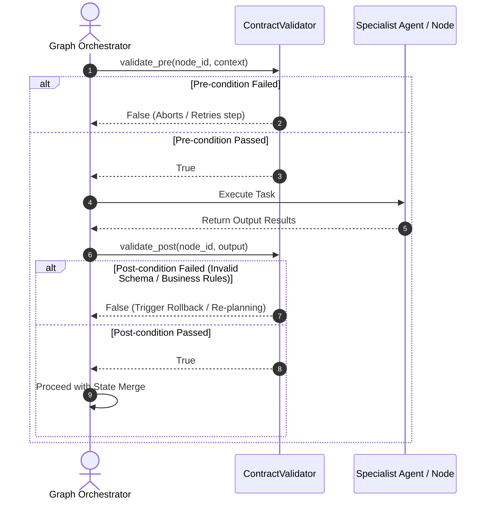

# Declarative Sensory Guardrails & Safety Contracts (CONCEPT:OS-5.1)

## Overview
Sensory verification utilizes declarative tool contracts (`ContractValidator`) enforcing functional pre-conditions and strict schema-validated post-conditions on execution steps. This ensures that agent steps operate strictly within validated environments and return safety-compliant data structures.

## System Sequence Flow



## Key Capabilities

### 1. Pre-condition Assertions
Pre-conditions assert the prerequisite structural and environmental states required for a step to begin safely (e.g., verifying database locks, network connections, or required preceding inputs).

### 2. Post-condition Schema Enforcement
Post-conditions ensure that output values match strict Pydantic structures (`post_condition_schema`) or pass customized assertion functions (`post_condition_verifier`) before propagating through the orchestrator.

## Implementation Details
* **Source Code Path**: [contract_validator.py](file:///home/apps/workspace/agent-packages/agent-utilities/agent_utilities/harness/contract_validator.py)
* **Pillar**: Agent OS Infrastructure (OS)
* **Concept ID**: `CONCEPT:OS-5.1`

## Example Configuration

```python
from agent_utilities.harness.contract_validator import ToolContract, ContractValidator
from pydantic import BaseModel, Field

class ProgrammerOutputSchema(BaseModel):
    source_code: str = Field(..., min_length=10)
    imports: list[str]

# Define contract
contract = ToolContract(
    node_id="programmer",
    pre_condition=lambda ctx: "workspace_dir" in ctx,
    post_condition_schema=ProgrammerOutputSchema
)

# Register contract with Validator singleton
ContractValidator.instance().register_contract(contract)
```
