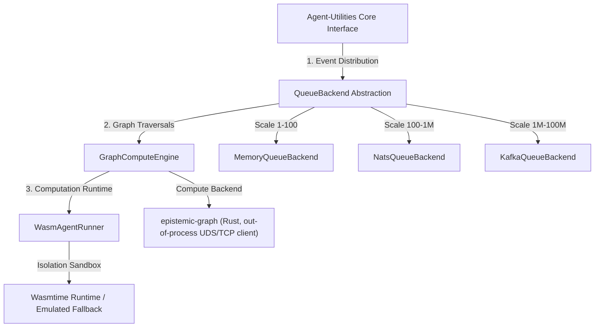

# CONCEPT:AU-OS.governance.wasm-micro-agent-sandbox — Massive Scale Architecture & Sandbox

## Overview

The `Massive Scale Architecture & Sandbox` engine establishes the architectural blueprint, patterns, and runtimes required to scale the `agent-utilities` ecosystem from a single standalone local agent to **100,000,000 concurrent agents**.

At such extreme volumes, typical thread-per-agent, process-per-agent, or even coroutine-based execution models collapse due to:
1. **CPU & Memory Overhead**: Runaway memory allocation, JVM footprints, or OS context-switching.
2. **Database & Ingestion Bottlenecks**: Relational locking and high-latency ingestion pipelines.
3. **Network Congestion**: Chatty point-to-point HTTP/gRPC mesh networks.

This concept resolves these limitations by introducing a unified **Compiled Micro-Kernel & Pluggable Distributed Event Fabric** consisting of three synergistic capabilities:

1. **Pluggable Event Queue Backend (`AU-ECO.bus.pluggable-event-queue`)**: A lightweight event/message log abstraction supporting in-memory queuing (1 to 100 agents), NATS JetStream (100 to 1,000,000 agents), and Apache Kafka (1,000,000 to 100,000,000+ agents).
2. **High-Performance Rust Graph Compute & Epistemic Traversal Engine (`KG-2.7`)**: Replaces standard Python graph engines with a compiled Rust `epistemic-graph` engine — reached **out-of-process** over a MessagePack/UDS (or TCP) client, **not** in-process PyO3 — for fast topological sorting, cycle detection, AST parsing, and subgraph matching.
3. **WASM Micro-Agent Execution Sandbox (`AU-ORCH.sandbox.compiled-orchestration-kernel`)**: Executes lightweight compiled agents (e.g., Rust compiled to WebAssembly) in sub-millisecond, sandboxed, isolated micro-containers via `wasmtime` with graceful Python emulation fallbacks.

---

## Architectural Synergy: The Scale-Width Blueprint

A single pattern—**reactive log-centric message passing combined with lightweight sandboxed tasks**—is utilized across all scales. The infrastructure remains identical; only the backend implementations swap under the hood.



---

## Technical Details & Component Integration

### 1. Pluggable Distributed Event Fabric (`AU-ECO.bus.pluggable-event-queue`)

The `QueueBackend` class abstracts the underlying messaging provider, isolating business logic from infrastructure.
- **`MemoryQueueBackend`**: Pure Python `asyncio.Queue` utilizing local variables. Zero external dependencies. Ideal for unit testing, local debuggers, and small single-node agent systems.
- **`NatsQueueBackend`**: Leverages **NATS JetStream** (written in Go, ultra-lightweight, 20MB memory foot-print, clustering support). Designed for high-throughput messaging up to millions of concurrent agents without server strain.
- **`KafkaQueueBackend`**: Connects to **Apache Kafka**. High operational overhead but unmatched partition-scaling capabilities, enabling horizontally clustered streams for hundreds of millions of events.

### 2. Compiled Rust & Rustworkx Compute (`KG-2.7`)

During epistemic ingestion and agent execution, cyclic dependency analysis, topological sorting, shortest-path discovery, repository AST parsing, subgraph matching, and state synchronization are bottleneck operations.
`GraphComputeEngine` delegates these operations to the compiled Rust `epistemic-graph`
engine over an out-of-process client (`epistemic_graph.client`):
- **Compiled Rust Engine (`epistemic-graph`)**: A native compiled Rust service providing lightning-fast AST parsing of Python directories (`parse_repository`/`parse_file`), highly optimized VF2 subgraph isomorphism matching (`vf2_subgraph_match`), topological sorting (`topological_sort`), cycle detection (`find_cycle`), and a Reactive State Ledger with transaction log serialization (`get_ledger`/`clear_ledger`).
- **Transport**: Python talks to the engine **only** through the out-of-process MessagePack/UDS (or TCP) client — there is **no PyO3 binding** in the primary path. An in-process embedded mode exists solely as a fallback when the service is unavailable and `GRAPH_COMPUTE_FALLBACK=embedded` is set.
These native backends achieve large traversal speedups and a much smaller memory footprint than pure Python implementations, ensuring seamless scale under heavy concurrent load.

### 3. WASM Micro-Agent Sandbox (`AU-ORCH.sandbox.compiled-orchestration-kernel`)

Instead of spawning heavy full-Python processes or holding millions of active greenlets:
- Agent behaviors are compiled into highly optimized WebAssembly (`.wasm`) bytecode.
- The `WasmAgentRunner` executes these sandboxes. It initializes the `wasmtime` runtime, sets strict memory/CPU gas limits, and runs the compiled agent.
- If `wasmtime` is unavailable (e.g., lightweight server environments or edge devices), it seamlessly falls back to a safe Python emulation mode to preserve zero-dependency operations.

---

## Code Usage Examples

### 1. Constructing a Scalable Event-Driven Workspace

A developer can seamlessly configure their system's scale width by changing a single queue backend adapter:

```python
import asyncio
from agent_utilities.knowledge_graph.core.queue_backend import QueueBackend
from agent_utilities.knowledge_graph.core.nats_queue_backend import NatsQueueBackend
from agent_utilities.knowledge_graph.core.kafka_queue_backend import KafkaQueueBackend

async def run_system(scale: str):
    # Swap backend depending on scale demands
    if scale == "local":
        # Zero-dependency, memory-only
        backend = QueueBackend.create("memory")
    elif scale == "scale_out":
        # Ultra-fast, lightweight clustering
        backend = QueueBackend.create(
            "nats",
            servers=["nats://localhost:4222"],
            stream_name="agent_events"
        )
    else:
        # Enterprise-grade partitioning
        backend = QueueBackend.create(
            "kafka",
            bootstrap_servers=["kafka:9092"],
            topic_name="agent_events"
        )

    await backend.connect()

    # Broadcast an agent state update event
    await backend.publish("agent.123.lifecycle", {"status": "thinking", "step": 42})

    # Consume events reactively
    async def event_handler(topic, payload):
        print(f"Received event on {topic}: {payload}")

    await backend.subscribe("agent.*.lifecycle", event_handler)

    await asyncio.sleep(1.0)
    await backend.disconnect()

# Run locally or scale out
asyncio.run(run_system("local"))
```

### 2. High-Performance Graph Compute

Perform sub-millisecond graph checks, native AST parsing, and subgraph matching:

```python
from agent_utilities.knowledge_graph.core.graph_compute import GraphComputeEngine

# Initialize the engine (routes to the compiled Rust epistemic-graph service
# over the out-of-process client by default)
engine = GraphComputeEngine(graph_name="__bus__")

# Parse entire Python repositories asynchronously and map as graph nodes instantly
engine.parse_repository("/home/apps/workspace/agent-packages/agent-utilities")

# Detect dependency cycles (e.g., deadlock prevention)
cycle = engine.find_cycle()
if cycle:
    print(f"Deadlock cycle detected: {cycle}")
else:
    # Get execution order via topological sort
    execution_order = engine.topological_sort()
    print(f"Scale-safe execution order: {execution_order}")

# Construct a target query pattern for subgraph isomorphism
pattern_engine = GraphComputeEngine(graph_name="__pattern__")
pattern_engine.add_node("P1", {"type": "class"})
pattern_engine.add_node("P2", {"type": "function"})
pattern_engine.add_edge("P1", "P2", {})

# Perform high-performance VF2 subgraph matching in native Rust
matches = engine.vf2_subgraph_match(pattern_engine)
print(f"Found subgraph matches: {matches}")

# Read and sync state via the Reactive State Ledger
transactions = engine.get_ledger()
json_data = engine.to_json()
```

### 3. WASM Micro-Agent Sandbox Execution

Instantiate isolated, zero-dependency sandboxed agents in sub-milliseconds:

```python
from agent_utilities.core.wasm_runner import WasmAgentRunner

# Setup runner (automatically uses wasmtime sandbox or emulated fallback)
runner = WasmAgentRunner()

# Compiled WASM agent module input state
input_payload = {
    "agent_id": "micro_agent_99",
    "prompt": "Synthesize the recent financial forecast.",
    "context": {"market": "bullish", "leverage": 1.5}
}

# Sub-millisecond execution in isolated sandbox
result = runner.execute(input_payload)
print(f"Sandbox status: {result['status']}")
print(f"Sandbox output: {result['output']}")
```
