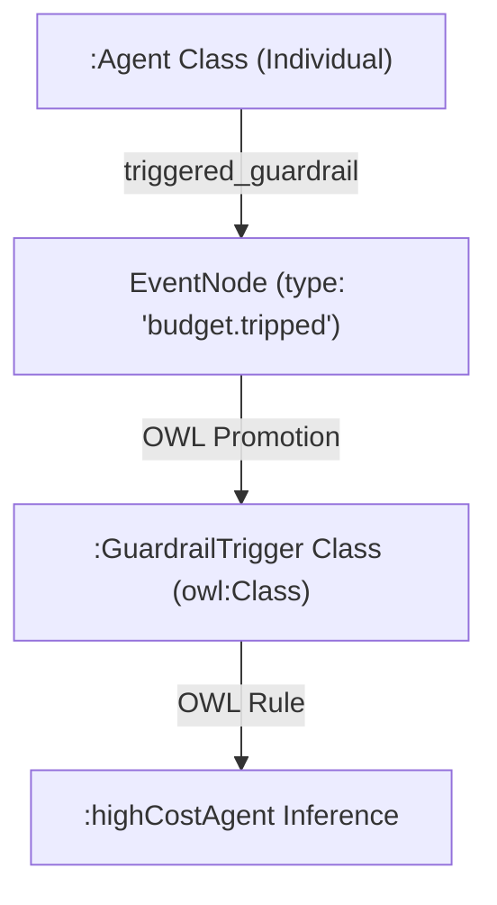

# CONCEPT:AU-OS.governance.reactive-multi-axis-budget — Reactive Budget Guardrails

## Overview

The `Reactive Budget Guardrails` engine implements a state-of-the-art sensory execution governor designed to enforce operating-system-level constraints on agent swarms. In complex autonomous systems, loops or runaway reasoning chains can consume millions of LLM tokens and result in unexpected USD expenses or hang indefinitely.

The `BudgetGuard` solves this by continuously monitoring execution along **three distinct axes**:
1. **Wall-clock Time Limit**: Measures elapsed duration from the start of the execution step to prevent process lockups.
2. **Granular Token Budget**: Monitors accumulated tokens (including inputs, outputs, hidden thoughts, and tool invocation payloads) by integrating with the `TokenUsageTracker`.
3. **Spend Limit (USD Cost)**: Computes real-time execution costs based on configurable per-token pricing models.

When a boundary limit is breached, the guardrail immediately appends a critical event node to the `EventLedger` to notify downstream self-healing blocks, then raises a `BudgetTrippedException` to halt execution safely.

---

## Architectural Synergy: Graph & OWL Integration

### OWL Ontological Mapping

When a budget limit is tripped, a specialized `EventNode` with type `"budget.tripped"` and severity `"critical"` is dual-written to the LPG. The `OWLBridge` promotes these records into standard RDF individuals.



* **Guardrail Triggering**: Trips map to the OWL `:GuardrailTrigger` class (a subclass of `:Observation`).
* **High-Cost Agent Classification**: If an agent frequently triggers budget guardrails, the HermiT/Stardog OWL reasoner infers the relation `:highCostAgent` on the agent's class.
* **Audit Lineage**: The event links to the `TokenUsageRecord` via `"audited_by"` or `"was_derived_from"` edges, supporting complete expense auditing.

---

## Code Usage Examples

### 1. Initializing and Enforcing Guardrails

Wrap reasoning loops or workflows with the `BudgetGuard`:

```python
from agent_utilities.graph.reactive import BudgetGuard, BudgetTrippedException, EventLedger
from agent_utilities.observability.token_tracker import TokenUsageTracker

# Setup tracker and guardrail
tracker = TokenUsageTracker()
guard = BudgetGuard(
    max_time_seconds=60.0,       # 1 minute wall-clock limit
    max_tokens=100000,           # 100k token ceiling
    max_cost_usd=0.50,           # 50 cents maximum cost limit
    token_tracker=tracker
)

ledger = EventLedger()
run_id = "run_98765"

try:
    for step in range(10):
        # ... Execute agent step / LLM call ...

        # Check boundary constraints
        guard.check_limits(run_id=run_id, ledger=ledger)

except BudgetTrippedException as e:
    print(f"CRITICAL: Agent budget tripped! Axis: {e.limit_type}. Current: {e.current_value}")
    # Trigger self-healing or graceful degradation...
```

### 2. Self-Healing Integration

React to budget breaches automatically using reactive behaviors:

```python
from agent_utilities.graph.reactive import reactive_behavior
from agent_utilities.models.knowledge_graph import EventNode

@reactive_behavior(on="budget.tripped")
async def handle_budget_breach(event: EventNode):
    payload = event.payload
    print(f"[Self-Healing] Detected budget trip on {payload.get('limit_type')}!")

    # Degrade to a smaller, cheaper LLM or reduce step curriculum resolution
    print("[Graceful Degradation] Switching swarm to low-latency fallback model.")
```
