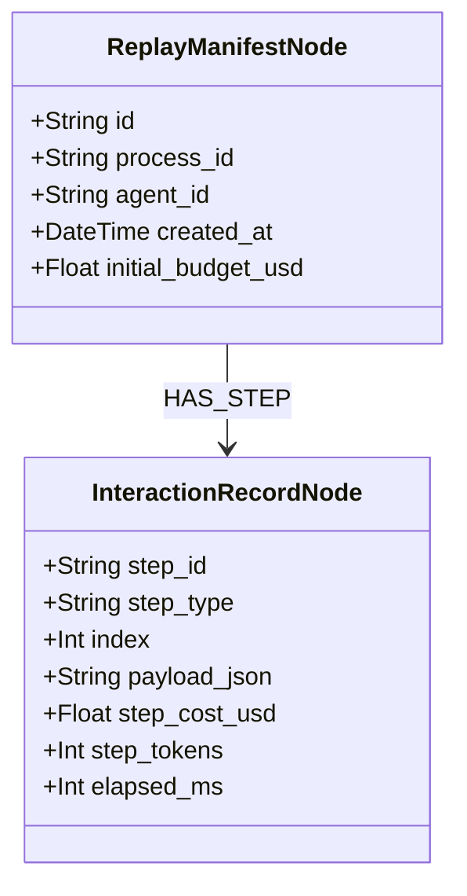

# OS-5.7 — Distributed Replay, Sandboxing, & Epistemic Resource Scheduling

This module details the design, interfaces, and formal concepts behind the high-scale Agent OS extensions designed for distributed replay, deep sandboxed execution, centrality-based resource scheduling, and proof-of-safety ontological guardrails.

---

## 1. Deterministic Replay & Trace Ontology (OS-5.7)

To satisfy strict regulatory compliance and debugging requirements in an ecosystem of up to 1 million active nodes, the **Distributed Replay Engine** records and plays back step-by-step agent executions. 

Every logical transition (prompt, tool call, memory retrieval, response) is registered as a first-class OWL sub-graph under the **PROV-O (Provenance Ontology)**.

### Data Model Schema


---

## 2. Hardened WASM Sandbox Executor (OS-5.8)

Rather than executing raw local subprocesses, the kernel runs untrusted tools inside a **WebAssembly (WASM) Sandbox**. This guarantees memory safety, execution limits, and microsecond-level isolation.

### Core Safeguards:
1. **Dynamic Gas Limit Bounds**: An execution is allotted a fixed amount of gas instructions. If exceeded, a `GasQuotaExceeded` trap is fired.
2. **Memory Footprint Quota**: Restricts dynamic memory allocations to 64MB per sandbox.
3. **Restricted Callbacks**: Prevent access to OS-level system calls (file system, network) unless explicitly granted by the permissions kernel.

---

## 3. Epistemic Resource Scheduler (OS-5.9)

Standard schedulers use crude priority queues (e.g. Nice levels). The **Epistemic Resource Scheduler** queries the active **Knowledge Graph** to compute the topological centrality (eigenvector or out-degree) of the agent's node.

$$\text{Priority Score} = \text{Base Priority} \times (1.0 + \alpha \times \text{Centrality})$$

### Preemption Escalation Protocol:
* **High Centrality agents** (e.g. orchestrators, key routing blocks) are allocated greater token budgets, elevated CPU threads, and protected against preemption.
* **Low Centrality agents** (e.g. auxiliary crawlers) are quickly checkpointed and paged to local DB storage under heavy system resource contention.

---

## 4. Ontological Guardrail Engine (OS-5.10)

High-risk tools (e.g. writing system configurations, executing financial transactions) must be verified prior to execution. The **Ontological Guardrail Engine** intercepts the tool schema and argument payload, checking for safety violation proofs against active OWL policy constraints using subsumption reasoning.

### Safety Proof Model:
```
  [Proposed Tool Argument: Path = "/home/genius/workspace/secret.key"]
                       |
                       v
         (Ontological Guardrail Check)
                       |
                       v
  Is Path Subsumed by "ForbiddenSystemDirectory"?
                       |
      +----------------+----------------+
      |                                 |
     YES                                NO
      |                                 |
      v                                 v
[RAISE AccessDenied]            [ALLOW Tool Execution]
```
