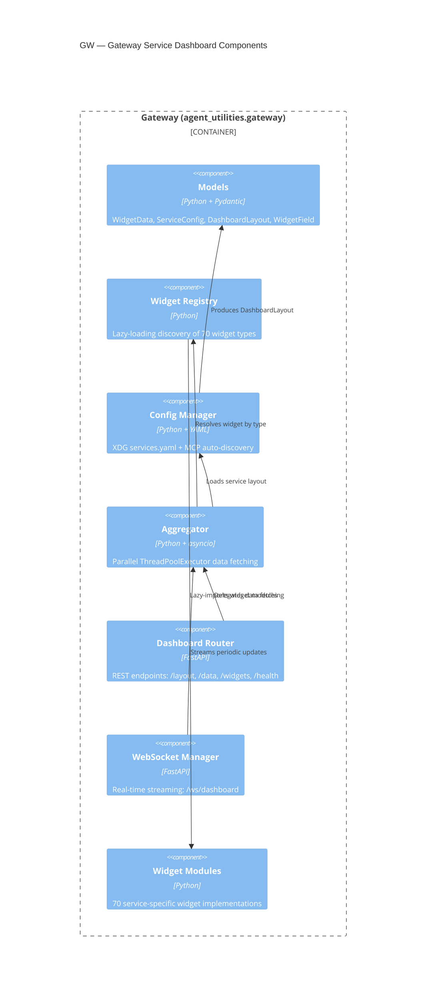

# Gateway Service Dashboard (CONCEPT:AU-OS.config.gateway-service-dashboard)

> **CONCEPT:AU-OS.config.gateway-service-dashboard** — Gateway Service Dashboard
>
> Synthesized from the former standalone `service-dashboard-core` package
> into `agent_utilities/gateway/` to eliminate duplicate registries,
> duplicate XDG path logic, and an orphaned package dependency.

## Overview

The Gateway provides a **Homepage-style service dashboard** for Agent-OS.
It is the unified data layer that all three frontends use to render
service health, metrics, and quick-access links for 70 integrated services —
covering 64 of the 68 `agent-packages/agents/*` connectors (see
[Connector Coverage](#connector-coverage) below for the 4 that cannot get a
direct-import widget, and why).

| Frontend | Integration | Data Flow |
|----------|-------------|-----------|
| **agent-webui** | `dashboard_router` mounted at `/api/dashboard` | REST + WebSocket |
| **agent-terminal-ui** | `Aggregator` imported directly | Direct Python API |
| **geniusbot** | `Aggregator` imported directly | Direct Python API (QThread) |

## Architecture



## Package Structure

```
agent_utilities/gateway/
├── __init__.py          # Public API re-exports
├── models.py            # Pydantic models: WidgetData, ServiceConfig, DashboardLayout
├── registry.py          # Widget Registry singleton with lazy loading
├── config.py            # ConfigManager: YAML load/save + MCP auto-discovery
├── aggregator.py        # Async parallel data fetcher (ThreadPoolExecutor)
├── api.py               # FastAPI router (mountable at /api/dashboard)
├── ws.py                # WebSocket manager (/ws/dashboard)
└── widgets/
    ├── __init__.py
    ├── base.py           # BaseWidget ABC
    ├── portainer.py      # Portainer widget
    ├── uptime_kuma.py    # Uptime Kuma widget
    ├── technitium.py     # Technitium DNS widget
    ├── gitlab.py         # GitLab widget
    ├── ...               # 66 more service widgets
    └── zulip.py          # Zulip widget
```

## Widget Registry

The registry uses **lazy loading** — widgets are only imported when first accessed.
This means frontends don't pay import cost for unused agent-packages.

```python
from agent_utilities.gateway.registry import get_registry

reg = get_registry()
print(reg.list_all_known())   # All 70 known widget types
print(reg.list_available())   # Only those whose deps are installed
widget = reg.get_widget("portainer")  # Lazy-imports on first access
```

### Built-in Widget Types (70)

| Category | Widgets |
|----------|---------|
| **Infrastructure** | portainer, uptime_kuma, technitium, caddy, container_manager, home_assistant, tunnel_manager, systems_manager, fan_manager, kafka |
| **DevOps** | gitlab, github, ansible_tower, repository_manager, dockerhub |
| **Media** | jellyfin, qbittorrent, owncast, media_downloader, arr, audiobookshelf, hdhomerun, rom_manager |
| **Productivity** | nextcloud, plane, stirlingpdf, archivebox, freshrss, paperless_ngx |
| **Lifestyle** | mealie, wger, firefly_iii, gramps |
| **Security** | keycloak, openbao, teleport, ciso_assistant, okta, onetrust |
| **Communication** | mattermost, postiz, listmonk, zulip |
| **Observability** | langfuse, sentry, lgtm |
| **Business** | servicenow, erpnext, leanix, twenty, legal_peripherals, atlassian, google_workspace, microsoft, aris, camunda, egeria |
| **Data & Research** | data_science, vector_db, documentdb, scholarx, audio_transcriber, ollama, clarity, jena, pulselink |
| **Custom** | genius_agent, emerald_exchange, searxng |

## Connector Dependencies (`gateway-widgets` extra)

Most widgets talk to their service **in-process**, by importing that service's
connector-package API client inside `fetch_data()` rather than calling out over
plain HTTP — e.g. `caddy.py`: `from caddy_mcp.api_client import Api as CaddyApi`.
None of those connector packages are base `agent-utilities` dependencies
(Configuration discipline: a widget's connector is only needed if that specific
service tile is configured), so they must be installed explicitly via the
**`gateway-widgets`** optional-dependency group (`pyproject.toml`):

```bash
pip install "agent-utilities[gateway-widgets]"
# or, as part of the serving plane (already included):
pip install "agent-utilities[serving]"
```

Without it, every configured widget whose connector isn't installed logs
`ModuleNotFoundError: No module named '<connector>_mcp'` (`code=dependency_unavailable`,
`agent_utilities.gateway.widgets.base`) on **every** `WidgetAggregator` cache-refresh
cycle (`_cache_ttl = 10.0` in `aggregator.py`, driven by the dashboard WebSocket's
15s tick) — a continuous production log flood, not a one-time warning.

**Not every widget needs a declared dependency**: `archivebox`, `data_science`,
`emerald_exchange`, `genius_agent`, `google_workspace`, `legal_peripherals`, `lgtm`,
`ollama`, `scholarx`, `searxng`, `stirlingpdf`, `systems_manager`, and `teleport`
talk over plain HTTP (`self._http_client`) and have no in-process connector import.

**Known gaps, not fixed by installing the extra:**

- `sentry.py` and `zulip.py` import `sentry_mcp` / `zulip_agent`, distributions that
  exist neither locally nor on PyPI. Both now guard the import and degrade to
  `status="skipped"` (matching `ear.py`'s long-standing pattern) rather than
  flooding the log, but they cannot report real data until those connectors ship.
- `media_downloader.py` resolves, but `MediaDownloader` is a one-shot yt-dlp wrapper
  with no queue or status surface to report, so it degrades the same way.
- `portainer.py`'s `portainer-agent` resolves from PyPI, but the newest published
  release (1.1.0) still imports the since-renamed `agent_utilities.http` (now
  `agent_utilities.httpsupport`); the fix exists in the unpublished sibling
  checkout (2.1.0+) but PyPI has nothing newer to pick up.

Previously listed here as broken-beyond-the-extra — `container_manager`, `arr`,
`vector_db`, `tunnel_manager`, `atlassian`, `repository_manager` — were pointed at
their real connector entry points and now reach live data; see
`tests/unit/gateway/test_widget_connector_imports.py`.

## Connector Coverage

Every `agent-packages/agents/*` connector is either a live widget in the
table above or listed below with the reason it is not. Widget keys don't
always match the package name — e.g. `technitium` widget ↔
`technitium-dns-mcp` package, `vector_db` widget ↔ `vector-mcp` package;
the full name↔`widget_type` mapping lives in `registry.py`'s
`_BUILTIN_WIDGETS` and `config.py`'s `_MCP_TO_WIDGET`.

Of the 68 `agent-packages/agents/*` connectors, **64 have a widget** (45
pre-existing + `leanix` — registered since the dashboard's inception but
missing its module file until this pass — + 19 new ones added in the
`widget-connector-expansion` lane). **4 do not**, each because it has no
single reachable "service" a `url` + `token` widget can poll:

| Package | Why it has no widget |
|---------|----------------------|
| `archimate-mcp` | Local ArchiMate model-authoring engine (no remote API — "Archi has no remote API" per the package's own `api_client.py` docstring); no running service to report status for. |
| `sql-mcp` | Generic multi-connection SQL client keyed by named connections defined in its own connection registry, not a single `url`/`token` target — no single "service" to dashboard without a config-shape change. |
| `objectstore-mcp` | Multi-backend abstraction (filesystem/S3/GCS/Azure) selected via backend-specific fields (`endpoint`/`profile`/`region`/`connection_string`/`project`) rather than a single `url`+`token`; the cloud backends also need their own optional SDKs (`boto3`, `google-cloud-storage`, `azure-storage-blob`) that are not `agent-utilities` dependencies. |
| `salesforce-agent` | Multi-flow OAuth2 (`client_credentials`/`refresh_token`/`jwt_bearer`/`access_token`) resolved through the package's own `SalesforceConfig.from_env()`, not the gateway's `url`+`token` model — would need its own credential-resolution path in `BaseWidget` to do safely. |

All four are legitimate future work, not oversights — each would need either
a dashboard config-model change (named multi-connection/backend targets) or
a bespoke credential-resolution path before a widget could report an honest
status.

## Configuration

### Auto-Discovery from `mcp_config.json`

On first load, if no `services.yaml` exists, the ConfigManager reads
`~/.config/agent-utilities/mcp_config.json` and auto-maps known MCP servers
to dashboard widgets:

```python
from agent_utilities.gateway.config import ConfigManager

mgr = ConfigManager()
layout = mgr.load()  # Auto-discovers if no YAML exists
mgr.save(layout)     # Persists to ~/.config/agent-utilities/services.yaml
```

### Manual Configuration (`services.yaml`)

Users can customize their dashboard by editing `~/.config/agent-utilities/services.yaml`:

```yaml
settings:
  columns: 4
  theme: dark
  card_size: medium
  auto_refresh: true
  refresh_interval: 30

groups:
  - name: Infrastructure
    order: 0
    icon: server
    services:
      - id: portainer-1
        name: Portainer
        widget_type: portainer
        url: https://container-console.example.test
        env_prefix: PORTAINER
        category: Infrastructure

  - name: DevOps
    order: 1
    services:
      - id: gitlab-1
        name: GitLab
        widget_type: gitlab
        url: https://scm.example.test
        env_prefix: GITLAB
```

## XDG Path Integration

All paths delegate to `agent_utilities.core.paths` — **no duplicate XDG logic**:

| Function | Default Path | Usage |
|----------|-------------|-------|
| `services_config_path()` | `~/.config/agent-utilities/services.yaml` | Service layout |
| `dashboard_layout_path()` | `~/.local/share/agent-utilities/layout.yaml` | Persisted UI state |
| `mcp_config_path()` | `~/.config/agent-utilities/mcp_config.json` | Auto-discovery source |

## API Endpoints

When mounted in agent-webui via `app.include_router(dashboard_router, prefix='/api/dashboard')`:

| Endpoint | Method | Description |
|----------|--------|-------------|
| `/api/dashboard/layout` | GET | Get current dashboard layout |
| `/api/dashboard/layout` | PUT | Save dashboard layout |
| `/api/dashboard/data` | GET | Fetch all widget data |
| `/api/dashboard/data/{service_id}` | GET | Fetch single widget data |
| `/api/dashboard/full` | GET | Layout + data (initial load) |
| `/api/dashboard/widgets` | GET | List available widget types |
| `/api/dashboard/health` | GET | Health check all services |
| `/api/dashboard/discover` | GET | Auto-discover from mcp_config |
| `/ws/dashboard` | WS | Real-time streaming updates |

## Consolidation History

> [!IMPORTANT]
> The Gateway was synthesized from `service-dashboard-core` (standalone package)
> into `agent_utilities/gateway/` to eliminate 5 patterns that were duplicated
> across both packages:
>
> 1. **ServiceRegistry** — now uses `gateway/registry.py` (aligned with `graph/service_registry.py`)
> 2. **PluginRegistry** — lazy-loading via `importlib` (same pattern as `graph/plugin_registry.py`)
> 3. **XDG Path Resolution** — delegates to `core/paths.py` (eliminated `discovery.py`)
> 4. **MCP Config Discovery** — uses `core/paths.mcp_config_path()` (single source of truth)
> 5. **Graceful Import Degradation** — same try/except ImportError pattern as core

## Creating a New Widget

1. Create `agent_utilities/gateway/widgets/my_service.py`
2. Implement `Widget(BaseWidget)` with `service_type`, `get_fields()`, `fetch_data()`
3. Register in `registry.py` `_BUILTIN_WIDGETS` map
4. Add MCP mapping in `config.py` `_MCP_TO_WIDGET` (if an MCP server exists)

```python
from agent_utilities.gateway.widgets.base import BaseWidget
from agent_utilities.gateway.models import ServiceCategory, ServiceConfig, WidgetData, WidgetField

class Widget(BaseWidget):
    service_type = "my_service"
    display_name = "My Service"
    icon = "star"
    category = ServiceCategory.CUSTOM
    description = "Example custom service widget"
    env_prefix = "MY_SERVICE"

    def get_fields(self) -> list[WidgetField]:
        return [
            WidgetField(key="status", label="Status", format="text"),
            WidgetField(key="count", label="Items", format="number"),
        ]

    def fetch_data(self, config: ServiceConfig) -> WidgetData:
        url = self._resolve_url(config)
        token = self._resolve_token(config)
        # Call API and return structured data
        return WidgetData(
            status="ok",
            fields={"status": "running", "count": 42},
        )
```

The service URL is required through `ServiceConfig.url` or the corresponding
`<ENV_PREFIX>_URL` runtime setting; widgets do not embed endpoint fallbacks.
