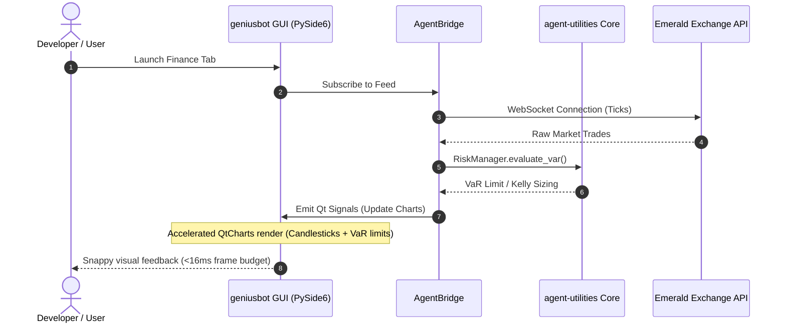

# Pillar 6: GeniusBot Desktop Cockpit (GBOT)

## Overview

The **GeniusBot Desktop Cockpit** (`geniusbot`) represents the premium multi-platform desktop client and visual trading cockpit for the `agent-utilities` ecosystem. Built on PySide6 (Qt for Python), it provides a fast, snappy, and hardware-accelerated GUI that serves as the ultimate systems command center for both human developers and autonomous agent swarms.

```
┌────────────────────────────────────────────────────────┐
│               geniusbot Desktop Cockpit                 │
├────────────────────────────────────────────────────────┤
│  [ Systems View ]  [ Finance Cockpit ]  [ Agent Logs ] │
├────────────────────────────────────────────────────────┤
│  ┌───────────────────────┐   ┌──────────────────────┐  │
│  │   Topological Memory  │   │  Snappy Trading Chart│  │
│  │   Virtual Context VCB │   │  [ Emerald Exchange ]│  │
│  │                       │   │  ▲                    │  │
│  │   Active node focus:  │   │  │   /\   /\  [Buy]   │  │
│  │   (CONCEPT:KG-2.6)    │   │  └───\/───\/─────────│  │
│  └───────────────────────┘   └──────────────────────┘  │
│  ┌──────────────────────────────────────────────────┐  │
│  │  Embedded Terminal Sandbox (CONCEPT:GBOT-6.2)     │  │
│  │  $ agent-utilities run --swarm                   │  │
│  └──────────────────────────────────────────────────┘  │
└────────────────────────────────────────────────────────┘
```

---

## ⚙️ Core Concepts & Subsystems

The cockpit is partitioned into seven distinct, highly optimized architectural layers mapping to `CONCEPT:GBOT-6.0` through `GBOT-6.6`:

### 1. Desktop Cockpit Orchestrator (CONCEPT:GBOT-6.0)
*   **Module Path**: `geniusbot/geniusbot.py`
*   **Behavior**: Orchestrates the main Qt Application loop, managing asynchronous threading bridges (`QThread`, `QObject`) that allow the GUI to interact non-blockingly with the `agent-utilities` Python core API and the `graph-os` server.
*   **Aesthetics**: Sleek dark-mode interface utilizing a premium glassmorphic stylesheet (curated slate HSL colors, `#0f172a` body background, `#1e293b` card panels, smooth hover gradients, and subtle Outfit typography).

### 2. Ecosystem Dynamic Tab Matrix (CONCEPT:GBOT-6.1)
*   **Module Path**: `geniusbot/plugins/`
*   **Behavior**: Swappable plugin matrix allowing developers to load multi-tenant tabs on the fly. Each plugin registers a standard JSON interface defining its visual layout, required system permissions, and context bindings.
*   **UX**: Fully customizable drag-and-drop workspace tiles with smooth transitions and animated resizing constraints.

### 3. Embedded Terminal Sandbox (CONCEPT:GBOT-6.2)
*   **Module Path**: `geniusbot/qt/terminal_widget.py`
*   **Behavior**: High-performance, sandboxed terminal widget directly embedded within the Qt window. Interfaces directly with virtualized pty allocations to safely run and display background executions, package builds, or agent CLI inputs.
*   **Security**: Prevents unauthorized terminal operations via strict sensory regex matching (hooked to the `PromptInjectionScanner`).

### 4. Universal Tool Approval Gate (CONCEPT:GBOT-6.3)
*   **Module Path**: `geniusbot/qt/tool_guard.py`
*   **Behavior**: The desktop UI layer for Human-in-the-Loop approval (`requires_approval=True`). Pauses execution of the remote or local agent graph, popping up a beautiful, glassmorphic modal displaying the exact diff of the proposed file edit, SQL query, or terminal command.
*   **Interactivity**: Complete reject/approve/modify workflow before releasing the asyncio Future.

### 5. Topological Cockpit Memory (CONCEPT:GBOT-6.4)
*   **Module Path**: `geniusbot/utils/agent_bridge.py`
*   **Behavior**: Dynamic visualizer that renders active Virtual Context Blocks (VCBs) and topological Knowledge Graph associations in real-time. Leverages hardware-accelerated QtGraphicsViews to plot active memory nodes, decay status, and high-density hub associations as force-directed layouts.

### 6. Multi-Tenant Daemon & Tray (CONCEPT:GBOT-6.5)
*   **Module Path**: `geniusbot/utils/daemon.py`
*   **Behavior**: Background tray daemon that boots on startup. Continuously polls active background watchers (`agent-utilities` watcher engines) and triggers system tray notifications on successful file changes, comparative audits, or ingestion sweeps.

### 7. High-Performance Visual Finance Cockpit (CONCEPT:GBOT-6.6)
*   **Module Path**: `geniusbot/qt/finance_cockpit.py`
*   **Behavior**: Accelerated market-data rendering engine built using `QtCharts` and `QWebEngineView`. Renders beautiful, snappy candlestick series, moving averages, and trading signals directly sourced from **emerald-exchange**.
*   **Quant Features**:
    *   Walk-forward trade visualizer mapping entries/exits to historical price charts.
    *   Interactive sliders for custom **Kelly Criterion** position sizing and leverage adjustments.
    *   Kolmogorov-Smirnov regime shift indicators overlay.
    *   Snappy WebSocket client streaming price updates directly into chart buffers without GIL-induced UI freezing.

### 8. Systems Dashboard (via CONCEPT:GW-1.0)
*   **Module Path**: `geniusbot/qt/service_dashboard.py`
*   **Data Backend**: `agent_utilities.gateway` (native, no standalone package required)
*   **Behavior**: Homepage-style service dashboard rendering 50+ infrastructure service widgets (Portainer, GitLab, Uptime Kuma, Jellyfin, etc.) using the centralized `Aggregator` and `ConfigManager` from `agent_utilities.gateway`. Runs data fetching on a `QThread` to keep the UI responsive while polling service health.
*   **Integration**: Imports `Aggregator` and `ConfigManager` directly from `agent_utilities.gateway`, ensuring zero dependency on external dashboard packages.

---

## 📈 Integration & Data Flow



---

## 🔬 Feature Parity & Verification

To guarantee robust visual performance, the finance cockpit incorporates the following hardware optimizations:

1.  **Fast Path Buffering**: Trades and price ticks are buffered in an optimized Python deque before being dispatched via Qt signals (`pyqtSignal` / `Signal`) to the Qt C++ rendering thread in batches, avoiding main-thread overhead.
2.  **OpenGL Canvas**: All charts leverage `QGraphicsVideoItem` or OpenGL-enabled `QtCharts` to achieve a 60fps refresh rate even when rendering 100,000+ historical ticks.
3.  **Local Sandboxing**: Database connections use LadybugDB transaction caching to allow instantaneous switching between historical backtests.
