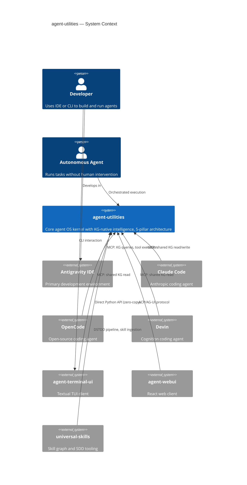
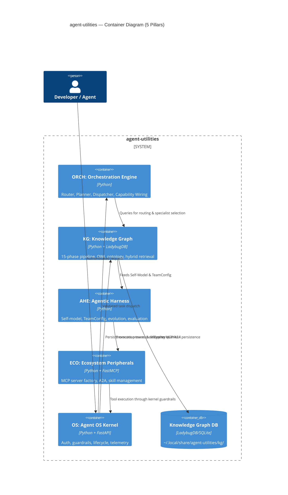
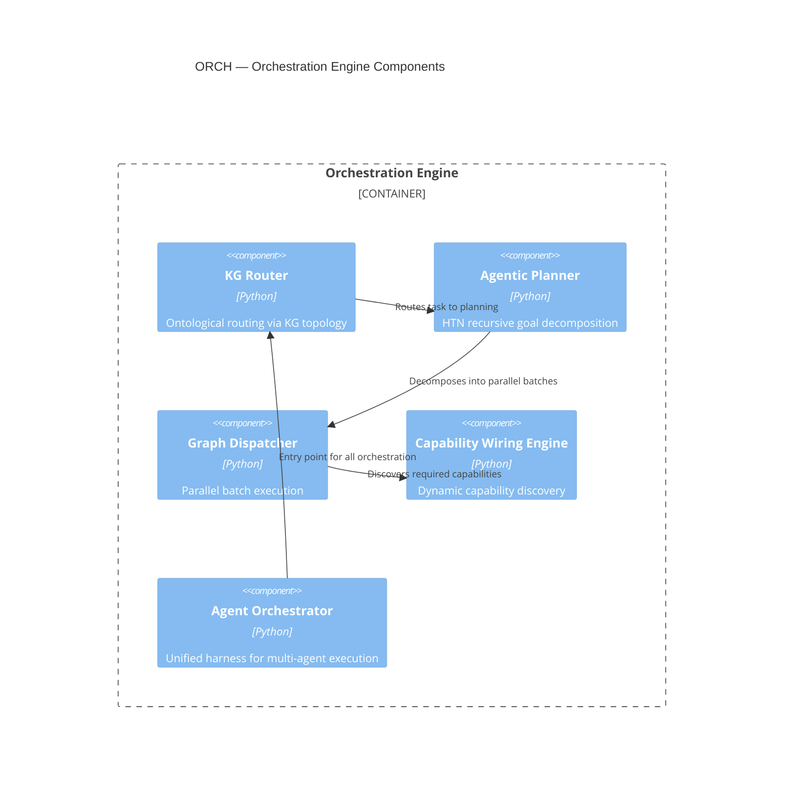
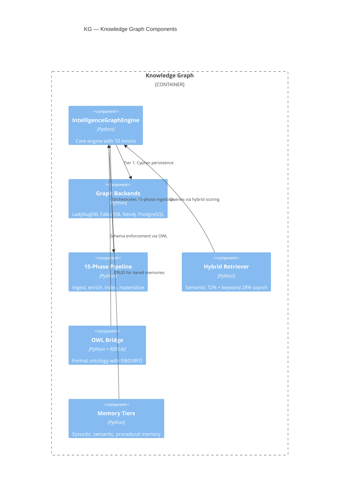
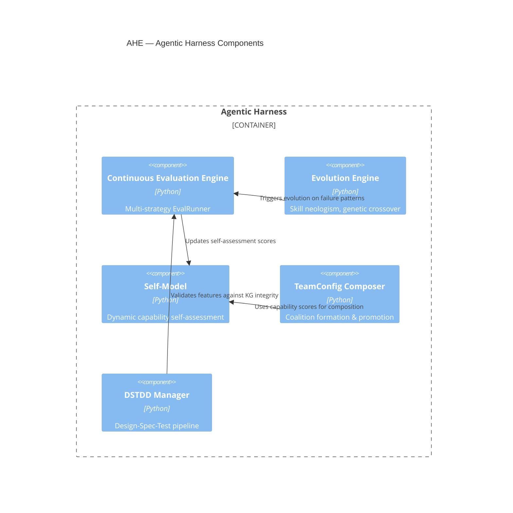
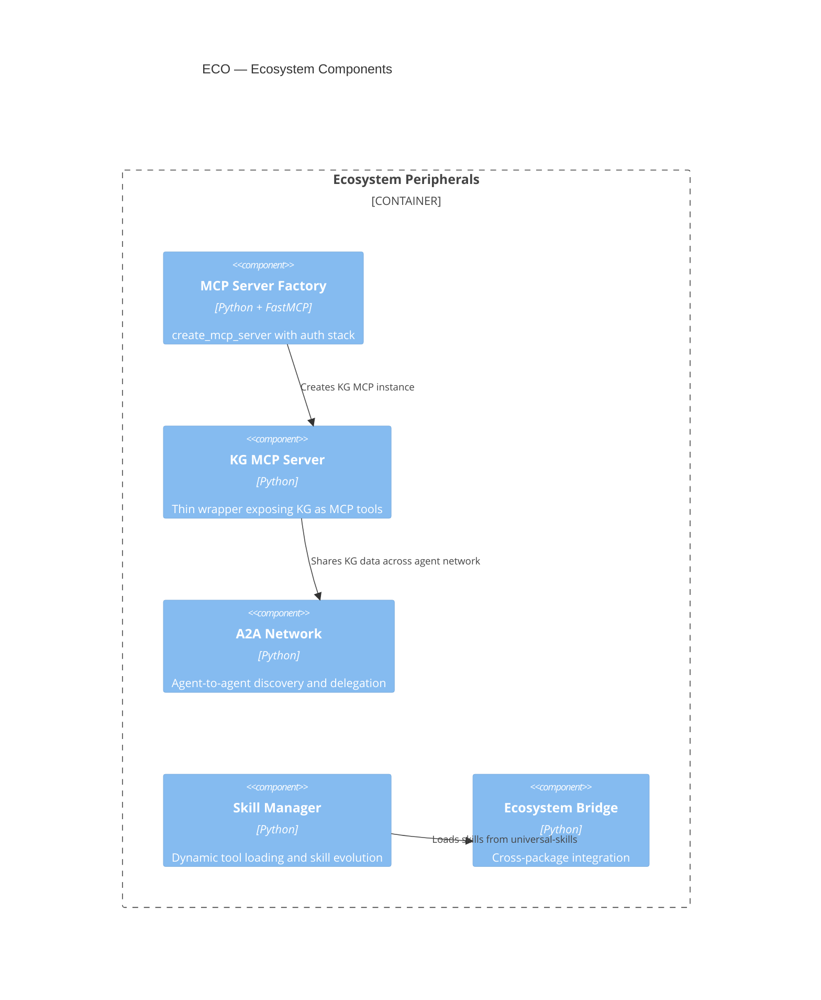
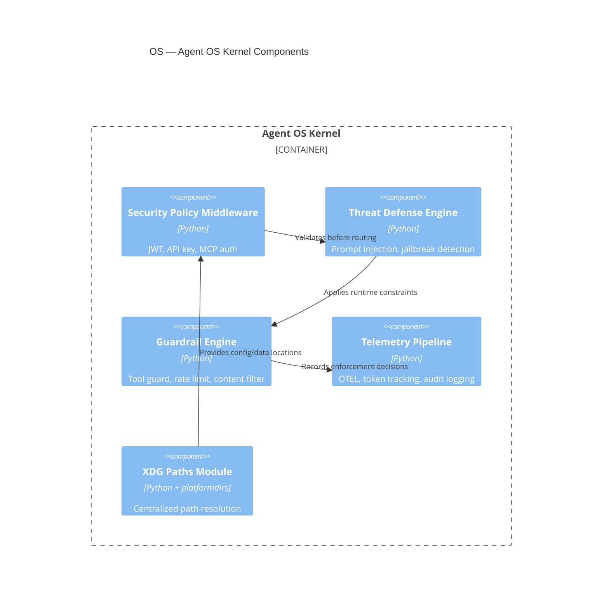
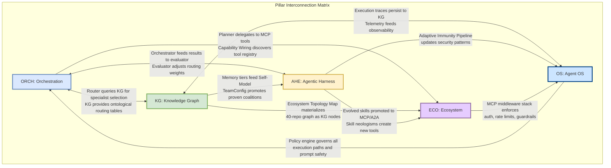

# agent-utilities C4 Architecture

This document provides formal C4 architecture diagrams showing how the 5 pillars
of `agent-utilities` interconnect with each other and with external IDE consumers.

## Level 1: System Context

Shows `agent-utilities` in the broader ecosystem — all IDE and agent consumers.

## Level 2: Container Diagram

Shows the 5 pillars as containers with data flows between them.

## Level 3: Component Diagram — Per Pillar

### Pillar 1: Orchestration Engine (ORCH)

### Pillar 2: Knowledge Graph (KG)

### Pillar 3: Agentic Harness (AHE)

### Pillar 4: Ecosystem Peripherals (ECO)

### Pillar 5: Agent OS Kernel (OS)

## Cross-Pillar Data Flows

```mermaid
flowchart LR
    subgraph "Cross-Pillar Data Flows"
        direction TB

        subgraph INGEST ["Ingestion Flow"]
            direction LR
            ECO_MCP["ECO: MCP Tool Call"] --> ORCH_ROUTE["ORCH: Router"]
            ORCH_ROUTE --> KG_INGEST["KG: Ingest Engine"]
            KG_INGEST --> KG_OWL["KG: OWL Bridge"]
        end

        subgraph EXECUTE ["Execution Flow"]
            direction LR
            ORCH_PLAN["ORCH: Planner"] --> ORCH_DISPATCH["ORCH: Dispatcher"]
            ORCH_DISPATCH --> ECO_TOOL["ECO: Tool Executor"]
            ECO_TOOL --> OS_GUARD["OS: Guardrails"]
            OS_GUARD --> AHE_EVAL["AHE: Evaluator"]
        end

        subgraph LEARN ["Learning Flow"]
            direction LR
            AHE_EVAL2["AHE: EvalRunner"] --> KG_MEMORY["KG: Memory Tier"]
            KG_MEMORY --> AHE_EVOLVE["AHE: Evolution"]
            AHE_EVOLVE --> ECO_SKILL["ECO: Skill Evolver"]
        end

        subgraph SECURE ["Security Flow"]
            direction LR
            OS_SCAN["OS: Threat Scanner"] --> KG_RISK["KG: Risk Ontology"]
            KG_RISK --> AHE_IMMUNE["AHE: Immunity"]
            AHE_IMMUNE --> OS_POLICY["OS: Policy Engine"]
        end
    end
```

## Pillar Interconnection Matrix

> **Key Insight**: Every pillar has at least one bidirectional dependency with another pillar.
> The system is a closed feedback loop, not a layered stack. This is why isolated concept
> additions are dangerous — they must wire into the loop.
