# Master Concept Integration Mapping

This diagram maps the deep, physical wiring between the logically derived engines across the 5 Pillars of the `agent-utilities` ecosystem. The ecosystem has transitioned from fragmented, flat concepts to highly cohesive, synergistic engines.

```mermaid
flowchart TD
    %% Ecosystem & Peripherals (Pillar 4)
    subgraph ECO ["Pillar 4: Ecosystem & Peripherals"]
        CapabilityRegistry["Capability Registry Engine (ECO-4.0, 4.1, 4.6)"]
        ToolOrchestrator["Dynamic Tool Orchestrator (ECO-4.9)"]
        SkillEvolver["Skill Evolution Engine (ECO-4.8)"]
        DataConnector["Market Data Connector (ECO-4.4)"]
    end

    %% Security & Infrastructure (Pillar 5)
    subgraph OS ["Pillar 5: Security & Infrastructure"]
        ThreatDefenseEngine["Threat Defense Engine (OS-5.4, 5.11, 5.12)"]
        ExecutionStabilityEngine["Execution Stability Engine (OS-5.5, OS-5.18, AHE-3.11)"]
        AuthMiddleware["Security Policy Middleware (OS-5.1)"]
        TelemetryPipeline["Telemetry & Observability (OS-5.6, 5.7, 5.9)"]
    end

    %% Agentic Harness Engineering (Pillar 3)
    subgraph AHE ["Pillar 3: Agentic Harness"]
        ContinuousEvaluationEngine["Continuous Evaluation Engine (AHE-3.1, 3.8, 3.12)"]
        ContinualLearningEngine["Continual Learning Engine (AHE-3.5, 3.6)"]
        AdaptiveImmunityPipeline["Adaptive Immunity Pipeline (ThreatDefense + ContinualLearning)"]
        AgenticEngineering["Agentic Engineering Patterns (AHE-3.14)"]
    end

    %% Epistemic Knowledge Graph (Pillar 2)
    subgraph KG ["Pillar 2: Epistemic Knowledge Graph"]
        ActiveKG["Active Knowledge Graph (KG-2.0, 2.22)"]
        AdaptiveContextManager["Adaptive Context Manager (KG-2.10, 2.20, 2.21)"]
        KnowledgeRetrievalEngine["Knowledge Retrieval Engine (KG-2.37, 2.38, 2.40)"]
        OntologicalReasoningEngine["Ontological Reasoning Engine (KG-2.2, 2.16, 2.43)"]
        PrecognitiveContextCaching["Precognitive Context Caching (KG-2.49, 2.50)"]
        FinanceDomainEngine["Finance Domain Engine (KG-2.60 - 2.76)"]
    end

    %% Graph Orchestration (Pillar 1)
    subgraph ORCH ["Pillar 1: Orchestration Engine"]
        AgenticPlanningEngine["Agentic Planning Engine (ORCH-1.1, 1.2, 1.6)"]
        DynamicOrchestrator["Dynamic Subgraph Orchestrator (ORCH-1.0, 1.19, 1.20)"]
        OntologicalFallbackEngine["Ontological Fallback Engine (ORCH-1.14)"]
        CapabilityWiringEngine["Capability Wiring Engine (ORCH-1.21)"]
    end

    %% External Connections
    ExternalUser["User / External Systems"] --> AuthMiddleware
    AuthMiddleware --> ThreatDefenseEngine

    %% Security Flow
    ThreatDefenseEngine -.->|Proactive Defense| AdaptiveImmunityPipeline
    AdaptiveImmunityPipeline -.->|Updates| ContinualLearningEngine
    ThreatDefenseEngine -- Validated --> DynamicOrchestrator

    %% Orchestration Flow
    DynamicOrchestrator --> AgenticPlanningEngine
    AgenticPlanningEngine --> CapabilityWiringEngine
    CapabilityWiringEngine --> CapabilityRegistry
    DynamicOrchestrator --> AdaptiveContextManager
    CapabilityRegistry --> ToolOrchestrator
    ToolOrchestrator --> ExecutionStabilityEngine

    %% Knowledge Graph Enhancements
    AdaptiveContextManager --> ActiveKG
    KnowledgeRetrievalEngine -.->|Accelerates| AdaptiveContextManager
    PrecognitiveContextCaching -.->|Pre-loads| AdaptiveContextManager
    ActiveKG --> OntologicalReasoningEngine
    ActiveKG --> FinanceDomainEngine

    %% Retry & Healing
    ExecutionStabilityEngine -- Fails --> OntologicalFallbackEngine
    OntologicalFallbackEngine -.->|Triggers| SkillEvolver
    OntologicalFallbackEngine --> CapabilityWiringEngine

    %% Continuous Evolution
    DynamicOrchestrator --> ContinuousEvaluationEngine
    ContinuousEvaluationEngine --> ActiveKG
    ContinualLearningEngine --> ActiveKG

    %% Domains
    DataConnector --> FinanceDomainEngine

    classDef engine fill:#e1f5fe,stroke:#01579b,stroke-width:2px;
    classDef synergy fill:#fff9c4,stroke:#fbc02d,stroke-width:2px;

    class DynamicOrchestrator,AgenticPlanningEngine,AdaptiveContextManager,ThreatDefenseEngine,CapabilityRegistry,ExecutionStabilityEngine,ContinuousEvaluationEngine,KnowledgeRetrievalEngine,OntologicalReasoningEngine engine;
    class AdaptiveImmunityPipeline,PrecognitiveContextCaching,OntologicalFallbackEngine synergy;
```

## Synergy Key

- **Adaptive Immunity Pipeline (Yellow):** Crosses OS and AHE pillars by wiring the `ThreatDefenseEngine` directly to the `ContinualLearningEngine`, allowing the system to proactively synthesize defensive patterns against novel jailbreaks and zero-day prompts.
- **Precognitive Context Caching (Yellow):** Crosses KG and ORCH pillars by polling Markov Transition Forecasts (KG-2.49) to pre-fetch vectors into the `AdaptiveContextManager` before the agent requests them, drastically reducing latency.
- **Ontological Fallback Engine (Yellow):** Crosses ORCH, ECO, and OS pillars by taking execution failures from the `ExecutionStabilityEngine` and synthesizing real-time fallbacks by querying the `ActiveKG` for analogous capabilities.
- **Dynamic Subgraph Orchestrator (Blue):** Directly synthesizes team execution graphs without static presets, routing across AHE, KG, and ECO tools dynamically at runtime.
