# Ecosystem Integration & Concept Wiring

> **Single source of truth** for all CONCEPT: tags interconnection.

This document serves as the master blueprint for the `agent-utilities` OS Kernel. It illustrates precisely how the 5 foundational pillars interact across execution boundaries to form a continuous, resilient intelligence graph.

---

## 1. The Five Pillars Overview

- **ORCH (Orchestration Engine)**: The cognitive router, HTN planner, and task dispatcher.
- **KG (Knowledge Graph)**: The active epistemic state, tiered memory, and semantic search engine.
- **AHE (Agentic Harness)**: The continuous evaluation, evolution, curriculum, and task detection engine.
- **ECO (Ecosystem Peripherals)**: External integrations, A2A consensus, and MCP tool factories.
- **OS (Agent OS Kernel)**: The guardrails, security policies, paths, and cognitive scheduler.

---

## 2. Master Wiring Diagram

```mermaid
graph TD
    %% Pillar Boundaries
    subgraph ORCH ["Pillar 1: Orchestration Engine (ORCH)"]
        direction TB
        ORCH10("ORCH-1.0: Intelligence Graph Core")
        ORCH11("ORCH-1.1: HTN Planning Pipeline")
        ORCH12("ORCH-1.2: Specialist Routing & Discovery")
        ORCH13("ORCH-1.3: Execution Safety & State")
        ORCH14("ORCH-1.4: Capability Wiring Engine")
        ORCH15("ORCH-1.0: Agent Orchestrator 🔬")
        ORCH16("ORCH-1.5: DSTDD Pipeline")
        ORCH17("ORCH-1.6: Prediction Linkage Layer 🔬")

        ORCH10 --> ORCH11
        ORCH11 --> ORCH15
        ORCH15 --> ORCH14
        ORCH14 --> ORCH12
        ORCH13 --> ORCH15
        ORCH16 --> ORCH10
    end

    subgraph KG ["Pillar 2: Knowledge Graph (KG)"]
        direction TB
        KG20("KG-2.0: Active Knowledge Graph")
        KG21("KG-2.1: Tiered Memory & Context 🔬")
        KG22("KG-2.2: Ontology & Epistemics")
        KG23("KG-2.3: Graph Integrity & Retrieval 🔬")
        KG24("KG-2.4: Inductive Knowledge")
        KG25("KG-2.5: Topological Analysis")
        KG26("KG-2.6: Domain: Finance")
        KG27("KG-2.6: Research Intelligence")
        KG28("KG-2.6: Memory Stability")
        KG29("KG-2.7: Multi-Domain Architecture")
        KG210("KG-2.6: Domain: Enterprise")
        KG211("KG-2.3: Vectorized Retrieval")

        KG20 --> KG22
        KG23 --> KG20
        KG21 --> KG28
        KG29 --> KG26
        KG24 --> KG25
        KG27 --> KG20
    end

    subgraph AHE ["Pillar 3: Agentic Harness (AHE)"]
        direction TB
        AHE30("AHE-3.0: Agentic Harness Core")
        AHE31("AHE-3.1: Continuous Evaluation Engine")
        AHE32("AHE-3.2: Agentic Evolution Engine")
        AHE33("AHE-3.3: Team & Synergy Optimization")
        AHE34("AHE-3.4: Distributed Agentic Evolution")
        AHE35("AHE-3.5: Heavy Thinking & Background Intelligence")
        AHE36("AHE-3.6: Backtest & Curriculum")
        AHE37("AHE-3.7: KG-Native Task Detection")

        AHE30 --> AHE31
        AHE31 --> AHE32
        AHE31 --> AHE33
        AHE36 --> AHE31
        AHE32 --> AHE34
        AHE35 --> AHE30
        AHE37 --> AHE30
    end

    subgraph ECO ["Pillar 4: Ecosystem Peripherals (ECO)"]
        direction TB
        ECO40("ECO-4.0: Tool Interface & MCP Factory")
        ECO41("ECO-4.1: A2A Network & Consensus 🔬")
        ECO42("ECO-4.2: Community Telemetry & Ecosystem Map")
        ECO43("ECO-4.3: Market Data KG Node Models")
        ECO44("ECO-4.4: KG MCP Server & Execution")
        ECO410("ECO-4.6: Agent Toolkit Ingestor")
        ECO411("ECO-4.6: MCP Live Discovery")

        ECO40 --> ECO411
        ECO410 --> ECO40
        ECO44 --> ECO40
        ECO43 --> ECO41
    end

    subgraph OS ["Pillar 5: Agent OS Kernel (OS)"]
        direction TB
        OS50("OS-5.0: Agent OS Kernel & XDG Paths")
        OS51("OS-5.1: Security & Auth")
        OS52("OS-5.2: Resource Scheduling 🔬")
        OS53("OS-5.3: Guardrails & Safety")
        OS54("OS-5.4: Telemetry & Observability")

        OS50 --> OS51
        OS51 --> OS53
        OS53 --> OS54
        OS50 --> OS52
    end

    %% Cross-Pillar Execution Edges
    ORCH14 -->|Wires discovered tools| ECO40
    ORCH10 -->|Retrieves templates/memory| KG23
    ORCH12 -->|Specialist Discovery| KG20
    ORCH11 -->|Records memory contexts| KG21
    ORCH15 -->|Tracks state & fallbacks| ORCH13

    AHE31 -->|Updates self-model in graph| KG20
    AHE32 -->|Generates new skill topologies| ECO410
    AHE33 -->|Forms coalitions| KG22

    ECO411 -->|Populates callable resources| KG20
    ECO44 -->|Exposes KG logic as tools| OS51
    ECO43 -->|Injects financial signals| KG26

    OS51 -->|Validates tool requests| ECO40
    OS53 -->|Emits execution faults| AHE31
    OS54 -->|Stores traces & telemetry| KG20
    OS52 -->|Preempts heavy planning| ORCH15

    %% Styling
    style ORCH fill:#e6f3ff,stroke:#0066cc,stroke-width:2px
    style KG fill:#e6ffe6,stroke:#009900,stroke-width:2px
    style AHE fill:#fff0e6,stroke:#cc5200,stroke-width:2px
    style ECO fill:#f2e6ff,stroke:#6600cc,stroke-width:2px
    style OS fill:#ffffe6,stroke:#cccc00,stroke-width:2px
```

---

## 3. Consolidation Key (v2.0)

> **Note:** The canonical, machine-checked concept registry now lives in
> [`docs/concepts.yaml`](../concepts.yaml) (single source of truth, regenerated via
> `scripts/build_concepts_yaml.py` and enforced by `scripts/check_concepts.py`).
> The current registry tracks **70 concepts across 12 pillars**; the historical
> merge log below records how the earlier sprawling layout was first pruned and
> may use concept IDs that have since been renumbered in `concepts.yaml`.

To achieve maximum system stability and clean 1:1:1 traceability, the legacy conceptual layout was pruned and synthesized down to a compact concept set:
* **Legacy ORCH Consolidation**:
  * `ORCH-1.0` -> Merged into `ORCH-1.3` (Execution Safety & State).
  * `ORCH-1.5` -> Merged into `ORCH-1.0` (Agent Orchestrator).
  * `ORCH-1.14` & `ORCH-1.17` -> Merged into `ORCH-1.2` (Specialist Routing & Discovery).
  * `ORCH-1.15` & `ORCH-1.16` -> Merged into `ORCH-1.1` (HTN Planning Pipeline).
  * `ORCH-1.18`, `ORCH-1.19`, `ORCH-1.20` -> Merged into `ORCH-1.4` (Capability Wiring Engine).
* **Legacy KG Consolidation**:
  * `KG-2.7` (External Graph Federation) -> Eliminated due to collision with multi-domain structure.
  * `KG-2.3` (Dynamic AR-Graph) -> Merged into `KG-2.2` (Ontology & Epistemics).
  * `KG-2.6` (Time-Series Weighted Graph) -> Merged into `KG-2.6` (Domain: Finance).
* **Legacy AHE Consolidation**:
  * `AHE-3.4` (Distributed Agentic Evolution) -> Merged into `AHE-3.2` (Agentic Evolution Engine).
  * `AHE-3.7` (Distributed Agent State Manager) -> Displaced by `ORCH-1.3` (Execution Safety & State).
* **Legacy ECO Consolidation**:
  * `ECO-4.5` (Terminal Agent Launcher) -> Merged into `ECO-4.0` (Tool Interface & MCP Factory).
  * `ECO-4.6` (Agent Hook Installer) -> Merged into `ECO-4.0` (Tool Interface & MCP Factory).
  * `ECO-4.7`, `ECO-4.8`, `ECO-4.9` (Quant ecosystem) -> Synthesized into `ECO-4.3` (Market Data Connectors).
