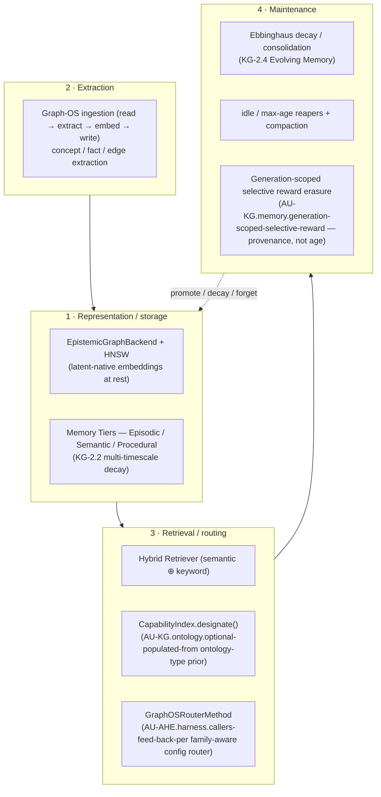
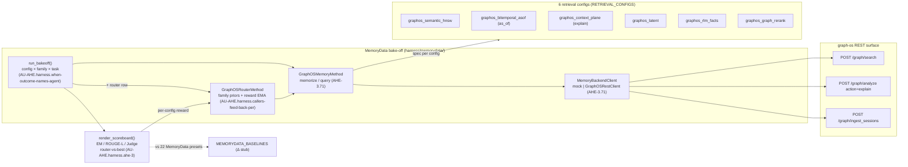

# Unified Memory Architecture

This document consolidates the memory paradigms used by agent-utilities.

## Core Memory Features

- **Autonomous Memory Architecture (CONCEPT:AU-KG.memory.tiered-memory-caching)**: MAGMA-inspired orthogonal reasoning views (Semantic, Temporal, Causal, Entity) combined with Autonomous Self-Improvement loops. Unifies code awareness, chat memory, and **Research Knowledge Bases** (Medical, Chemistry, etc.) into a singular, schema-enforced graph. Cross-domain relationships emerge automatically through shared concepts. Supports unified ingestion of MCP, A2A, and Skill-based resources with automated importance scoring and temporal decay.
- **Cross-Agent Observational Memory Bridge (CONCEPT:AU-KG.memory.tiered-memory-caching)**: Shared local memory layer across 10 terminal agents (Claude Code, Codex, Grok Build, Devin, Antigravity, Windsurf, OpenCode, agent-terminal-ui, Cowork, Hermes). KG is the source of truth; materialized Markdown files (`observations.md`, `reflections.md`, `profile.md`, `active.md`) provide inspectable, editable views at `~/.local/share/agent-utilities/memory/`. Bidirectional sync ensures user edits flow back to the KG. Includes LLM-powered Observer/Reflector pipeline, budgeted startup context injection via agent hooks (AU-ECO.mcp.toolkit-live-discovery), and `agent-utilities-memory` CLI.
- **Token-Aware Context Compaction (CONCEPT:AU-KG.memory.tiered-memory-caching)**: Intelligent context window management with three strategies (`summarize_tools`, `drop_middle`, `progressive`). Adapted from Goose's `context_mgmt/mod.rs`. Compaction summaries persist as `EpisodeNode` snapshots for cross-session context recall via `MemoryRetriever`.
- **Multi-Timescale Memory Dynamics (CONCEPT:AU-KG.ingest.engineering-rules)**: Three-tier memory with timescale-aware exponential decay (Working 5min, Episodic 4hr, Semantic 30-day). Consolidation promotes high-activation memories. Derived from Continual Knowledge Updating (arXiv:2605.05097v1).
- **Memory-Aware Test-Time Scaling (CONCEPT:AU-AHE.evaluation.backtest-harness)**: Integrates batch-parallel trajectory generation into the HTN planner. Distills reasoning memory concurrently across multiple parallel attempts (successes and failures) yielding zero-shot hypergraph generalization and structural topological feedback.

## Memento Context Management

Integrated context compression and block-masking architecture to optimize KV cache usage and improve long-context agent performance. This powers "sawtooth" context construction, enabling infinite-horizon agent execution.

## Agent-native memory — the four modules, mapped to our stack

The agent-native-memory literature decomposes any memory system into four
modules: **representation/storage**, **extraction**, **retrieval/routing**, and
**maintenance**. agent-utilities already implements all four — it never had a
*surface representation* problem (embeddings are stored latent-natively in the
`EpistemicGraphBackend`/HNSW path), so the framing below is a map of existing
components onto those four roles, not a new subsystem.

### Generation-scoped selective reward erasure (CONCEPT:AU-KG.memory.generation-scoped-selective-reward)

The maintenance quadrant decays learned utility by **age** (`decay_rewards`,
KG-2.4) and reaps memories by idle/max-age. It had no way to forget utility by
**provenance** — when the source/impl/model regime that *produced* a learned
reward is superseded, the reward EMA on `CapabilityIndex` (`record_outcome`,
the live retrieval router's self-tuning signal) kept biasing `designate()` with
evidence scored under a now-defunct representation. This is the *non-stationary
utility* problem the Red Queen Gödel Machine names (arXiv:2606.26294): a fixed
utility carried across a regime change leaves the search anchored by stale,
potentially reward-hacked evidence. RQGM's answer is **selective erasure** at an
epoch boundary — discard only the utility records tied to the displaced
evaluator, preserve everything unrelated, and let the router re-climb under the
new regime. We adopt exactly that primitive on the memory router's utility
records, in two wired forms:

- **Native, auto-detected (the upsert path).** `CapabilityIndex.add()` already
  re-embeds an entity on every re-ingest. When the new embedding has *materially*
  diverged from the stored one (cosine distance `> _REWARD_REGEN_DISTANCE`), the
  re-add is a new *generation*: the stale reward EMA is selectively erased to the
  neutral prior, while content-stable re-adds keep their reward. No flag — it runs
  on the existing ingestion upsert for every entity (Native-by-default).
- **Explicit, two-surface (operator/agent).** `selective_erase_rewards(ids)` is
  the order-independent direct analog, surfaced through `FeedbackService`
  (`record_correction` `correction_type="selective_erasure"`) and therefore
  through both `graph_feedback` (MCP) and `POST /graph/feedback` (REST) — to
  forget a whole superseded generation (a redeployed capability, a retracted
  source) in one call. Unlike `decay_rewards`, it targets by *provenance*, not by
  *age*.

> **Scope honesty.** arXiv:2606.26294 is a *self-improving-agents / co-evolving-evaluator*
> paper, not a memory paper; most of its mechanism (controlled utility evolution,
> ground-truth-anchored challenger promotion, the multi-agent workspace tree)
> already lives in our AU-AHE.optimization.telemetry-optimization self-improvement spine (the capability reward-EMA
> router, the eval/preference corpus, the GEPA held-out split, the MemoryData
> router-vs-best bake-off). Selective erasure is the **one** mechanism that filled
> a genuine memory-maintenance gap. See
> `reports/memory-2606.26294-comparative-analysis-2026-06-28.md`.

## MemoryData bake-off — proving the retrieval stack against published baselines

`agent_utilities/harness/memorydata/` is a self-contained measurement harness
that drives the **graph-os memory surfaces** through the MemoryData benchmark
contract and scores them against the field. It is the *retrieval/routing*
quadrant's evidence: which graph-os retrieval config wins on which task family,
and whether a learned router beats every single config.

- **AHE-3.71 — adapter + transport.** `GraphOSMemoryMethod` (`adapter.py`)
  implements MemoryData's `memorize`/`query` contract over a pluggable
  `MemoryBackendClient` (`client.py`): a `mock` transport for offline runs and a
  `GraphOSRestClient` that talks to graph-os over REST.
- **AU-AHE.harness.when-outcome-names-agent — bake-off.** `run_bakeoff` (`bakeoff.py`) runs every
  config × family × task cell and scores **EM + ROUGE-L** into a `BakeoffResult`.
- **AU-AHE.harness.callers-feed-back-per — family-aware router.** `GraphOSRouterMethod` (`router_method.py`)
  picks a config per query from `DEFAULT_FAMILY_PRIORS` and self-tunes with a
  per-config reward EMA (`record_outcome`).
- **AU-AHE.harness.ahe-3 — scoreboard.** `render_scoreboard` (`scoreboard.py`) emits a
  markdown table: measured results, best-config-per-family, and router-vs-best,
  with the 22 published MemoryData presets stubbed for a future Δ column.

> **Status:** the bake-off ships on `feat/memorydata-bench-and-ingestion-profiling`
> (concepts AHE-3.71–3.74). It is a measurement module — no MCP surface; it
> consumes the served graph-os REST endpoints read-only.
