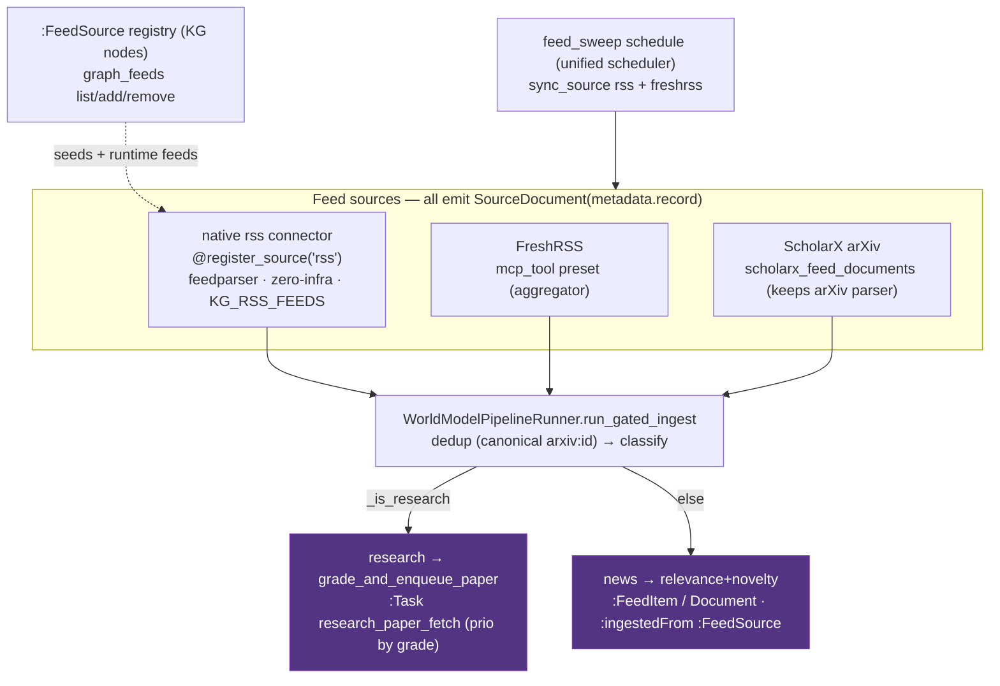

# Recipe — Unified RSS ingestion (native RSS + FreshRSS + ScholarX arXiv)

Three feed sources, **one** ingestion system (CONCEPT:AU-KG.ingest.rss-feed-connector / AU-KG.compute.first-class-rss-atom). A native
zero-infra RSS/Atom extractor, the FreshRSS aggregator, and the ScholarX arXiv feed
are all first-class `:FeedSource` citizens that emit the same `SourceDocument` and flow
through **one** world-model gate, which routes research items to the prioritized
research-paper fetch and news items to relevance+novelty ingestion.



## The three sources

| Source | How | When to use |
|---|---|---|
| **native `rss`** | `@register_source("rss")` `RssConnector` (feedparser); feeds in `KG_RSS_FEEDS` or added via `graph_feeds`. | Ingest any RSS/Atom URL with **nothing deployed** — the zero-infra default. |
| **FreshRSS** | `freshrss` `mcp_tool` preset over the GReader API. | A managed aggregator of many curated feeds (subscriptions, read-state). |
| **ScholarX arXiv** | `scholarx_feed_documents` maps `Paper`s (its specialized arXiv parser stays in scholarx) to the unified shape. | arXiv daily announcements → the research path. |

## The one gate (content-routed)

Every feed item carries a `metadata["record"]` envelope (`categories` + `origin`). The
gate (`automation/worldmodel_pipeline.py`):

1. **dedups** on the canonical `arxiv:<id>` (so the same paper via ScholarX **and**
   FreshRSS collapses to one node) plus node existence;
2. **classifies** research vs news (`_is_research`);
3. **research** → `grade_and_enqueue_paper` (keyword + novelty grade → a prioritized
   `research_paper_fetch` `:Task`, best-graded fetched first; abstract-only / reject
   otherwise) — the same AU-KG.research.scholarx-rss-research-feed path for items from *any* feed;
4. **news** → relevance+novelty → a `:FeedItem`/Document linked `:ingestedFrom` its
   `:FeedSource`.

## Managing feeds (two surfaces)

```bash
# MCP
graph_feeds action=add url=https://example.com/feed.xml
graph_feeds action=list
graph_feeds action=sync          # run the unified sweep now
graph_feeds action=remove url=https://example.com/feed.xml

# REST (auto-mounted twin)
curl -s localhost:8080/graph/feeds -d '{"action":"list"}'
```

A feed added at runtime becomes a durable `:FeedSource` node; the next `feed_sweep`
unions it with the `KG_RSS_FEEDS` seed and ingests it. The sweep is the generalized
`research_feed`/`feed_sweep` schedule on the [unified scheduler](unified-scheduling.md)
(`graph_schedules` controls cadence; default 30 min, `KG_RESEARCH_FEED=0` disables).

## Verifying

```bash
graph_feeds action=add url=https://rss.arxiv.org/rss/cs.AI
graph_feeds action=sync
# research item → a prioritized fetch task
graph_query "MATCH (t:Task {type:'research_paper_fetch'}) RETURN t.id, t.prio_bucket"
# feeds + provenance
graph_query "MATCH (i)-[:INGESTED_FROM]->(f:FeedSource) RETURN f.name, count(i)"
```

See also: [Unified scheduling](unified-scheduling.md),
[the gateway daemon](../architecture/gateway_daemon.md).
