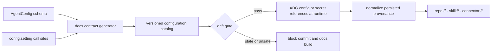

# Runtime Configuration Catalog

> **GENERATED — do not edit by hand.** Run `python scripts/docs_contract.py --write`. Defaults come from the `AgentConfig` schema; secret values are never rendered.

527 typed fields · 318 runtime-only call-site inputs.

Use the XDG configuration file created by `setup-config generate`; deployment secrets must be references resolved by the configured secret store.

Persisted provenance uses neutral identifiers such as `repo://<package>/<path>`, `skill://<provider>/<skill>`, or `connector://<provider>/<record>`. Fields including `workspace_path`, `source_path`, `skill_path`, `source_file`, and endpoint identities are runtime-only inputs: normalize or omit them before writing tracked files, logs, traces, caches, or graph metadata.

Both GraphOS process-identity fields remain unset only for `graph-os --transport stdio` with `DEPLOYMENT_PROFILE=tiny`, no `GRAPH_SERVICE_ENDPOINTS`, and the packaged local engine. That exact boundary signs and validates a short-lived JWT with an in-memory key as a one-time proof, uses neutral service claims, destroys the proof key and token, and returns a process-lifetime session; it persists no personal, host, endpoint, filesystem, credential, or proof data. Every network transport, non-tiny profile, explicit engine endpoint, and other entry point requires exactly one of `KG_AUTH_TOKEN_REF` or `KG_IDENTITY_OAUTH2`; acquisition or validation failure never falls back locally. External stdio authority uses a renewable shared in-memory expiry-only lease. Renewal must preserve subject, actor type, capabilities, tenant, authentication state, and groups; drift is rejected, failure never extends the lease, and graph work fails closed at expiry while renewal retries.

## General

| Environment key | Type | Default |
|---|---|---|
| `APP_PROFILE` | `str` | `dev` |
| `DEPLOYMENT_PROFILE` | `Literal` | `tiny` |
| `CHAT_MODELS` | `list` | `unset` |
| `EMBEDDING_MODELS` | `list` | `unset` |
| `TLS_PROFILE` | `str \| None` | `unset` |
| `TLS_PROFILE_REF` | `str \| None` | `unset` |
| `TLS_PROFILES_REF` | `str \| None` | `unset` |
| `TLS_CA_BUNDLE_REF` | `str \| None` | `unset` |
| `TLS_CLIENT_CERT_REF` | `str \| None` | `unset` |
| `TLS_CLIENT_KEY_REF` | `str \| None` | `unset` |
| `TLS_CLIENT_KEY_PASSWORD_REF` | `str \| None` | `unset` |
| `TLS_PROXY_URL_REF` | `str \| None` | `unset` |
| `TLS_SYSTEM_TRUST` | `bool` | `True` |
| `TLS_TRUST_ENV` | `bool` | `True` |
| `SOURCE_HTTP_ALLOWED_PRIVATE_HOSTS` | `list` | `unset` |
| `SOURCE_HTTP_ALLOWED_REDIRECT_HOSTS` | `list` | `unset` |
| `SOURCE_HTTP_MAX_RESPONSE_BYTES` | `int` | `10485760` |
| `SOURCE_HTTP_MAX_REDIRECTS` | `int` | `3` |
| `SOURCE_HTTP_ALLOW_BROWSER_FETCH` | `bool` | `False` |
| `EUNOMIA_TYPE` | `Literal` | `none` |
| `EUNOMIA_POLICY_FILE` | `str \| None` | `unset` |
| `EUNOMIA_REMOTE_URL` | `str \| None` | `unset` |
| `EUNOMIA_API_KEY_REF` | `str \| None` | `unset` |
| `EUNOMIA_TLS_PROFILE` | `str \| None` | `unset` |
| `EUNOMIA_TLS_PROFILE_REF` | `str \| None` | `unset` |
| `EUNOMIA_ALLOWED_PRIVATE_HOSTS` | `list` | `unset` |
| `EUNOMIA_TIMEOUT_SECONDS` | `float` | `10.0` |
| `EUNOMIA_MAX_RESPONSE_BYTES` | `int` | `1048576` |
| `EUNOMIA_BULK_CHECK_MAX` | `int` | `100` |
| `DATABASE_TYPE` | `Literal` | `epistemic_graph` |
| `DB_HOST` | `str \| None` | `unset` |
| `DB_PORT` | `int \| None` | `unset` |
| `DBNAME` | `str \| None` | `unset` |
| `DB_USERNAME_REF` | `str \| None` | `unset` |
| `DB_PASSWORD_REF` | `str \| None` | `unset` |
| `DOCUMENT_DIRECTORY` | `str \| None` | `unset` |
| `POSTGRES_TLS_PROFILE` | `str \| None` | `unset` |
| `POSTGRES_TLS_PROFILE_REF` | `str \| None` | `unset` |
| `POSTGRES_REQUEST_TIMEOUT` | `int` | `30` |
| `POSTGRES_MAX_POOL_SIZE` | `int` | `20` |
| `QDRANT_API_KEY_REF` | `str \| None` | `unset` |
| `QDRANT_TLS_PROFILE` | `str \| None` | `unset` |
| `QDRANT_TLS_PROFILE_REF` | `str \| None` | `unset` |
| `QDRANT_HTTP_ALLOWED_PRIVATE_HOSTS` | `list` | `unset` |
| `QDRANT_REQUEST_TIMEOUT` | `int` | `30` |
| `MONGODB_URI_REF` | `str \| None` | `unset` |
| `MONGODB_TLS_PROFILE` | `str \| None` | `unset` |
| `MONGODB_TLS_PROFILE_REF` | `str \| None` | `unset` |
| `MONGODB_REQUEST_TIMEOUT_MS` | `int` | `30000` |
| `MONGODB_MAX_POOL_SIZE` | `int` | `20` |
| `REDIS_CONNECTION_PROFILE_REF` | `str \| None` | `unset` |
| `REDIS_TLS_PROFILE` | `str \| None` | `unset` |
| `REDIS_TLS_PROFILE_REF` | `str \| None` | `unset` |
| `MODEL_HTTP_ALLOWED_PRIVATE_HOSTS` | `list` | `unset` |
| `MODEL_TLS_PROFILE` | `str \| None` | `unset` |
| `MODEL_TLS_PROFILE_REF` | `str \| None` | `unset` |
| `EMBEDDING_TLS_PROFILE` | `str \| None` | `unset` |
| `EMBEDDING_TLS_PROFILE_REF` | `str \| None` | `unset` |
| `OAUTH2_TOKEN_TLS_PROFILE` | `str \| None` | `unset` |
| `OAUTH2_TOKEN_TLS_PROFILE_REF` | `str \| None` | `unset` |
| `EXTERNAL_GRAPH_CONNECTORS` | `list` | `unset` |
| `PROVIDER_CONFIGS` | `dict` | `unset` |

## Exact skill certification deployment references

| Environment key | Type | Default |
|---|---|---|
| `SKILL_CERT_RUNTIME_CONFIGURATION` | `str \| None` | `unset` |
| `SKILL_CERT_RUNTIME_PROFILE` | `str \| None` | `unset` |
| `SKILL_CERT_RELEASE_SPEC` | `str \| None` | `unset` |
| `SKILL_CERT_PROMOTION_EVIDENCE` | `str \| None` | `unset` |
| `SKILL_CERT_GRAPHOS_ENDPOINT` | `str \| None` | `unset` |
| `SKILL_CERT_GRAPHOS_COMMAND` | `list` | `unset` |
| `SKILL_VALIDATION_EVIDENCE_SIGNER_COMMAND` | `list` | `unset` |
| `SKILL_VALIDATION_EVIDENCE_VERIFIER_COMMAND` | `list` | `unset` |
| `SKILL_CERT_IDENTITY_AUTHORITY_MODE` | `Literal` | `ephemeral-https-loopback` |
| `SKILL_CERT_IDENTITY_TOKEN_TTL_SECONDS` | `int` | `300` |

## Production certification runtime

| Environment key | Type | Default |
|---|---|---|
| `CERTIFICATION_MODE` | `Literal` | `disabled` |
| `CERT_RELEASE_MANIFEST` | `str \| None` | `unset` |
| `CERT_ARTIFACTS_DIR` | `str \| None` | `unset` |
| `CERT_HARDWARE_CLASS` | `str \| None` | `unset` |
| `CERT_LOAD_COMMAND` | `list` | `unset` |
| `CERT_METRICS_COMMAND` | `list` | `unset` |
| `CERT_HOOK_COMMANDS` | `dict` | `unset` |
| `CERT_FAULT_ACTION_COMMANDS` | `dict` | `unset` |
| `CERT_FAULT_PROBE_COMMANDS` | `dict` | `unset` |
| `CERT_EVIDENCE_SIGNER_COMMAND` | `list` | `unset` |
| `CERT_EVIDENCE_VERIFIER_COMMAND` | `list` | `unset` |
| `CERT_PROMETHEUS_URL` | `str \| None` | `unset` |
| `CERT_PROMETHEUS_BEARER_TOKEN_REF` | `str \| None` | `unset` |
| `CERT_PROMETHEUS_TLS_PROFILE` | `str \| None` | `unset` |
| `CERT_PROMETHEUS_TLS_PROFILE_REF` | `str \| None` | `unset` |

## Provider API Keys (global fallbacks for ad-hoc model creation)

| Environment key | Type | Default |
|---|---|---|
| `OPENAI_API_KEY` | `str \| None` | `explicit runtime process value only` |
| `OPENAI_BASE_URL` | `str \| None` | `unset` |
| `ANTHROPIC_API_KEY` | `str \| None` | `explicit runtime process value only` |
| `GEMINI_API_KEY` | `str \| None` | `explicit runtime process value only` |
| `GROQ_API_KEY` | `str \| None` | `explicit runtime process value only` |
| `MISTRAL_API_KEY` | `str \| None` | `explicit runtime process value only` |
| `HUGGING_FACE_API_KEY` | `str \| None` | `explicit runtime process value only` |
| `DEEPSEEK_API_KEY` | `str \| None` | `explicit runtime process value only` |
| `DEEPSEEK_BASE_URL` | `str \| None` | `unset` |

## Messaging reach + agent KG layer (CONCEPT:AU-ECO.messaging.messaging-reach-service-governed–4.61)

| Environment key | Type | Default |
|---|---|---|
| `TELEGRAM_BOT_TOKEN` | `str \| None` | `explicit runtime process value only` |
| `MESSAGING_DEFAULT_PLATFORM` | `str` | `telegram` |
| `MESSAGING_DEFAULT_CHANNEL` | `str` | `` |
| `MESSAGING_ALERT_INTAKE_PORT` | `int \| None` | `unset` |
| `MESSAGING_ALERT_INTAKE_HOST` | `str` | `127.0.0.1` |
| `MESSAGING_ALERT_INTAKE_TOKEN_REF` | `str \| None` | `unset` |
| `MESSAGING_ALERT_INTAKE_ALLOW_REMOTE` | `bool` | `False` |
| `MESSAGING_AGENT` | `str` | `` |
| `MESSAGING_CLAUDE_TRIGGER` | `str` | `/claude` |
| `MESSAGING_CLAUDE_MODEL` | `str` | `claude-sonnet-4-6` |
| `MESSAGING_LOCAL_MODEL` | `str` | `` |
| `REACTIONS` | `str` | `1` |
| `MESSAGING_BURST_WINDOW_S` | `str` | `2.5` |
| `MESSAGING_BURST_MAX_S` | `str` | `12` |
| `MESSAGING_ENRICH` | `str` | `1` |
| `MESSAGING_GOALS` | `str` | `1` |
| `MESSAGING_WEBHOOK_BASE_URL` | `str` | `` |
| `MESSAGING_WEBHOOK_PORT` | `str` | `8443` |
| `MESSAGING_WEBHOOK_SECRET` | `str` | `explicit runtime process value only` |
| `MESSAGING_VOICE` | `str` | `1` |
| `MESSAGING_VOICE_MODEL` | `str` | `base` |
| `AGENT_KG_TOOLS` | `str` | `True` |

## Ingestion sources (CONCEPT:AU-KG.query.vendor-agnostic-traversal web-fetch)

| Environment key | Type | Default |
|---|---|---|
| `ARCHIVEBOX_URL` | `str \| None` | `unset` |
| `INFRA_INVENTORY_PATH` | `str \| None` | `unset` |

## Media service endpoints

| Environment key | Type | Default |
|---|---|---|
| `COMFYUI_URL` | `str \| None` | `unset` |
| `XTTS_URL` | `str \| None` | `unset` |
| `OPENAI_TTS_URL` | `str \| None` | `unset` |
| `WHISPER_URL` | `str \| None` | `unset` |
| `FASTER_WHISPER_URL` | `str \| None` | `unset` |
| `FLUX_URL` | `str \| None` | `unset` |
| `SD35_URL` | `str \| None` | `unset` |
| `HUNYUAN_URL` | `str \| None` | `unset` |
| `SVD_URL` | `str \| None` | `unset` |

## Graph / KG tuning knobs

| Environment key | Type | Default |
|---|---|---|
| `GRAPH_TIMEOUT` | `str \| None` | `600000` |
| `MAX_RECURSION_DEPTH` | `str \| None` | `2` |
| `ROUTING_PERCENTILE` | `str \| None` | `50.0` |
| `KG_EMBEDDING_DIM` | `str \| None` | `768` |
| `KG_DEV_MODE` | `bool` | `False` |

## Observability / usage analytics (CONCEPT:AU-OS.observability.usage-analytics-store / ECO-4.40 / OS-5.31)

| Environment key | Type | Default |
|---|---|---|
| `USAGE_DB_BACKEND` | `str` | `sqlite` |
| `USAGE_DB_URI` | `str \| None` | `unset` |
| `USAGE_TRACKING_ENABLED` | `bool` | `True` |
| `USAGE_CONTENT_RETENTION` | `str` | `metadata` |
| `PRICING_LITELLM_URL` | `str` | `https://raw.githubusercontent.com/BerriAI/litellm/main/model_prices_and_context_window.json` |

## Parallel-call capacity resolution (CONCEPT:AU-KG.compute.concurrency-controller-sizing)

| Environment key | Type | Default |
|---|---|---|
| `DEFAULT_AGENT_NAME` | `str` | `Agent` |
| `AGENT_DESCRIPTION` | `str` | `AI Agent` |
| `AGENT_SYSTEM_PROMPT` | `str \| None` | `unset` |
| `WORKSPACE_PATH` | `str \| None` | `unset` |
| `EVOLUTION_STAGING_ROOT` | `str \| None` | `unset` |
| `AGENT_UTILITIES_CONFIG_DIR` | `str \| None` | `unset` |
| `HOST` | `str` | `127.0.0.1` |
| `PORT` | `int` | `9000` |
| `DEBUG` | `bool` | `False` |
| `AIRGAP_MODE` | `bool` | `False` |
| `ENABLE_WEB_UI` | `bool` | `False` |
| `ENABLE_TERMINAL_UI` | `bool` | `False` |
| `ENABLE_WEB_LOGS` | `bool` | `False` |
| `ENABLE_ACP` | `bool` | `False` |
| `ACP_PORT` | `int` | `8001` |
| `ACP_SESSION_ROOT` | `str` | `.acp-sessions` |
| `MCP_URL` | `str \| None` | `unset` |
| `MCP_CONFIG` | `str \| None` | `unset` |
| `MCP_FLEET_SECRET_REFS` | `dict` | `unset` |
| `MCP_TOOL_MODE` | `Literal` | `intent` |
| `MCP_HTTP_ALLOWED_PRIVATE_HOSTS` | `list` | `unset` |
| `FASTMCP_SERVER_AUTH_STATIC_TOKENS_REF` | `str \| None` | `unset` |
| `AUTH_TYPE` | `Literal` | `none` |
| `FASTMCP_SERVER_AUTH_JWT_JWKS_URI` | `str \| None` | `unset` |
| `FASTMCP_SERVER_AUTH_JWT_ISSUER` | `str \| None` | `unset` |
| `FASTMCP_SERVER_AUTH_JWT_AUDIENCE` | `str \| None` | `unset` |
| `FASTMCP_SERVER_AUTH_JWT_ALGORITHM` | `str \| None` | `unset` |
| `FASTMCP_SERVER_AUTH_JWT_REQUIRED_SCOPES` | `str \| None` | `unset` |
| `FASTMCP_SERVER_AUTH_JWT_SECRET_REF` | `str \| None` | `unset` |
| `MCP_TLS_CERTFILE` | `str \| None` | `unset` |
| `MCP_TLS_KEYFILE` | `str \| None` | `unset` |
| `MCP_TLS_TERMINATED` | `bool` | `False` |
| `MCP_TRUSTED_PROXY_CIDRS` | `str \| None` | `unset` |
| `MCP_ALLOWED_HOSTS` | `str \| None` | `unset` |
| `MCP_ALLOWED_ORIGINS` | `str \| None` | `unset` |
| `MCP_MAX_REQUEST_BYTES` | `int` | `4194304` |
| `MCP_MAX_CONNECTIONS` | `int` | `128` |
| `MCP_LISTEN_BACKLOG` | `int` | `256` |
| `MCP_METRICS_TOKEN_REF` | `str \| None` | `unset` |
| `MAX_UPLOAD_SIZE` | `int` | `10485760` |
| `AUTH_JWT_JWKS_URI` | `str \| None` | `unset` |
| `AUTH_JWT_ISSUER` | `str \| None` | `unset` |
| `AUTH_JWT_AUDIENCE` | `str \| None` | `unset` |
| `KG_POLICY_VERSION` | `str \| None` | `unset` |
| `AUTH_JWT_ALGORITHMS` | `list` | `unset` |
| `IDENTITY_GROUP_CAPABILITY_MAP` | `dict[str, list[str]] \| None` | `unset` |

## Knowledge Graph process identity

| Environment key | Type | Default |
|---|---|---|
| `KG_AUTH_TOKEN_REF` | `str \| None` | `unset` |
| `KG_IDENTITY_OAUTH2` | `dict[str, typing.Any] \| None` | `unset` |

## Fleet events webhook ingress (CONCEPT:AU-OS.config.fleet-event-ingress)

| Environment key | Type | Default |
|---|---|---|
| `FLEET_EVENTS_TOKEN_REF` | `str \| None` | `unset` |

## Gateway middle-tier hardening (CONCEPT:AU-OS.observability.no-op-without-metrics)

| Environment key | Type | Default |
|---|---|---|
| `GATEWAY_METRICS` | `bool` | `True` |
| `GATEWAY_RATE_LIMIT` | `float` | `0.0` |
| `GATEWAY_RATE_BURST` | `float` | `0.0` |
| `GATEWAY_WORKERS` | `int` | `1` |
| `ENGINE_BREAKER_THRESHOLD` | `int` | `5` |
| `ENGINE_BREAKER_COOLDOWN` | `float` | `15.0` |

## MCP multiplexer child resilience (CONCEPT:AU-ECO.mcp.profile-differences-from-client)

| Environment key | Type | Default |
|---|---|---|
| `MCP_CHILD_MAX_CONCURRENCY` | `int` | `8` |
| `MCP_CHILD_QUEUE_TIMEOUT` | `float` | `30.0` |
| `MCP_CHILD_POOL_SIZE` | `int` | `1` |
| `MCP_CHILD_MAX_RESTARTS` | `int` | `5` |
| `MCP_CHILD_RESTART_WINDOW` | `float` | `300.0` |
| `MCP_CHILD_BREAKER_THRESHOLD` | `int` | `5` |
| `MCP_CHILD_BREAKER_COOLDOWN` | `float` | `15.0` |

## Embedded MCP fleet discovery (CONCEPT:AU-ECO.multiplexer.tool-gateway-catalog)

| Environment key | Type | Default |
|---|---|---|
| `MCP_DYNAMIC_TOP_K` | `int` | `8` |

## OIDC / OAuth 2.0 Delegation (CONCEPT:AU-ECO.messaging.native-backend-abstraction)

| Environment key | Type | Default |
|---|---|---|
| `MCP_CLIENT_AUTH` | `Literal` | `none` |
| `OIDC_CONFIG_URL` | `str \| None` | `unset` |
| `OIDC_CLIENT_ID` | `str \| None` | `unset` |
| `OIDC_CLIENT_SECRET_REF` | `str \| None` | `unset` |
| `OIDC_AUDIENCE` | `str \| None` | `unset` |
| `OIDC_ISSUER` | `str \| None` | `unset` |
| `OIDC_TOKEN_URL` | `str \| None` | `unset` |
| `OIDC_SCOPE` | `str \| None` | `unset` |
| `MCP_BASIC_AUTH_USERNAME` | `str \| None` | `unset` |
| `MCP_BASIC_AUTH_PASSWORD_REF` | `str \| None` | `unset` |
| `OIDC_TLS_PROFILE` | `str \| None` | `unset` |
| `OIDC_TLS_PROFILE_REF` | `str \| None` | `unset` |
| `OIDC_HTTP_ALLOWED_PRIVATE_HOSTS` | `list` | `unset` |
| `ENABLE_DELEGATION` | `bool` | `False` |
| `AUDIENCE` | `str \| None` | `unset` |
| `DELEGATED_SCOPES` | `str` | `api` |

## Vault Secrets Backend (CONCEPT:AU-OS.config.secrets-authentication)

| Environment key | Type | Default |
|---|---|---|
| `SECRETS_VAULT_URL` | `str \| None` | `unset` |
| `SECRETS_VAULT_MOUNT` | `str` | `secret` |
| `VAULT_AUTH_METHOD` | `str` | `auto` |
| `VAULT_AUTH_MOUNT` | `str` | `jwt` |
| `VAULT_ROLE` | `str \| None` | `unset` |
| `VAULT_PATH_PREFIX` | `str \| None` | `unset` |
| `ALLOWED_ORIGINS` | `str \| None` | `unset` |
| `CORS_ALLOW_CREDENTIALS` | `bool` | `False` |
| `ALLOWED_HOSTS` | `str \| None` | `unset` |
| `SERVER_TLS_CERTFILE` | `str \| None` | `unset` |
| `SERVER_TLS_KEYFILE` | `str \| None` | `unset` |
| `SERVER_TLS_TERMINATED` | `bool` | `False` |
| `SERVER_TRUSTED_PROXY_CIDRS` | `list` | `unset` |
| `SERVER_MAX_CONNECTIONS` | `int` | `256` |
| `RUNTIME_WORKSPACE_IMAGES` | `list` | `unset` |
| `RUNTIME_WORKSPACE_NETWORK` | `Literal` | `none` |
| `RUNTIME_MAX_SESSIONS` | `int` | `16` |
| `RUNTIME_SESSION_TTL_SECONDS` | `int` | `3600` |
| `RUNTIME_MAX_EVENTS` | `int` | `1000` |
| `ROUTING_STRATEGY` | `str` | `hybrid` |
| `GRAPH_PERSISTENCE_TYPE` | `str` | `file` |
| `GRAPH_DB_CONNECTION_PROFILE_REF` | `str \| None` | `unset` |
| `GRAPH_MIRROR_TARGETS` | `list[str] \| None` | `unset` |
| `CONTINUOUS_STARDOG_MIRROR` | `bool` | `False` |
| `ASSET_MIRROR_TARGETS` | `list[str] \| None` | `unset` |
| `TASK_QUEUE_BACKEND` | `str \| None` | `unset` |
| `KG_TASKS_PARTITIONS` | `int` | `6` |
| `AGENT_TURNS_PARTITIONS` | `int` | `6` |
| `AGENT_DISPATCH_MAX_DEPTH` | `int` | `100000` |
| `AGENT_DISPATCH_CLAIM_TTL_S` | `float` | `120.0` |
| `AGENT_DISPATCH_RENEW_INTERVAL_S` | `float` | `30.0` |
| `AGENT_BUS_LOG_BACKEND` | `str` | `engine` |
| `AGENT_BUS_PARTITIONS` | `int` | `6` |
| `AGENT_BUS_MAX_CONSUMERS` | `int` | `32` |
| `AGENT_BUS_MAX_DEPTH` | `int` | `100000` |
| `AGENT_BUS_MAX_TOPIC_SUBSCRIBERS` | `int` | `1024` |
| `AGENT_BUS_DELIVERY_LEASE_SECONDS` | `int` | `300` |
| `STATE_DB_URI` | `str \| None` | `unset` |
| `STATE_DB_POOL_SIZE` | `int` | `8` |
| `KG_BREADTH_LIBRARY_ROOTS` | `str` | `` |
| `KG_BREADTH_REPO_ROOTS` | `str` | `` |
| `KG_LOOP` | `bool` | `False` |
| `KG_LOOP_DISTILL` | `bool` | `False` |
| `KG_LOOP_DISCOVER` | `bool` | `False` |
| `KG_LOOP_BREADTH` | `bool` | `True` |
| `KG_LOOP_STANDARDIZE` | `bool` | `False` |
| `KG_LOOP_MINE_DISCOVERY` | `bool` | `True` |
| `KG_LOOP_BELIEF_REVISION` | `bool` | `True` |
| `KG_LOOP_INSIGHT_VALIDATION` | `bool` | `True` |
| `KG_INSIGHT_AUTONOMY` | `bool` | `False` |
| `KG_LOOP_AUTO_DEVELOP` | `bool` | `False` |
| `KG_LOOP_ALLOW_HOST_VALIDATION` | `bool` | `False` |
| `KG_LOOP_HOST_VALIDATION_EXECUTABLES` | `str` | `pytest,ruff,mypy,pyright,nox,tox,cargo,go` |
| `ENABLE_RLM` | `bool` | `False` |
| `RLM_AUTO_TRIGGER` | `bool` | `False` |
| `RLM_SANDBOX` | `str` | `auto` |
| `RLM_CONTAINER_IMAGE_REF` | `str \| None` | `unset` |
| `RLM_CONTAINER_MEMORY` | `str` | `512m` |
| `RLM_CONTAINER_CPUS` | `float` | `1.0` |
| `RLM_CONTAINER_PIDS_LIMIT` | `int` | `256` |
| `RLM_CONTAINER_TIMEOUT_SECONDS` | `float` | `120.0` |
| `KG_LOOP_TRACE_MINING` | `bool` | `True` |
| `KG_GOLDEN_AUTO_MERGE` | `bool` | `False` |
| `KG_GOLDEN_MERGE_THRESHOLD` | `float \| None` | `unset` |
| `EVOLUTION_WORKTREE_ROOT` | `str` | `` |
| `KG_LOOP_INTERVAL` | `float` | `3600.0` |
| `KG_LOOP_TOPICS` | `int` | `5` |
| `KG_RESEARCH_FEED` | `bool` | `True` |
| `KG_RESEARCH_FEED_INTERVAL` | `float` | `1800.0` |
| `KG_RSS_FEEDS` | `str` | `` |
| `KG_SAI_FACTORY` | `bool` | `True` |
| `KG_SAI_FACTORY_INTERVAL` | `float` | `3600.0` |
| `KG_FAILURE_EVOLUTION` | `bool` | `False` |
| `KG_FAILURE_EVOLUTION_INTERVAL` | `float` | `3600.0` |
| `KG_FAILURE_EVOLUTION_WINDOW` | `float` | `86400.0` |
| `KG_FAILURE_REGRESSION_DATASET` | `bool` | `False` |
| `KG_OPTIMIZATION_ENABLED` | `bool` | `True` |
| `KG_OPTIMIZATION_INTERVAL` | `float` | `10800.0` |
| `KG_AGENT_AUTO_APPLY` | `bool` | `False` |
| `KG_ANOMALY_CONSUMER` | `bool` | `True` |
| `KG_TENANT_GC_INTERVAL` | `float` | `300.0` |
| `KG_ENGINE_POOL_SIZE` | `int` | `8` |
| `KG_ENGINE_POOL_DROP_ON_EVICT` | `bool` | `False` |
| `KG_ENGINE_TOOL_POOL_SIZE` | `int` | `16` |
| `KG_FUSEKI_PUBLISH` | `bool` | `False` |
| `KG_FUSEKI_ENDPOINT` | `str` | `` |
| `GRAPH_FUSEKI_DATASET` | `str` | `agent_kg` |
| `GRAPH_FUSEKI_USER` | `str \| None` | `unset` |
| `GRAPH_FUSEKI_PASSWORD_REF` | `str \| None` | `unset` |
| `KG_FUSEKI_PUBLISH_INTERVAL` | `float` | `3600.0` |
| `KG_WORKFLOW_SHAPE_GATE` | `bool` | `True` |

## Autonomy control plane (CONCEPT:AU-OS.deployment.fleet-lifecycle-control — OS-5.27)

| Environment key | Type | Default |
|---|---|---|
| `FLEET_MCP_URL_TEMPLATE` | `str \| None` | `unset` |
| `ACTION_POLICY_PATH` | `str` | `` |
| `FLEET_RECONCILER` | `bool` | `False` |
| `FLEET_RECONCILER_INTERVAL` | `float` | `120.0` |
| `FLEET_RECONCILER_MAX_ACTIONS` | `int` | `5` |
| `FLEET_REGISTRY_PATH` | `str` | `` |
| `FLEET_DESIRED_STATE_PATH` | `str` | `` |
| `FLEET_ACTUATOR` | `str` | `dryrun` |
| `DEPLOY_WATCH_WINDOW` | `float` | `300.0` |
| `DEPLOY_WATCH_POLL` | `float` | `15.0` |
| `FLEET_AUTOSCALER` | `bool` | `False` |
| `FLEET_AUTOSCALER_INTERVAL` | `float` | `60.0` |
| `SCALING_PROMETHEUS_URL` | `str \| None` | `unset` |
| `NATS_URL` | `str \| None` | `unset` |
| `KAFKA_BOOTSTRAP_SERVERS` | `str` | `` |
| `GRAPH_COMPUTE_BACKEND` | `str` | `rust` |
| `GRAPH_SERVICE_ENDPOINTS` | `list[str] \| None` | `unset` |
| `GRAPH_RAFT_GROUP_ENDPOINTS` | `dict[str, str] \| None` | `unset` |
| `KG_CONNECTIONS` | `list[dict[str, typing.Any]] \| None` | `unset` |
| `GITLAB_INSTANCES` | `list[dict[str, typing.Any]] \| None` | `unset` |
| `JIRA_INSTANCES` | `list[dict[str, typing.Any]] \| None` | `unset` |
| `CONFLUENCE_INSTANCES` | `list[dict[str, typing.Any]] \| None` | `unset` |
| `PLANE_INSTANCES` | `list[dict[str, typing.Any]] \| None` | `unset` |
| `KG_DEFAULT_GRAPH` | `str` | `__commons__` |
| `GRAPH_SCHEMA_PACK` | `str` | `core` |
| `KG_INGEST_SHARD_FANOUT` | `bool` | `False` |
| `KG_RERANK_MODEL` | `str \| None` | `unset` |
| `KG_RERANK_BASE_URL` | `str \| None` | `unset` |
| `GRAPH_SERVICE_AUTH_SECRET` | `str \| None` | `explicit runtime process value only` |
| `ENGINE_TLS_PROFILE` | `str \| None` | `unset` |
| `ENGINE_TLS_PROFILE_REF` | `str \| None` | `unset` |
| `ENGINE_TLS_SERVER_NAME` | `str \| None` | `unset` |
| `ENGINE_LIFECYCLE` | `str` | `refcounted` |
| `ENGINE_IDLE_SHUTDOWN_SECS` | `int` | `60` |
| `EPISTEMIC_GRAPH_MAX_RESIDENT_GRAPHS` | `int` | `256` |
| `EPISTEMIC_GRAPH_LAZY_OPEN_PAGE_SIZE` | `int` | `4096` |
| `EPISTEMIC_GRAPH_MAX_NODES_PER_GRAPH` | `int` | `250000` |
| `EPISTEMIC_GRAPH_MAX_REQUEST_BYTES` | `int` | `67108864` |
| `EPISTEMIC_GRAPH_MAX_RESPONSE_BYTES` | `int` | `67108864` |
| `EPISTEMIC_GRAPH_MAX_MSGPACK_ITEMS` | `int` | `1000000` |
| `EPISTEMIC_GRAPH_CONNECTION_IO_TIMEOUT_SECS` | `int` | `120` |
| `EPISTEMIC_GRAPH_TLS_HANDSHAKE_TIMEOUT_SECS` | `int` | `10` |
| `EPISTEMIC_GRAPH_AST_MAX_FILES` | `int` | `4096` |
| `EPISTEMIC_GRAPH_AST_MAX_SOURCE_BYTES` | `int` | `4194304` |
| `EPISTEMIC_GRAPH_AST_MAX_TOTAL_BYTES` | `int` | `33554432` |
| `EPISTEMIC_GRAPH_MODALITY_MAX_BUNDLE_BYTES` | `int` | `4194304` |
| `EPISTEMIC_GRAPH_MODALITY_MAX_SOURCE_BYTES` | `int` | `16777216` |
| `EPISTEMIC_GRAPH_ENCRYPTION_KEY_REF` | `str \| None` | `unset` |
| `EPISTEMIC_GRAPH_SQLITE_TRANSFER_ROOT_REF` | `str \| None` | `unset` |
| `EPISTEMIC_GRAPH_SQLITE_MAX_BYTES` | `int` | `268435456` |
| `EPISTEMIC_GRAPH_SQLITE_MAX_ROWS` | `int` | `1000000` |
| `EPISTEMIC_GRAPH_BACKUP_ROOT_REF` | `str \| None` | `unset` |
| `GRAPH_OS_BACKUP_PRINCIPAL` | `str \| None` | `unset` |
| `GRAPH_OS_BACKUP_TENANT` | `str \| None` | `unset` |
| `GRAPHOS_BACKUP_RETENTION_COUNT` | `int` | `2` |
| `EPISTEMIC_GRAPH_RESTORE_BIN` | `str` | `restore` |
| `EPISTEMIC_GRAPH_SERVER_BIN` | `str` | `epistemic-graph-server` |
| `RESTORE_VALIDATION_PORT` | `int` | `19100` |
| `COMPUTER_USE_DISPLAY` | `str` | `:1` |
| `COMPUTER_USE_USER` | `str` | `sandbox` |
| `COMPUTER_USE_HOME` | `str` | `` |
| `GRAPH_OS_ANALYTICS_PRINCIPAL` | `str \| None` | `unset` |
| `GRAPH_OS_ANALYTICS_TENANT` | `str \| None` | `unset` |
| `EG_ANALYTICS_WORKER_CAPABILITIES` | `str` | `mining.association,pool:default` |
| `EG_ANALYTICS_WORKER_SLOTS` | `int` | `1` |
| `EG_ANALYTICS_WORKER_LEASE_MS` | `int` | `60000` |
| `EG_ANALYTICS_WORKER_POLL_SECONDS` | `float` | `0.25` |
| `PLACEMENT_CATALOG_TTL_S` | `float` | `5.0` |
| `PLACEMENT_CONTROL_LOOP_ENABLED` | `bool` | `False` |
| `GRAPH_SERVICE_PERSIST_ON_SHUTDOWN` | `bool` | `True` |
| `GRAPH_PERSISTENCE_PATH` | `str` | `unset` |
| `ENABLE_LLM_VALIDATION` | `bool` | `False` |
| `GRAPH_ROUTER_TIMEOUT` | `float` | `300.0` |
| `GRAPH_VERIFIER_TIMEOUT` | `float` | `300.0` |
| `ENABLE_KG_EMBEDDINGS` | `bool` | `True` |
| `KG_BACKUPS` | `int` | `3` |
| `KG_INGESTION_WORKERS` | `int \| None` | `unset` |
| `KG_LLM_CONCURRENCY` | `int` | `4` |
| `KG_ANALYSIS_MAX_DEPTH` | `int` | `2` |
| `KNOWLEDGE_GRAPH_SYNC_BACKGROUND` | `bool` | `True` |
| `ENABLE_SDD_WATCHER` | `bool` | `True` |
| `MODEL_REGISTRY_PATH` | `str \| None` | `unset` |
| `MODEL_ROLE_ROUTING` | `dict` | `unset` |
| `KG_EPISTEMIC_LIGHT_DEFAULT` | `bool` | `True` |
| `SPARQL_ENDPOINTS` | `list` | `["https://query.wikidata.org/sparql"]` |
| `VLLM_BASE_URL` | `str \| None` | `unset` |
| `KAFKA_TOPIC` | `str \| None` | `unset` |
| `SECRETS_BACKEND` | `Literal` | `engine` |
| `CUSTOM_SKILLS_DIRECTORY` | `str \| None` | `unset` |
| `SKILL_TYPES` | `list[str] \| None` | `unset` |
| `ENABLE_OTEL` | `bool` | `False` |
| `OTEL_EXPORTER_OTLP_ENDPOINT` | `str \| None` | `unset` |
| `OTEL_EXPORTER_OTLP_HEADERS_REF` | `str \| None` | `unset` |
| `OTEL_EXPORTER_OTLP_PUBLIC_KEY_REF` | `str \| None` | `unset` |
| `OTEL_EXPORTER_OTLP_SECRET_KEY_REF` | `str \| None` | `unset` |
| `OTEL_EXPORTER_OTLP_PROTOCOL` | `str` | `http/protobuf` |
| `OTEL_TLS_PROFILE` | `str \| None` | `unset` |
| `OTEL_TLS_PROFILE_REF` | `str \| None` | `unset` |
| `LANGFUSE_PUBLIC_KEY_REF` | `str \| None` | `unset` |
| `LANGFUSE_SECRET_KEY_REF` | `str \| None` | `unset` |
| `LANGFUSE_PERSISTENCE_HMAC_KEY_REF` | `str \| None` | `unset` |
| `LANGFUSE_HOST` | `str` | `https://cloud.langfuse.com` |
| `LANGFUSE_TLS_PROFILE` | `str \| None` | `unset` |
| `LANGFUSE_TLS_PROFILE_REF` | `str \| None` | `unset` |
| `LANGFUSE_CA_BUNDLE_REF` | `str \| None` | `unset` |
| `LANGFUSE_CLIENT_CERT_REF` | `str \| None` | `unset` |
| `LANGFUSE_CLIENT_KEY_REF` | `str \| None` | `unset` |
| `LANGFUSE_CLIENT_KEY_PASSWORD_REF` | `str \| None` | `unset` |
| `LANGFUSE_PROXY_URL_REF` | `str \| None` | `unset` |
| `LANGFUSE_DATASET_CAPTURE_THRESHOLD` | `float` | `0.0` |
| `LANGFUSE_LATENCY_BASELINE_SECONDS` | `float` | `60.0` |
| `LANGFUSE_TOKEN_BASELINE` | `int` | `20000` |
| `LANGFUSE_VERIFIER_FALLBACK_LIMIT` | `int` | `1` |
| `LANGFUSE_CAPTURE_CONTENT` | `bool` | `False` |
| `LANGFUSE_KG_AUTO_INGEST` | `bool` | `False` |
| `LANGFUSE_MCP_ENABLED` | `bool` | `False` |
| `GOOGLE_WORKSPACE_OAUTH_CLIENT_ID` | `str \| None` | `unset` |
| `GOOGLE_WORKSPACE_OAUTH_BROKER_URL` | `str \| None` | `unset` |
| `TRACE_EXPORT_ENABLED` | `bool` | `False` |
| `PERSISTENCE_PRIVACY_DENY_TERMS_REF` | `str \| None` | `unset` |
| `PERSISTENCE_IDENTITY_HMAC_KEY_REF` | `str \| None` | `unset` |
| `MEMENTO_RAW_RETENTION_ENABLED` | `bool` | `False` |
| `MEMENTO_RAW_RETENTION_POLICY` | `str` | `` |
| `MEMENTO_RAW_ENCRYPTION_KEY_REF` | `str \| None` | `unset` |
| `A2A_BROKER` | `Literal` | `epistemic_graph` |
| `A2A_STORAGE` | `Literal` | `epistemic_graph` |
| `A2A_BROKER_POLL_INTERVAL_MS` | `int` | `100` |
| `A2A_BROKER_LEASE_MS` | `int` | `300000` |
| `A2A_BROKER_PREFETCH` | `int` | `1` |
| `A2A_BROKER_MESSAGE_TTL_MS` | `int` | `86400000` |
| `A2A_BROKER_MAX_DELIVERY_COUNT` | `int` | `5` |
| `A2A_MAX_PAYLOAD_BYTES` | `int` | `262144` |
| `A2A_MAX_HISTORY` | `int` | `100` |
| `A2A_MAX_ARTIFACTS` | `int` | `50` |
| `A2A_MAX_CONTEXT_MESSAGES` | `int` | `100` |
| `A2A_STORAGE_UPDATE_RETRIES` | `int` | `4` |
| `A2A_DISPATCH_RECONCILE_INTERVAL_MS` | `int` | `1000` |
| `A2A_DISPATCH_RECONCILE_LIMIT` | `int` | `64` |
| `A2A_CANCELLATION_POLL_INTERVAL_MS` | `int` | `1000` |
| `A2A_CONFIG` | `str \| None` | `unset` |
| `A2A_REFRESH_INTERVAL` | `int` | `300` |
| `MAX_TOKENS` | `int` | `16384` |
| `TEMPERATURE` | `float` | `0.7` |
| `TOP_P` | `float` | `1.0` |
| `TIMEOUT` | `float` | `3600.0` |
| `TOOL_TIMEOUT` | `float` | `3600.0` |
| `PARALLEL_TOOL_CALLS` | `bool` | `True` |
| `SEED` | `int \| None` | `unset` |
| `PRESENCE_PENALTY` | `float` | `0.0` |
| `FREQUENCY_PENALTY` | `float` | `0.0` |
| `LOGIT_BIAS` | `dict[str, float] \| None` | `unset` |
| `STOP_SEQUENCES` | `list[str] \| None` | `unset` |
| `EXTRA_HEADERS` | `dict[str, str] \| None` | `unset` |
| `EXTRA_BODY` | `dict[str, typing.Any] \| None` | `unset` |
| `MIN_CONFIDENCE` | `float` | `0.4` |
| `VALIDATION_MODE` | `bool` | `False` |
| `APPROVAL_TIMEOUT` | `float` | `0.0` |

## Agent OS Architecture (CONCEPT:AU-OS.state.cognitive-scheduler-preemption)

| Environment key | Type | Default |
|---|---|---|
| `COGNITIVE_SCHEDULER_ENABLED` | `bool` | `True` |
| `MAX_CONCURRENT_AGENTS` | `int` | `5` |
| `AGENT_TOKEN_QUOTA` | `int` | `100000` |
| `PREEMPTION_THRESHOLD_PCT` | `float` | `0.85` |
| `AGENT_POLICIES_PATH` | `str \| None` | `unset` |
| `PERMISSIONS_SIGNING_KEY_REF` | `str \| None` | `unset` |
| `ONTOLOGY_RELEASE_SIGNING_PRIVATE_KEY_REF` | `str \| None` | `unset` |
| `ONTOLOGY_RELEASE_TRUSTED_PUBLIC_KEYS` | `str` | `` |
| `SPECIALIST_REGISTRY_PATH` | `str \| None` | `unset` |

## Native Messaging Backend (CONCEPT:AU-ECO.messaging.native-backend-abstraction)

| Environment key | Type | Default |
|---|---|---|
| `MESSAGING_ENABLED_BACKENDS` | `list` | `unset` |
| `MESSAGING_KG_INGEST` | `bool` | `True` |
| `MESSAGING_KG_MEMORY_TYPE` | `str` | `episodic` |
| `MESSAGING_ROUTE_TO_PLANNER` | `bool` | `True` |
| `MESSAGING_DISCORD_TOKEN` | `str \| None` | `explicit runtime process value only` |
| `MESSAGING_SLACK_TOKEN` | `str \| None` | `explicit runtime process value only` |
| `MESSAGING_SLACK_APP_TOKEN` | `str \| None` | `explicit runtime process value only` |
| `MESSAGING_TELEGRAM_TOKEN` | `str \| None` | `explicit runtime process value only` |
| `MESSAGING_WHATSAPP_TOKEN` | `str \| None` | `explicit runtime process value only` |
| `MESSAGING_WHATSAPP_PHONE_NUMBER_ID` | `str \| None` | `unset` |
| `MESSAGING_WHATSAPP_USE_BUSINESS_API` | `bool` | `False` |
| `MESSAGING_TEAMS_APP_ID` | `str \| None` | `unset` |
| `MESSAGING_TEAMS_APP_SECRET` | `str \| None` | `explicit runtime process value only` |
| `MESSAGING_GOOGLECHAT_TOKEN` | `str \| None` | `explicit runtime process value only` |
| `MESSAGING_GOOGLEMEET_TOKEN` | `str \| None` | `explicit runtime process value only` |
| `MESSAGING_MATTERMOST_TOKEN` | `str \| None` | `explicit runtime process value only` |
| `MESSAGING_MATTERMOST_URL` | `str \| None` | `unset` |
| `MESSAGING_MATRIX_TOKEN` | `str \| None` | `explicit runtime process value only` |
| `MESSAGING_MATRIX_HOMESERVER` | `str \| None` | `unset` |
| `MESSAGING_MATRIX_USER_ID` | `str \| None` | `unset` |
| `MESSAGING_IRC_SERVER` | `str \| None` | `unset` |
| `MESSAGING_IRC_PORT` | `int` | `6667` |
| `MESSAGING_IRC_NICKNAME` | `str` | `agent_bot` |
| `MESSAGING_IRC_CHANNELS` | `list` | `unset` |
| `MESSAGING_SIGNAL_TOKEN` | `str \| None` | `explicit runtime process value only` |
| `MESSAGING_LINE_TOKEN` | `str \| None` | `explicit runtime process value only` |
| `MESSAGING_TWITCH_TOKEN` | `str \| None` | `explicit runtime process value only` |
| `MESSAGING_TWITCH_CHANNELS` | `list` | `unset` |
| `MESSAGING_SYNOLOGY_WEBHOOK_URL` | `str \| None` | `unset` |
| `MESSAGING_VOICECALL_APP_ID` | `str \| None` | `unset` |
| `MESSAGING_VOICECALL_TOKEN` | `str \| None` | `explicit runtime process value only` |
| `MESSAGING_VOICECALL_FROM_NUMBER` | `str \| None` | `unset` |
| `MESSAGING_NEXTCLOUD_URL` | `str \| None` | `unset` |
| `MESSAGING_NEXTCLOUD_TOKEN` | `str \| None` | `explicit runtime process value only` |
| `MESSAGING_NEXTCLOUD_APP_ID` | `str \| None` | `unset` |

## Parallel Engine (CONCEPT:AU-ORCH.execution.parallel-engine-visualizer)

| Environment key | Type | Default |
|---|---|---|
| `MAX_PARALLEL_AGENTS` | `int` | `60` |
| `WORKER_POOL_SIZE` | `int` | `8` |
| `PARALLEL_BATCH_SIZE` | `int` | `25` |
| `SYNTHESIS_STRATEGY` | `str` | `auto` |
| `SYNTHESIS_RATIO` | `int` | `10` |
| `AGENT_EXECUTION_TIMEOUT` | `float` | `120.0` |
| `CIRCUIT_BREAKER_THRESHOLD` | `int` | `3` |
| `ENABLE_PROGRESSIVE_SYNTHESIS` | `bool` | `True` |

## Innovation Framework (CONCEPT:AU-OS.state.cognitive-scheduler-preemption through CONCEPT:AU-OS.state.cognitive-scheduler-preemption)

| Environment key | Type | Default |
|---|---|---|
| `HOMEOSTATIC_DOWNGRADE_ENABLED` | `bool` | `True` |
| `ADVERSARIAL_VERIFICATION` | `bool` | `False` |
| `MAINTENANCE_TOKEN_BUDGET` | `int` | `0` |
| `MAINTENANCE_PRIORITY` | `str` | `LOW` |
| `WATCHDOG_PATTERNS` | `list` | `["pyproject.toml", "mcp_config.json", "requirements*.txt"]` |
| `TOOL_GUARD_MODE` | `Literal` | `strict` |
| `DEVELOPER_TOOL_MAX_OUTPUT_BYTES` | `int` | `65536` |
| `DEVELOPER_TOOL_MAX_TIMEOUT_SECONDS` | `int` | `600` |
| `SENSITIVE_TOOL_PATTERNS` | `list` | `[".*delete.*", ".*remove.*", ".*rm_.*", ".*rmdir.*", ".*drop.*", ".*truncate.*", ".*prune.*", ".*kill.*", ".*terminate.*", ".*reboot.*", ".*shutdown.*", ".*install.*", ".*uninstall.*", ".*redeploy.*", ".*bump.*", ".*create.*", ".*add.*", ".*post.*", ".*put.*", ".*insert.*", ".*upload.*", ".*ingest.*", ".*write.*", ".*update.*", ".*patch.*", ".*set.*", ".*reset.*", ".*clear.*", ".*revert.*", ".*replace.*", ".*rename.*", ".*move.*", ".*rotate.*", ".*start.*", ".*stop.*", ".*restart.*", ".*pause.*", ".*unpause.*", ".*execute.*", ".*shell.*", ".*run_shell.*", ".*run_command.*", ".*run_script.*", ".*run_code.*", ".*git_.*", ".*clone.*", ".*pull.*", ".*maintain.*", ".*setup.*", ".*build.*", ".*validate.*", ".*sync.*", ".*enable.*", ".*disable.*", ".*activate.*", ".*approve.*", ".*graphql.*", ".*mutation.*", ".*http.*", ".*eval.*", ".*exec.*", ".*compile.*", ".*socket.*", ".*connect.*", ".*os\\..*", ".*subprocess\\..*", ".*shutil\\..*"]` |

## Runtime-only call-site inputs

These keys are discovered from literal `config.setting(...)` calls but are not durable AgentConfig fields. This includes secret values materialized only inside a child process for an upstream SDK. Persisted configuration must use the corresponding `*_REF` field; an ordinary durable setting belongs in AgentConfig and will then move into the typed tables above.

| Environment key | Read sites |
|---|---:|
| `A2A_TOOLS` | 1 |
| `ACTION_IRREVERSIBILITY_AVERSION` | 1 |
| `AGENTS_ROOT` | 1 |
| `AGENT_ID` | 2 |
| `AGENT_INVENTORY_YAML` | 1 |
| `AGENT_MCP_CONFIG_JSON` | 1 |
| `AGENT_PACKAGES_ROOT` | 1 |
| `AGENT_PROVIDER_PROFILE` | 1 |
| `AGENT_REQUEST_LIMIT` | 1 |
| `AGENT_RESEARCH_DIR` | 1 |
| `AGENT_THINKING_EFFORT` | 1 |
| `AGENT_USER_MAP` | 1 |
| `AGENT_UTILITIES_GWT_STRICT` | 1 |
| `AGENT_UTILITIES_MEMORY_DIR` | 1 |
| `AGENT_UTILITIES_RUNTIME_DIR` | 3 |
| `AGENT_UTILITIES_SELF_INGEST` | 1 |
| `AGENT_UTILITIES_SELF_INGEST_BATCH` | 1 |
| `AGENT_UTILITIES_SELF_INGEST_INTERVAL` | 1 |
| `AGENT_UTILITIES_SELF_INGEST_LEVEL` | 1 |
| `AGENT_UTILITIES_SELF_INGEST_MAX_RETRIES` | 1 |
| `AGENT_UTILITIES_SELF_INGEST_MODE` | 1 |
| `AGENT_UTILITIES_SELF_INGEST_QUEUE_MAX` | 1 |
| `AGENT_UTILITIES_SELF_INGEST_SERVICE` | 1 |
| `AGENT_UTILITIES_SELF_INGEST_SPILL_MAX` | 1 |
| `AGENT_UTILITIES_SELF_INGEST_SPILL_PATH` | 1 |
| `AGENT_UTILITIES_SELF_INGEST_TIMEOUT` | 1 |
| `AGENT_UTILITIES_TESTING` | 7 |
| `AGENT_UTILITIES_TOKEN_SECRET` | 1 |
| `APPDATA` | 1 |
| `ARCHI_MODEL_PATH` | 1 |
| `ARD_FEDERATION_MODE` | 1 |
| `ARD_PUBLISHER_DOMAIN` | 2 |
| `ARD_REGISTRIES` | 1 |
| `ARD_REQUIRE_SIGNATURE` | 1 |
| `ARD_SIGNING_PRIVATE_KEY` | 1 |
| `ARD_SPEC_VERSION` | 1 |
| `ARPO_BRANCH_ENTROPY` | 1 |
| `ARPO_MAX_BRANCHES` | 1 |
| `ASSIMILATION_ENGINE_PAGERANK` | 1 |
| `ASSIMILATION_SYNTH_TIMEOUT_S` | 1 |
| `BACKSTAGE_FILE` | 1 |
| `BAO_URL` | 1 |
| `BINANCE_API_KEY` | 1 |
| `BINANCE_SECRET` | 1 |
| `BINANCE_SECRET_KEY` | 1 |
| `BPMN_FILE` | 1 |
| `BPM_PROVIDER` | 1 |
| `BPM_TOKEN` | 1 |
| `BPM_URL` | 1 |
| `BROWSER_TOOLS` | 1 |
| `BUS_HUB_ID` | 1 |
| `BUS_IDENTITY_HMAC_KEY_REF` | 1 |
| `CADDY_API_URL` | 1 |
| `CADDY_URL` | 1 |
| `CHECKLIST_FILE` | 1 |
| `CLAUDE_MEMORY_DIR` | 1 |
| `COMPUTER_USE_TOOLS` | 1 |
| `DB_TOOLS` | 2 |
| `DERIVATIVES_API_KEY` | 1 |
| `DEVELOPER_TOOLS` | 1 |
| `DISPLAY` | 1 |
| `DOCKERHUB_NAMESPACE` | 1 |
| `DOCKERHUB_NAMESPACES` | 1 |
| `EAR_TOKEN` | 1 |
| `EAR_URL` | 1 |
| `EMERALD_API_KEY` | 1 |
| `EMERALD_URL` | 1 |
| `EPISTEMIC_GRAPH_KVCACHE_ADDR` | 1 |
| `EPISTEMIC_GRAPH_KVCACHE_MAX_CONNECTIONS` | 1 |
| `EPISTEMIC_GRAPH_KVCACHE_TIMEOUT_S` | 1 |
| `EPISTEMIC_GRAPH_KVCACHE_TLS_PROFILE` | 1 |
| `EPISTEMIC_GRAPH_KVCACHE_TLS_PROFILE_REF` | 1 |
| `EPISTEMIC_GRAPH_KVCACHE_TOKEN` | 1 |
| `EPISTEMIC_GRAPH_KVCACHE_URL` | 1 |
| `EPISTEMIC_GRAPH_OBS_ADDR` | 1 |
| `EPISTEMIC_GRAPH_REDB_SHARDS` | 1 |
| `EPISTEMIC_GRAPH_SOCKET` | 1 |
| `ERPNEXT_TOKEN` | 1 |
| `ERPNEXT_URL` | 1 |
| `ESCALATION_BLAST_FANOUT` | 1 |
| `ESCALATION_CI_RETRY_CAP` | 1 |
| `ESCALATION_DIFF_FILES` | 1 |
| `ESCALATION_REWARD_FLOOR` | 1 |
| `ESSENTIAL_EA_TOKEN` | 1 |
| `ESSENTIAL_EA_URL` | 1 |
| `ETHERSCAN_API_KEY` | 1 |
| `EVENT_BACKEND` | 1 |
| `FASTMCP_SERVER_AUTH_JWT_PUBLIC_KEY` | 1 |
| `FLEET_REPLICA_COST_USD_PER_HOUR` | 1 |
| `FLEET_SCALE_BUDGET_USD_PER_HOUR` | 1 |
| `FORKD_SNAPSHOT_TAG` | 1 |
| `FORKD_TOKEN` | 1 |
| `FORKD_URL` | 1 |
| `FRESHRSS_MAX_BATCHES` | 1 |
| `FRESHRSS_URL` | 2 |
| `FRESHRSS_USE_NOVELTY` | 1 |
| `GITHUB_API_KEY` | 1 |
| `GITHUB_TOKEN` | 1 |
| `GITLAB_API_TOKEN` | 1 |
| `GITLAB_TOKEN` | 2 |
| `GITLAB_URL` | 2 |
| `GIT_TOOLS` | 1 |
| `GLPI_TOKEN` | 1 |
| `GLPI_URL` | 1 |
| `GOOGLE_CHAT_SERVICE_ACCOUNT` | 1 |
| `GOOGLE_MEET_SERVICE_ACCOUNT` | 1 |
| `GPU_CONCURRENCY_BUDGETS` | 1 |
| `GPU_RESERVED_ROLES` | 1 |
| `GRAFANA_URL` | 1 |
| `GRAPHOS_BASE_URL` | 1 |
| `GRAPHOS_TOKEN` | 1 |
| `GRAPH_DB_POOL_TIMEOUT` | 1 |
| `GRAPH_DIRECT_DISPATCH` | 1 |
| `GRAPH_FANOUT_TIMEOUT` | 1 |
| `GRAPH_PGGRAPH_SCHEMA` | 2 |
| `GRAPH_PG_AGE` | 1 |
| `GRAPH_SCHEMA_AUDIT_DIR` | 1 |
| `GRAPH_SCHEMA_AUDIT_VERBOSE` | 1 |
| `GRAPH_SERVICE_PERSIST_DIR` | 1 |
| `HERMES_HOME` | 1 |
| `HF_HOME` | 1 |
| `HITL_ESCALATION_TIMEOUT` | 1 |
| `HUNYUAN_IMAGE_URL` | 1 |
| `INCIDENT_ACTUATION_ENABLED` | 1 |
| `INCIDENT_NOTIFY_URL` | 1 |
| `INCIDENT_TICKET_BACKEND` | 1 |
| `INCIDENT_TICKET_ENABLE` | 1 |
| `IRC_NICKNAME` | 1 |
| `IRC_PORT` | 1 |
| `IRC_SERVER` | 1 |
| `JINA_API_KEY` | 1 |
| `JIRA_API_TOKEN` | 1 |
| `JIRA_TOKEN` | 1 |
| `JIRA_URL` | 1 |
| `KAFKA_ENABLED` | 1 |
| `KEYCLOAK_ADMIN_PASSWORD` | 1 |
| `KEYCLOAK_CLIENT_ID` | 1 |
| `KEYCLOAK_CLIENT_SECRET_REF` | 1 |
| `KEYCLOAK_REALM` | 1 |
| `KEYCLOAK_URL` | 2 |
| `KG_ADAPTIVE_CONCURRENCY` | 1 |
| `KG_ASR_MODEL` | 1 |
| `KG_CARD_MODEL` | 1 |
| `KG_CONCEPT_CODE_LINK` | 2 |
| `KG_DAEMON_LOG_LEVEL` | 1 |
| `KG_DAEMON_ROLE` | 4 |
| `KG_EA_WRITEBACK` | 1 |
| `KG_EMBED_TIMEOUT` | 1 |
| `KG_ENABLE_HARD_NEGATIVE_MINING` | 1 |
| `KG_ENGINE_DETACHED` | 1 |
| `KG_ENRICH_CHUNK_THRESHOLD` | 1 |
| `KG_ENRICH_MAX_CHUNKS` | 1 |
| `KG_EVAL_CAPTURE` | 1 |
| `KG_EXTRACT_MAX_RETRIES` | 1 |
| `KG_GRAPH_NAME` | 1 |
| `KG_INGEST_INFLIGHT` | 1 |
| `KG_INGEST_PROFILE` | 1 |
| `KG_LLM_PRIORITY_RESERVE` | 1 |
| `KG_LLM_PRIORITY_RESERVE_FRACTION` | 1 |
| `KG_MEDIA_TENANT_ISOLATED_BLOBS` | 1 |
| `KG_MIN_RELEVANCE_THRESHOLD` | 1 |
| `KG_PARSE_BATCH` | 1 |
| `KG_POOL_MEMORY_GEN_CAP` | 1 |
| `KG_PROVIDER_ADAPTER_BACKEND` | 1 |
| `KG_RERANK_LOCAL_NEURAL` | 1 |
| `KG_RESEARCH_EXTERNAL` | 1 |
| `KG_RETRIEVAL_QUALITY_GATE` | 1 |
| `KG_SCHED_CODEBASE_CAP` | 1 |
| `KG_STAGED_PIPELINE` | 1 |
| `KG_STRICT_SOURCE_PARTITION` | 1 |
| `KG_TRUST_HIERARCHY` | 1 |
| `KG_WATCH_DIRS` | 1 |
| `KG_WRITE_DELTA` | 1 |
| `KV_CACHE_CHARS_PER_TOKEN` | 1 |
| `KV_CACHE_LAYERING` | 1 |
| `KV_CACHE_MIN_CONTEXT_TOKENS` | 1 |
| `KV_CACHE_MIN_HISTORY_TURNS` | 1 |
| `KV_CACHE_MIN_PREFIX_TOKENS` | 1 |
| `LADYBUG_DB_READ_ONLY` | 1 |
| `LADYBUG_MAX_DB_SIZE` | 1 |
| `LADYBUG_TRANSIENT_CONNECTIONS` | 1 |
| `LEANIX_API_TOKEN` | 1 |
| `LEANIX_TOKEN` | 2 |
| `LEANIX_URL` | 2 |
| `LGTM_URL` | 1 |
| `LINE_CHANNEL_ACCESS_TOKEN` | 1 |
| `LISTMONK_TOKEN` | 1 |
| `LISTMONK_URL` | 1 |
| `LOCALAPPDATA` | 1 |
| `LTX_URL` | 1 |
| `MATRIX_ACCESS_TOKEN` | 1 |
| `MATRIX_HOMESERVER` | 1 |
| `MATRIX_USER_ID` | 1 |
| `MATTERMOST_BOT_USER` | 1 |
| `MATTERMOST_TOKEN` | 1 |
| `MATTERMOST_URL` | 2 |
| `MAX_TOOL_CALLS_PER_SESSION` | 1 |
| `MAX_TOOL_REPEATS` | 1 |
| `MCP_DISABLED_TAGS` | 1 |
| `MCP_DISABLED_TOOLS` | 1 |
| `MCP_ENABLED_TAGS` | 1 |
| `MCP_ENABLED_TOOLS` | 1 |
| `MEDIA_TOOLS` | 1 |
| `MESSAGING_INBOX_RETRY_S` | 1 |
| `MESSAGING_REPLY_TIMEOUT` | 2 |
| `MODEL_AUTOSCALE_UPDATE_INTERVAL_S` | 1 |
| `MODEL_AUTOSCALE_UPDATE_SAMPLES` | 1 |
| `MODEL_AUTOSCALE_VLLM_METRICS` | 1 |
| `MODEL_AUTOSCALE_WINDOW` | 1 |
| `MODEL_BREAKER_BACKOFF_FACTOR` | 1 |
| `MODEL_BREAKER_BASE_COOLDOWN_S` | 1 |
| `MODEL_BREAKER_FAIL_THRESHOLD` | 1 |
| `MODEL_BREAKER_MAX_COOLDOWN_S` | 1 |
| `MODEL_CIRCUIT_BREAKER` | 1 |
| `MODEL_CONTEXT_ORDERING_VERSION` | 1 |
| `MODEL_CONTEXT_REDACTION_VERSION` | 1 |
| `MODEL_CONTEXT_TOKEN_BUDGET` | 1 |
| `MODEL_ID` | 3 |
| `MODEL_LATENCY_GRADIENT_TARGET` | 1 |
| `MODEL_MAX_CONCURRENCY` | 1 |
| `MODEL_MAX_CONCURRENT_REQUESTS` | 1 |
| `MSTEAMS_APP_PASSWORD` | 1 |
| `NEXTCLOUD_PASSWORD` | 1 |
| `NEXTCLOUD_TOKEN` | 1 |
| `NEXTCLOUD_URL` | 2 |
| `NEXTCLOUD_USER` | 1 |
| `OAUTH_UPSTREAM_CLIENT_SECRET_REF` | 1 |
| `OIDC_BASE_URL` | 1 |
| `OPENAPI_CLIENT_ID` | 1 |
| `OPENAPI_CLIENT_SECRET_REF` | 1 |
| `OPENAPI_PASSWORD_REF` | 1 |
| `OPENAPI_USERNAME` | 1 |
| `OPENMAINT_TOKEN` | 1 |
| `OPENMAINT_URL` | 1 |
| `OTEL_EXPORTER_OTLP_HEADERS` | 2 |
| `OTEL_SERVICE_NAME` | 2 |
| `OWL_ALLOW_REMOTE_IMPORTS` | 1 |
| `OWL_BACKEND` | 1 |
| `OWL_DB_PATH` | 1 |
| `PLANE_API_TOKEN` | 1 |
| `PLANE_TOKEN` | 1 |
| `PLANE_URL` | 1 |
| `PLANNER_REQUEST_LIMIT` | 1 |
| `PORTAINER_PASSWORD` | 1 |
| `PORTAINER_TOKEN` | 1 |
| `PORTAINER_URL` | 1 |
| `POSTGRES_DSN` | 1 |
| `POSTIZ_TOKEN` | 1 |
| `POSTIZ_URL` | 1 |
| `PROVIDER` | 3 |
| `PYTEST_CURRENT_TEST` | 1 |
| `QWEN_IMAGE_URL` | 1 |
| `REDPANDA_BROKERS` | 1 |
| `REDPANDA_CONSUMER_GROUP` | 1 |
| `REDPANDA_SECURITY_PROTOCOL` | 1 |
| `RESOURCE_WEIGHT_COST` | 1 |
| `RESOURCE_WEIGHT_LATENCY` | 1 |
| `RESOURCE_WEIGHT_QUALITY` | 1 |
| `RLM_WASM_PYTHON` | 1 |
| `SCHEDULER_TOOLS` | 1 |
| `SCHOLARX_API_KEY` | 1 |
| `SCHOLARX_PAPERS_DIR` | 1 |
| `SCHOLARX_URL` | 1 |
| `SECURITY_PROMPT_THRESHOLD` | 1 |
| `SERVICENOW_ENABLE_WRITE` | 1 |
| `SERVICENOW_PASSWORD` | 1 |
| `SERVICENOW_URL` | 1 |
| `SERVICENOW_USER` | 1 |
| `SESSION_COST_BUDGET_USD` | 1 |
| `SESSION_ID` | 2 |
| `SESSION_LATENCY_BUDGET_MS` | 1 |
| `SESSION_TOKEN_BUDGET` | 1 |
| `SIGNAL_PHONE_NUMBER` | 1 |
| `SKILL_GRAPH_CRAWLER` | 1 |
| `SKILL_GRAPH_CRAWLER_PYTHON` | 1 |
| `SKILL_GRAPH_CRAWL_TIMEOUT` | 1 |
| `SKILL_GRAPH_MAX_PAGES` | 1 |
| `SLACK_APP_TOKEN` | 1 |
| `SOURCE_CREDENTIALS` | 1 |
| `SOURCE_SYNC_ALLOW_EMPTY_TOMBSTONE` | 1 |
| `STARDOG_DATABASE` | 5 |
| `STARDOG_ENDPOINT` | 5 |
| `STARDOG_PASSWORD` | 5 |
| `STARDOG_PASSWORD_REF` | 1 |
| `STARDOG_USER` | 5 |
| `SWE_TOOLS` | 1 |
| `SYNOLOGY_CHAT_WEBHOOK_URL_REF` | 2 |
| `TECHNITIUM_TOKEN` | 1 |
| `TECHNITIUM_URL` | 1 |
| `TRANSPORT` | 1 |
| `TRM_WRITEBACK_BACKEND` | 1 |
| `TUNNEL_MANAGER_URL` | 1 |
| `TUNNEL_URL` | 1 |
| `TWENTY_API_TOKEN` | 1 |
| `TWENTY_TOKEN` | 1 |
| `TWENTY_URL` | 1 |
| `TWILIO_ACCOUNT_SID` | 1 |
| `TWILIO_AUTH_TOKEN` | 1 |
| `TWILIO_FROM_NUMBER` | 1 |
| `TWITCH_CHANNELS` | 1 |
| `TWITCH_OAUTH_TOKEN` | 1 |
| `UPTIME_KUMA_URL` | 1 |
| `USAGE_DB_PATH` | 1 |
| `USAGE_DUCKDB_PATH` | 1 |
| `USAGE_GATEWAY_URL` | 1 |
| `USAGE_TENANT_ID` | 1 |
| `VAULT_K8S_SA_TOKEN_PATH` | 1 |
| `VAULT_ROLE_ID` | 1 |
| `VAULT_SECRET_ID` | 1 |
| `VAULT_TOKEN` | 1 |
| `VAULT_URL` | 1 |
| `VERIFIER_REQUEST_LIMIT` | 1 |
| `WAYLAND_DISPLAY` | 1 |
| `WORKSPACE_TOOLS` | 1 |
| `XDG_CONFIG_HOME` | 2 |
| `XDG_RUNTIME_DIR` | 2 |
| `X_TOOLS` | 1 |
| `kg_trust_hierarchy` | 1 |
