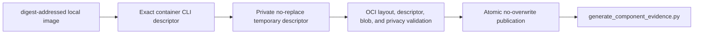

# Exact OCI-layout export

`scripts/release/export_oci_layout.py` is the canonical bridge from one exact
local container image to the OCI-layout archive consumed by component evidence.
The exporter accepts only a local `sha256:` image ID or a name pinned with
`@sha256:<digest>`; a mutable tag is never an export subject.



## Export contract

Create a new private directory on a Linux-native filesystem, resolve the
container executable under deployment policy, and obtain the immutable local
image ID from the runtime. The repository runtime policy selects Podman by
default; release automation should still pass the resolved executable
explicitly.

```sh
umask 077
install -d -m 700 "${PRIVATE_RELEASE_ROOT}"

CONTAINER_CLI="$(command -v podman)"
IMAGE_ID="$("${CONTAINER_CLI}" image inspect --format '{{.Id}}' agent-utilities:release)"

python scripts/release/export_oci_layout.py \
  --container-cli "${CONTAINER_CLI}" \
  --image "${IMAGE_ID}" \
  --output "${PRIVATE_RELEASE_ROOT}/agent-utilities.oci.tar"
```

The output must be a new absolute path whose existing parent is owned by the
caller and has no group or other permissions. Every run uses a new destination;
the exporter refuses files, links, aliases, non-private parents, `.` or `..`
components, and symlinked parent components. It does not invoke a shell. The
runtime receives one fixed argv sequence and writes its archive bytes directly
to a caller-owned descriptor. Runtime stdout cannot become a second status
channel, and runtime stderr is never retained or reflected.

Before publication, the exporter verifies all of the following:

- the outer archive contains only canonical directories and regular OCI files;
- `oci-layout` is version 1.0.0 and `index.json` has exactly one root descriptor;
- every descriptor size and SHA-256 digest matches its referenced blob;
- nested indexes are bounded, at least one image manifest exists, and the image
  uses only the layer encodings accepted by component evidence;
- no unreferenced blobs, duplicate paths, sparse files, links, special files,
  foreign paths, unsafe tar identities, credential-bearing metadata, email
  identities, or host-user paths are present; and
- a name pinned with `@sha256:` resolves to the same exported root descriptor.

The archive and its validation are bounded to 4 GiB, 65,536 outer entries, and
fixed descriptor/JSON limits. Publication uses a same-directory hard-link
commit followed by removal of the private temporary name, which gives
no-overwrite atomicity without a check-then-rename race. The final archive is
mode `0600`.

Successful status is bounded JSON containing only the OCI root digest, archive
digest, byte size, image-manifest count, schema, and verdict. Rejections contain
only a stable error code. Neither status form contains the image reference,
container executable, command diagnostics, or filesystem locations.

## Component evidence input

Pass the verified archive unchanged to the component evidence generator along
with the closed wheelhouse used for the exact image build:

```sh
generate-graphos-component-evidence \
  --name agent-utilities \
  --version "${AGENT_UTILITIES_VERSION}" \
  --kind oci \
  --artifact "${PRIVATE_RELEASE_ROOT}/agent-utilities.oci.tar" \
  --wheelhouse "${CLOSED_WHEELHOUSE}" \
  --source-manifest "${SOURCE_FREEZE_EVIDENCE}" \
  --release-root "${RELEASE_ROOT}" \
  --output-dir "${COMPONENT_EVIDENCE_DIR}" \
  --output "${COMPONENT_DECLARATION}" \
  --verifier-env COMPONENT_SIGNATURE_VERIFIER \
  --signer-env COMPONENT_SIGNATURE_SIGNER \
  --verify-signature
```

The exporter verifies the transport archive and privacy-safe OCI metadata. It
is not a replacement for the controlled `agent-local` build, layer-content
policy, closed-wheelhouse comparison, component signature verification, or
release assembly. `generate_component_evidence.py` independently reopens the
archive, validates the installed distribution closure, and binds both the OCI
root digest and archive digest into release evidence.
