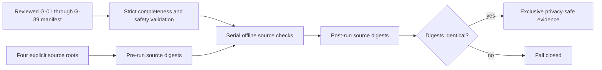

# Source-freeze gate

The source-freeze gate produces the single source-state proof required before
artifact construction. It covers every G-01 through G-39 acceptance row, while
distinguishing source checks from exact-artifact, external-infrastructure, and
terminal-report work. A source pass does not promote a non-source acceptance row.

The reviewed command catalog is
[`deploy/release/source-freeze-gates.json`](../../deploy/release/source-freeze-gates.json),
validated against
[`deploy/release/source-freeze-gates.schema.json`](../../deploy/release/source-freeze-gates.schema.json).
The evidence shape is fixed by
[`deploy/release/source-freeze-evidence.schema.json`](../../deploy/release/source-freeze-evidence.schema.json).

## Execution contract

The Linux/WSL runner requires explicit roots for Agent Utilities, Epistemic
Graph, Langfuse Agent, and the ecosystem checkout that contains `agents/` and
`skills/`. It verifies that the three component roots are members of that
checkout. The release CLI always loads the adjacent canonical manifest: there
is no repository discovery, manifest override, or ad-hoc command option. The
runner also pins the reviewed manifest's exact SHA-256 in source, so even a
schema-valid command-catalog change fails before root discovery or execution.
Commands execute once, in manifest order, as argument arrays with no shell.



The subprocess environment has a private `PATH`, neutral home and temporary
directory, disabled Git configuration/pagers/prompts/optional locks, and only
pinned `git` and `rg` links. The Python audit boundary blocks network sockets,
all file writes, shell/process escape paths, and every child command except the
reviewed read-only Git and ripgrep argv forms. Each command starts in a new
process group; timeout, output overflow, success, and failure all terminate
remaining descendants. Standard output and error are streamed through bounded
digest-free counters and are never buffered or retained.

Checks start through a `-S -B` bootstrap. The guard is installed before required
interpreter site directories are appended directly to `sys.path`; `.pth` files
are never executed. This prevents package-startup code from running before the
write, process, and network policy.

The manifest additionally rejects build, install, service, mutation, live, and
network command arguments. Complete source digests run before and after every
command over every root that command can inspect, followed by a final four-root
digest. Tracked files under directories named `build`, `dist`, `site`, or
`target`, untracked source, symlinks, file modes, and empty directories all
participate in the digest; generated cache, environment, and dependency trees
remain excluded.

Command output is never printed or retained. Evidence contains only stable gate
and command identifiers, deterministic source and manifest SHA-256 digests,
root-owned reviewed-tool SHA-256 digests, exit/termination status, and
source-evidence disposition. It contains no
duration, output count or digest, command arguments, source filenames,
repository roots, environment values, endpoints, identities, or captured
output.

The G-22/G-31 source check also fixes the eight-component release order, requires
Langfuse Agent, requires exactly 65 connector catalog entries, rejects non-exact
matrix dependency versions, and proves that the Agent Utilities base requirement
selects `epistemic-graph[full]` at the current engine floor.

Every gate lists all evidence classes it still requires. `source_status=passed`
means only that the local source slice passed. `remaining_evidence` continues to
name exact-artifact, external, or terminal work, so a source-freeze pass can
never be interpreted as full acceptance-gate closure.

When a packaged release schema, matrix, campaign, catalog, or workload contract
changes, regenerate the fixed release-resource digest catalog with
`python scripts/release/check_release_catalogs.py --write`, review that one
canonical file, and rerun the command without `--write`. The writer has no output
path option: it atomically replaces only
`deploy/release/release-contract-resources.catalog.json`, and its JSON result
contains digests and counts rather than a local filesystem location.

## Run

Set the four roots from deployment-owned configuration and choose an absolute
evidence destination outside all four source trees. Its complete parent chain
must be symlink-free; the immediate parent must be owned by the invoking user
with mode `0700`; and the destination must not already exist. Evidence is
written and file-`fsync`ed to an unlinked-name private `0600` temporary in the
held parent directory, then atomically hard-linked to the exclusive final name.
The temporary name is removed and the directory is `fsync`ed before success.
Every path operation uses the held parent descriptor with `O_NOFOLLOW`.

```bash
python -I -S -B scripts/source_freeze_gate.py \
  --repo "agent-utilities=${AGENT_UTILITIES_ROOT}" \
  --repo "epistemic-graph=${EPISTEMIC_GRAPH_ROOT}" \
  --repo "langfuse-agent=${LANGFUSE_AGENT_ROOT}" \
  --repo "provider-fleet=${PROVIDER_FLEET_ROOT}" \
  --evidence "${RELEASE_EVIDENCE_ROOT}/source-freeze.json"
```

The runner refuses to execute without `-I -S -B`; this excludes environment,
user-site, `.pth`, and bytecode startup effects before the manifest is pinned or
the first source digest is taken.

The canonical output is a required release input. Copy it under the release evidence
root without rewriting its bytes, then pass its release-relative reference to
`generate-graphos-release-assembly --source-freeze-evidence`. Release verification
reopens it exactly once, validates the current schema and packaged gate manifest,
recomputes both authority digests, and matches all eight component source documents.

The canonical catalog currently contains 49 commands. The runner fails before
execution for a missing or duplicate G-01 through G-39
row, an orphaned or unlisted command, a command-to-gate mismatch, an unsafe
argument, a missing or mismatched explicit root, an untrusted required tool, an
unsafe evidence parent, an output path inside source, or an existing evidence
file. After execution it fails for any command error, timeout, output overflow,
descendant-cleanup failure, per-command tree edit, special source-tree file, or
evidence-publication race.

G-23 and G-24 remain external because they require production-scale elapsed
chaos and independent signing. Mixed rows retain their exact-artifact and/or
external requirements after the local source slice passes. G-39 remains
terminal because the final project-grouped file inventory must be generated
only after all code, evidence, documentation, and report writes are complete.
