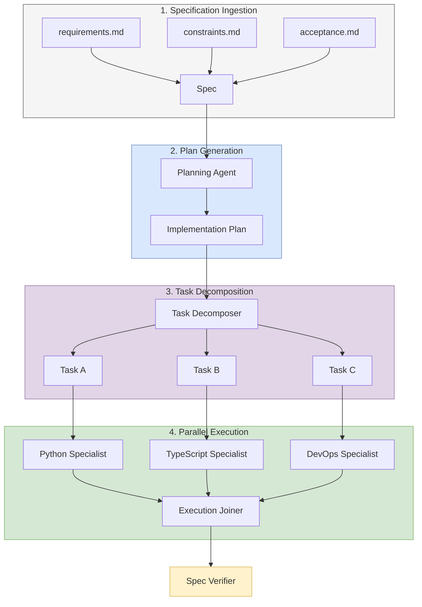

# Spec-Driven Development (SDD) Orchestrator

> CONCEPT:AU-009 — Spec-Driven Development

## Overview

The SDD orchestrator (`sdd/orchestrator.py`) implements a **specification-first development pipeline** where formal specs drive plan generation, task decomposition, and parallel execution. This aligns with the `.specify` standard (spec-kit).

## Pipeline

## SDD Lifecycle Diagram



### Phase 1: Specification Ingestion

Reads `.specify/` directory structures containing:
- `requirements.md`: Functional requirements
- `constraints.md`: Non-functional requirements
- `acceptance.md`: Acceptance criteria

### Phase 2: Plan Generation

Uses the planning agent to generate implementation plans from specs:
- Dependency analysis
- Topological sorting of tasks
- Risk assessment

### Phase 3: Task Decomposition

Breaks plans into atomic, executable tasks:
- Each task maps to a single file or function
- Tasks are tagged with CONCEPT markers for traceability
- Dependencies between tasks are explicit

### Phase 4: Parallel Execution

Dispatches independent tasks to specialist agents:
- DAG-based scheduling
- Parallel execution of independent tasks
- Synchronization barriers between dependent layers

## Integration with HSM and Knowledge Graph

The SDD pipeline is deeply integrated with the core architecture:

- **HSM Dispatcher**: Task execution is routed through the main Hierarchical State Machine (AU-002). Each task is mapped to a Specialist Superstate (e.g., Python Coder) which enters its own execution loop.
- **Knowledge Graph (AU-003)**: The generated Spec, Implementation Plan, and individual Tasks are persisted into the Knowledge Graph as nodes. This provides long-term context, allowing the system to reference past design decisions during future tasks.

## Real-World Usage Example

```python
import asyncio
from agent_utilities.sdd.orchestrator import SDDOrchestrator
from agent_utilities.core.workspace import get_agent_workspace

async def main():
    workspace = get_agent_workspace()

    # Initialize the SDD Pipeline
    orchestrator = SDDOrchestrator(
        spec_dir=workspace / ".specify",
        workspace=workspace,
    )

    # Run the full pipeline: Ingest -> Plan -> Task -> Execute -> Verify
    results = await orchestrator.run()

    if results.verified:
        print(f"Implementation complete and verified. Score: {results.verification_score}")
    else:
        print("Verification failed. Check the tasks for feedback gradients.")

if __name__ == "__main__":
    asyncio.run(main())
```

## Integration with CONCEPT Markers

SDD tasks are tagged with `CONCEPT:` markers that link:
- Specification → Implementation plan → Code → Tests → Documentation

This creates a full traceability chain from requirement to verification.
