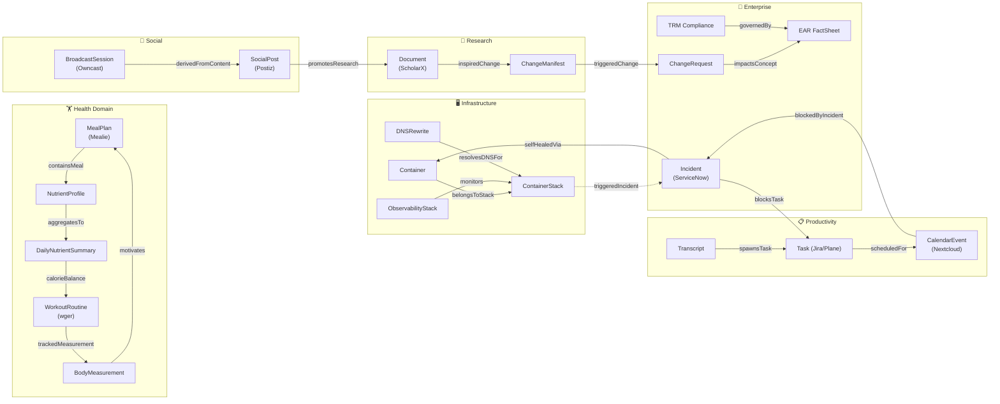

# Workflow × Knowledge Graph Synergy Map

> **ADR-WKG-001**: All workflow outputs are persisted as first-class OWL individuals in the Knowledge Graph at the engine level. This is deterministic — the user and LLM never need to explicitly trigger ingestion.

## Overview

Every workflow in the agent ecosystem produces structured data that feeds directly into the unified Knowledge Graph via 15 OWL ontology modules. This document maps the **cross-domain reasoning chains** that emerge when seemingly unrelated workflows share a common KG substrate.

The value is not in individual storage — it's in the **OWL reasoner inferring relationships** between domains that no single workflow would ever discover.

---

## Ontology Module Map

| Module | File | Domain | Workflows Served |
|---|---|---|---|
| Core | `ontology.ttl` | Agents, events, concepts | All |
| Enterprise | `ontology_enterprise.ttl` | ArchiMate, ADR, governance | ServiceNow, EAR |
| Infrastructure | `ontology_infrastructure.ttl` | Containers, DNS, hardware | Portainer, AdGuard, Uptime Kuma |
| Quant | `ontology_quant.ttl` | Finance, code, processes | Trading, workspace validation |
| SDD | `ontology_sdd.ttl` | Spec-driven development | GitHub Issues, evolution |
| **Wellness** | `ontology_wellness.ttl` | Nutrition + Fitness | Mealie dietician, wger trainer |
| **Social** | `ontology_social.ttl` | Content + streaming | Postiz scheduler, Owncast |
| **Personal** | `ontology_personal.ttl` | Calendar + tasks + voice | Nextcloud, audio transcriber |
| **Media** | `ontology_media.ttl` | Downloads + libraries | qBittorrent, Jellyfin |
| Medical | `ontology_medical.ttl` | Clinical concepts | Future health extensions |
| HR | `ontology_hr.ttl` | Org structure | Future HR extensions |
| Banking | `ontology_banking.ttl` | Banking domain | Future banking extensions |
| Legal | `ontology_legal.ttl` | Legal concepts | Future legal extensions |
| Government | `ontology_government.ttl` | Gov domain | Future gov extensions |
| Energy | `ontology_energy_geopolitics.ttl` | Energy markets | Geopolitical analysis |

---

## Cross-Domain Reasoning Architecture

---

## Hidden Value Chains — Cross-Domain Reasoning Examples

These are relationships between workflows that seem completely unrelated but create powerful reasoning chains when wired through the KG.

### 1. 🍎→🏋️→📏 Meal → Workout → Body (Health Holistic)

**Workflows**: `dietician_and_chef` + `personal_fitness_trainer`

**OWL Chain**: `Person --prescribedDiet--> MealPlan --containsMeal--> MealEntry --hasNutrientProfile--> NutrientProfile --aggregatesTo--> DailyNutrientSummary --calorieBalance--> CalorieExpenditure <--estimatedExpenditure-- WorkoutSession`

**Example Inference**:
> "Your MealPlan consumed 2800 kcal today (protein: 180g, carbs: 320g, fat: 85g) but your WorkoutRoutine only burned 1800 kcal. Your BodyMeasurement trend shows +0.5 kg/week over the last 3 weeks. Recommend reducing carbs by 40g and adding a 4th training day."

**Macro-Level Detail**: The `NutrientProfile` tracks per-meal breakdowns (protein, carbs, fat, fiber, sugar, sodium) while `DailyNutrientSummary` aggregates these. The `NutritionTarget` stores the user's goals, enabling target-vs-actual comparison at both meal and daily granularity.

---

### 2. 🚨→🐳→🌐 Incident → Container → DNS (Self-Healing Correlation)

**Workflows**: `servicenow_incident_tracker` + `uptime_self_healer` + `adguard_dns_orchestrator`

**OWL Chain**: `ContainerStack --triggeredIncident--> Incident --selfHealedVia--> Action(container_restart) | DNSRewrite --resolvesDNSFor--> ContainerStack`

**Example Inference**:
> "ServiceNow INC0012345 correlates with ContainerStack `grafana` going down at 03:42 UTC, which broke DNSRewrite `grafana.home.lab`. The `uptime_self_healer` detected it via Uptime Kuma monitor #47 and restarted the container at 03:43 UTC. Incident auto-resolved in 68 seconds."

---

### 3. 📄→🔧→📋→✅ Paper → SDD → Change → Task (Research-to-Implementation)

**Workflows**: `research_scanner` + `agent_utilities_evolution` + `servicenow_change_tracker` + `unified_task_tracker`

**OWL Chain**: `Document --inspiredChange--> ChangeManifest --triggeredChange--> ArchitectureDecisionRecord | Task --blocksTask-- Incident`

**Example Inference**:
> "Research paper arXiv:2506.01234 on 'Agentic Memory Consolidation' inspired ChangeManifest CM-42 for `agent-utilities`. This triggered ServiceNow CHG0001234 in the enterprise pipeline. The corresponding Jira task AGENT-567 is assigned to you and is due Friday."

---

### 4. 🎙️→📝→📋→📅 Transcript → Task → Calendar (Voice-to-Schedule)

**Workflows**: `voice_message_transcriber` + `unified_task_tracker` + `nextcloud_time_manager`

**OWL Chain**: `VoiceMessage --transcribedFrom--> Transcript --spawnsTask--> PersonalTask --originatedFrom--> CalendarEvent --scheduledFor--> Person`

**Example Inference**:
> "Voice message received at 9:15am, transcribed with 94% confidence: 'Need to review PR #42 for the new MCP server'. Created PersonalTask 'Review PR #42' (priority: high). Automatically scheduled CalendarEvent for tomorrow 10:00am — your calendar shows that slot is free."

---

### 5. 📱→📺→📊 Post → Stream → Engagement (Content Lifecycle)

**Workflows**: `postiz_scheduler` + `social_media_influencer`

**OWL Chain**: `SocialPost --publishedOn--> System | BroadcastSession --derivedFromContent--> SocialPost | DailyEngagement --aggregatesDaily--> AggregatedEngagement`

**Example Inference**:
> "Your Postiz post about agent-utilities got 340 engagements (142 likes, 87 shares, 111 comments) over 3 days — your best-performing post this month. Schedule an Owncast deep-dive stream? Your Nextcloud calendar shows Thursday 7pm is free."

---

### 6. 🚨→📋→📅 Incident → Task → Calendar (Ops Disruption)

**Workflows**: `servicenow_incident_tracker` + `unified_task_tracker` + `nextcloud_time_manager`

**OWL Chain**: `Incident --blocksTask--> Task | CalendarEvent --blockedByIncident--> Incident`

**Example Inference**:
> "ServiceNow P1 incident INC0099887 raised at 14:30. Automatically created Jira task OPS-123. Your CalendarEvent 'Team Standup' at 15:00 has been flagged as blocked — rescheduled to after resolution."

---

### 7. 🌐→🍎 DNS Stats → Meal Plan (Behavioral Insight)

**Workflows**: `adguard_stats_collector` + `dietician_and_chef`

**OWL Chain**: `DNSQueryStats --observation--> Observation | MealPlan --prescribedDiet--> Person`

**Example Inference**:
> "AdGuard blocked 847 ad domains from food delivery sites (UberEats, DoorDash) this week. Your MealPlan already covers dinner for all 7 days — you're effectively saving ~$120/week on takeout by following your meal plan."

---

### 8. 🏋️→📱 Fitness Goal → Social Post (Achievement Celebration)

**Workflows**: `personal_fitness_trainer` + `postiz_scheduler`

**OWL Chain**: `FitnessGoal --targetsGoal-- WorkoutRoutine | BodyMeasurement --trackedMeasurement-- Person | SocialPost --createdBy--> Person`

**Example Inference**:
> "Congratulations! Your latest BodyMeasurement shows you hit your FitnessGoal of 100kg bench press (logged via wger WorkoutSession #342). Draft a celebratory Postiz post to share the milestone?"

---

### 9. 🚀→🐳→🌐→📊 Bootstrap → Deploy → DNS → Monitor (Self-Deployment)

**Workflows**: `ecosystem_bootstrap` + `full_infrastructure_discovery` + `service_dependency_map`

**OWL Chain**: `DeploymentManifest --hasPhase--> DeploymentPhase --deployedInPhase--> MCPServerDeployment --servesEndpoint--> PlatformService --deployedOn--> ContainerStack --runsOn--> HardwareNode`

**Example Inference**:
> "Ecosystem bootstrap completed on `homelab-01` using profile `homelab`. Deployed 36 MCP servers, 12 platform services, and 48 DNS rewrites across 3 tiers in 12 minutes. The `full_infrastructure_discovery` workflow auto-ingested the complete topology. The KG now tracks 196 infrastructure nodes. Portainer took over from container-manager-mcp at Tier 1."

**Bootstrap Value**: After the first run, the KG knows the *entire* deployment topology. Subsequent `uptime_self_healer` runs can trace any failed service back to its `DeploymentManifest`, the `DeploymentProfile` that selected it, and the `DeploymentPrerequisite` versions it depends on — enabling root-cause analysis like: "Service X failed because Python 3.11.4 has a known bug with asyncio on this kernel version."

---

## Engine-Level KG Persistence (ADR-WKG-001)

> **Architectural Decision**: Workflow output persistence into the Knowledge Graph is handled **deterministically at the engine level**, not as an explicit workflow step. This means:
>
> 1. The user never needs to think about "saving to the KG"
> 2. The LLM never needs to execute an explicit ingestion step
> 3. Every workflow execution automatically produces OWL-promotable nodes
> 4. The OWL bridge's `_NODE_TYPE_TO_OWL_CLASS` mapping ensures type-safe promotion
>
> **Implementation**: The workflow execution engine's post-execution hook calls `graph_write(action='add_node')` for each primary output entity, then `graph_write(action='add_edge')` for any cross-domain relationships detected. This is transparent to both the user and the LLM.

---

## OWL Bridge Type Coverage

The `owlready2_backend.py` `_NODE_TYPE_TO_OWL_CLASS` mapping now covers **110+ node types** and **90+ edge types** (`_EDGE_TYPE_TO_OWL_PROP`) across the ontology modules, enabling automatic LPG → OWL promotion for every workflow output — including the ecosystem bootstrap deployment lifecycle.
