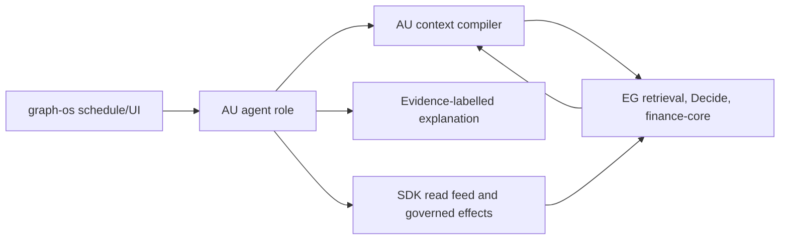

# Architecture and contracts

## Reuse and ownership

Reuse `agent_utilities/knowledge_graph/retrieval/context_compiler.py`, `context_plane.py` and `capability_index.py` for agent-side composition, but replace local retrieval-engine authority with generated EG methods. Reuse `agent_utilities/domains/finance/{trading_swarm,investor_debate,research_autopilot,persona_heuristics}.py` only for agent roles. `agent_utilities/domains/finance` currently also contains deterministic math and feed modules; migrate their behavior to EG/SDK, then delete copies. Reuse the existing AU orchestration capacity and approval ports; introduce a typed port only when no current one expresses the contract.

## Context interface

`ContextRequest` contains verified principal/tenant/graph, task class, schema digest, RunSpec digest, tokenizer ID/version, token window, cost and latency ceilings, and cited source bounds. EG returns typed candidates with proof/claim class, source revision, rank receipt and invalidation epoch. AU chooses a package only from allowed candidates, with exact token counts and deterministic tie ordering. It records what was excluded and why. If source revision or invalidation epoch changes before use, AU re-queries or abstains.

## Finance interface

`AnalysisRequest` contains verified account scope, holding/watchlist IDs, strategy version, as-of time, horizon and risk budget. EG returns durable positions, market observations, deterministic indicators and calibration/scorecard receipts; SDK provides source freshness and account read effects. AU's `AnalysisSnapshot` binds all inputs and claims, records confidence/abstention reason and carries `informational_only=true`. A separate `ActionIntent` may be sent only to the SDK write-back API with approval lease and idempotency key. The SDK/EG confirm resulting state; AU never directly submits an exchange order.

## Failure rules

Stale source, missing citation, unknown tokenizer, budget overrun, uncalibrated strategy, insufficient effective sample size, invalid lease, cross-account request or changed idempotency payload fails closed or yields typed abstention. AU never substitutes an LLM estimate for deterministic finance math. Unavailable EG/SDK means the output is unavailable, not silently sourced from a local cache.

## Quality

Preserve one owner for every calculation and transport. Apply CCCC to route/context complexity, jscpd and dupehound to copied finance/retrieval code, and KISS to avoid second ranking/approval engines. Pin generated contracts and use normal Ruff, mypy, Pytest and repository hooks.
