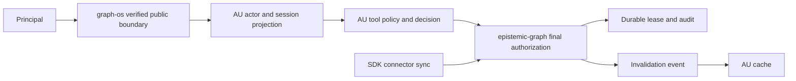

# Architecture and contracts — AU-SEC-01

## Existing wiring to reuse

`agent_utilities/security/request_identity.py` provides `ActorIdentityMiddleware`, `actor_from_claims`, `mint_graph_session`, `local_process_authority_enabled`, `mint_local_process_session`, and `system_write_session`. It reuses `security/auth.py` JWKS validation. `security/permissions_kernel.py` resolves tool policy; `security/tool_guard.py` connects that policy to pydantic-ai approval, preserving hard denial. `knowledge_graph/core/engine.py` binds the dedicated control view. `core/config.py` exposes registry invalidation; `caching/semantic_cache.py` has explicit invalidation. Reuse these entry points and existing typed `ActorContext`/`GraphSession` rather than adding parallel token or policy stores.

## Trust and data flow

1. The boundary validates signature, issuer, audience, expiry and claims before AU receives a verified actor. AU projects only classified scopes and tenant from trusted claims. An unknown registry revision fails closed or enters a documented compatibility window without granting new permissions.
2. `tiny` local authority stays tied to a private packaged stdio process, ephemeral signing key, 120-second proof, and bounded session renewal. No network transport may invoke it. Local setup may use deterministic in-process fixtures, but a test fixture cannot silently become production authority.
3. A request for elevation carries `{request_id, actor_id, tenant_id, action, resource, reason, expires_at, trace_id}`. AU submits a typed intent to graph-os/engine. The engine persists a lease and audits transitions; `check_access` consumes only an active, scoped lease. The approver identity must differ from requester; model output has proposal authority only. Idempotency key prevents duplicate grants. Revocation is effective before the next protected action; expiry uses server time.
4. Guardrail profile proposals carry current profile revision, candidate digest, bounded delta, evidence references, and decision ID. AU submits through its existing orchestration/decision path. A tightening operation is monotone within configured bounds; a loosening operation must reference a live explicit approval. Commit uses compare-and-swap on revision; failure leaves the old profile active and emits a typed audit event.
5. Cache invalidation is keyed by tenant and versioned object. Lost event transport must not produce indefinite stale reads: configured TTL remains a hard cap. Rate learning cannot lengthen it. Security decisions do not rely on a stale permissive cache; revalidation occurs at the engine chokepoint.
6. Connector drift reports are generated at the SDK/engine boundary. AU receives typed `SchemaDriftReport` metadata, suspends orchestration when classification or policy fails, and resumes only after explicit, versioned disposition. The SDK owns checkpoint advancement.

## Compatibility and migration

Add the classed scope projection behind the existing `GraphSession` contract. Regenerate from one registry source, reject stale checked-in projections, and migrate callers of string literals without inventing aliases. Keep the existing health path exemption narrow. Public API changes require graph-os contract compatibility tests and matching browser behavior. Durable record schema evolution belongs to epistemic-graph and must be versioned there. No change may alter tenant or scope claims while fixing placement or transport.

## Failure and observability

Return 401 for absent/invalid identity, 403 for valid but forbidden identity, and a typed unavailable/retryable response for control or policy storage failure; never treat unavailable as allowed. Audit decisions and lifecycle transitions with redacted actor/trace metadata. Emit counters for deny, approval, expiry, revoke, drift quarantine, invalidation lag, and failed policy reload without logging tokens or sensitive payloads.

## Developer setup

Fresh clone: install Python and `uv` as declared by this repository, run `python3 scripts/uv_workspace.py doctor`, then `python3 scripts/uv_workspace.py run --all-extras pytest tests/unit/security -q`. Unit and contract suites must use local fixtures and provision only their declared dependencies. A served integration test that needs an engine must start or provision its own disposable fixture and fail with a clear missing-dependency reason; ordinary PR checks must not depend on a private network or a running deployment.
