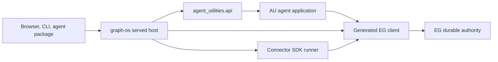

# Architecture and cutover design

## Boundaries

AU layers are pure versioned application contracts, domain policy, use cases, protocols, runtime adapters, and composition. Dependencies point inward. Only composition chooses concrete model, EG client, harness and clock adapters. The graph-os server admits authenticated requests, then calls an AU API method; it does not import AU internals. The SDK fetches source data and submits generated EG requests; no AU connector wrapper remains. EG alone commits graph, job, memory and usage facts.

## Existing wiring to reuse

- `agent_utilities/api/` is the AU public integration boundary. Extend it with narrow typed methods rather than exposing `knowledge_graph/core/engine.py` or `mcp/kg_server.py`.
- `agent_utilities/knowledge_graph/backends/epistemic_graph_backend.py` already illustrates a thin engine adapter. Reuse generated `epistemic_graph` client types and digest checks, then retire duplicated backend dispatch branches.
- `agent_utilities/knowledge_graph/retrieval/context_compiler.py` is retained as application context composition; graph search/ranking moves to EG methods.
- `agent_utilities/observability/` retains agent telemetry emission while durable trace and usage records live in EG.
- `graph-os` already owns gateway and fleet composition. Compare each AU-only gateway module and drifted duplicate before deleting it; port unique behavior only to its legal host.

## Cutover algorithm

1. Pin a released EG client contract and enumerate consumers using AST imports plus runtime registry/script discovery. Build a machine-readable operation and module inventory with public paths only.
2. For each old entry point, write a typed new-owner request/result and a contract test. Include identity, tenant, graph, purpose, policy version, timeout, idempotency key, source digest and outcome receipt where relevant.
3. Wire one real public caller through the new route. Run a parity fixture against old and new behavior, including refusal cases. Move data only with verified tenant/source binding.
4. Delete the AU duplicate, stale tests and dependency declarations atomically with the caller cut. The owner-manifest check fails if imports, scripts or stale route registration remain.
5. Regenerate all owner manifests and public API references from source authority. Document intentional drops with a reason and a test proving the old operation is unavailable.

## Failure behavior

Contract mismatch, unknown tenant, absent authorization, duplicate idempotency key with different payload, corrupt legacy record, unsupported operation, or unavailable owner service fails closed with typed errors. No local fallback reads a different state authority. Retryable transport failure may retry only an idempotent request with the same key.

## Design constraints

Keep one owner per capability. Check copied code with jscpd and dupehound and use CCCC complexity reports to split oversized cutover adapters. Apply KISS by deleting obsolete wrappers rather than creating a second translation registry. Every change needs the language-native lint/type/test gate and this repository's normal pre-commit gate.
