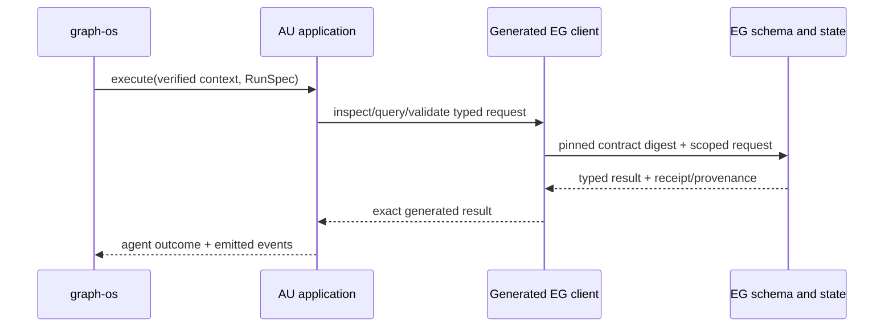

# Architecture and interfaces

### Existing components to reuse

`agent_utilities/knowledge_graph/backends/epistemic_graph_backend.py` shows the client-adapter boundary. `agent_utilities/knowledge_graph/retrieval/context_compiler.py` is the retained context composer. `tests/gates/test_epistemic_graph_schema_authority_cutover.py` is the existing static authority check. Extend these rather than introduce a second graph service. The EG client is the sole schema and wire implementation; the generated release digest is checked during composition.

### Typed request contract

Every AU→EG call carries a verified principal and tenant, graph, purpose, policy version, operation, bounded budget, idempotency key for writes, and an exact contract digest. Schema inspection returns source identity, composed digest, classes/properties and provenance. Validation returns findings and source digest; a failed validation cannot advance a cursor or publish a pack. Candidate-claim submission includes RunSpec and source evidence; EG issues the durable receipt. Unknown enum fields and digest mismatch fail before side effects.

### Semantic migration

Inventory each AU TTL and parsing call. Associate it with an EG core source or a certified connector pack source. Publish the destination first; verify semantic graph parity and composed digest; then switch AU callers to IRI/digest requests and remove the AU file/parser. The cutover cannot leave two writable ontology authorities. Dynamic schema conflicts are atomic and typed. Schema drift classification runs in the SDK sync runner, while EG owns shape rendering, candidate validation and activation; AU only asks for an agent review when policy requires one.

### Failure handling

Reject absent tenant/graph, stale digest, schema conflict, malformed claim, denied read, untrusted historical memory, unsupported method and owner outage. A transport retry reuses the same key only for idempotent operations. No branch falls back to an AU RDF graph or SQLite store.

### Simplicity and quality

Delete adapters that only rename the same EG method. Keep one DTO conversion at the AU API/composition edge. CCCC highlights oversized client facades to split by use case; jscpd and dupehound catch copied wire logic; KISS review rejects a second registry or optional backend. Use Ruff/mypy/Pytest plus normal repo hooks.
